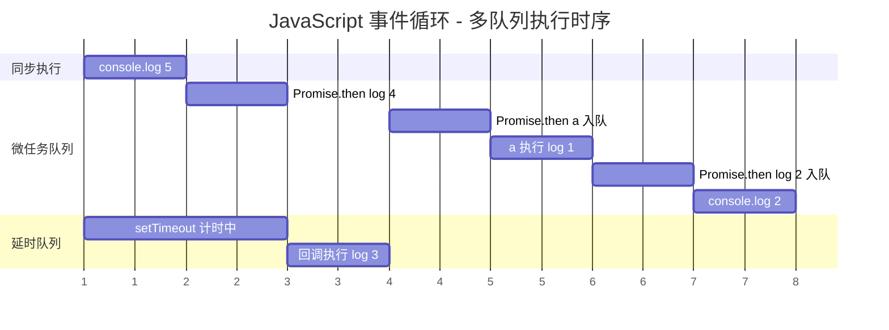

> 本文是我一个字一个字敲出来的，非AI生成😲
> 如果有不对的东西，欢迎登陆GitHub账号发表评论指正


如果你对事件循环的理解还停留在"宏任务 + 微任务"，那么这篇文章，可能会帮你把这套认知彻底拆掉重来。

读完你应该能做到：
- 理解事件循环和异步的真实运作方式
- 分清进程与线程在浏览器中的角色
- 不再依赖"宏任务 / 微任务"这种简化但不准确的模型

# 浏览器的进程模型

## 何为进程

进程是操作系统进行资源分配和调度的基本单位，包含独立的内存空间

## 何为线程

一个进程至少一个线程，进程开启之后会自动创建一个线程来运行代码，这个线程称之为主线程；
如果程序需要同时执行多块代码，主线程会启动更多的线程来执行代码，所以一个进程可以包含多个线程；
可以理解为，运行代码的东西就是线程

## 浏览器有哪些进程和线程

四个主要的进程：
- 浏览器进程（UI，管理标签）
- 网络进程
- 渲染进程
  - 渲染进程启动后会开启一个主线程，负责执行 HTML、CSS、**JS 代码**
    > JavaScript 的执行依赖 V8 引擎，但 V8 并不是一个独立线程，而是运行在主线程中的一个执行模块。
  - 默认情况下，浏览器会为每个标签页开启一个新的渲染进程，保证不同标签页之间互不影响
- GPU 进程

**思考**：为什么渲染进程不适用多个线程来处理这些事情？

> 浏览器没有使用多线程去并行处理 DOM 和渲染，是因为 DOM 同时会被 JavaScript 修改，也会被渲染流程读取。如果多个线程同时操作 DOM，就容易出现数据前后不一致的问题，比如一个线程正在修改 DOM，另一个线程同时在读取，就可能拿到不完整或混乱的数据。
>
> 因此浏览器选择让 DOM 的操作在同一时刻只由一个线程执行，保证数据的一致性，同时也让整个渲染流程更加稳定可控。

# 渲染主线程是如何工作的

## 包括但不限于

- 解析 HTML、CSS，计算样式，布局，处理图层，每秒把页面画 60 次（FPS），执行全局 JS 代码，执行事件处理函数，执行计时器回调函数……

## 如何调度任务

如果执行 JS 函数的时候遇到——计时器到达时间？用户点击了按钮？之类的，如何决策去执行哪个？

- **消息队列**排队：

```text
              ┌─────────────────────────┐
              │       渲染主线程         │
              │                         │
              │    ┌ ─ ─ ─ ─ ─ ─ ┐     │
              │    │ 正在执行的任务 │     │
              │    └ ─ ─ ─ ─ ─ ─ ┘     │
              └────────────┬────────────┘
                           │ 取出
              ┌────────────▼────────────────────────┐
  消息队列     │ 任务 │ 任务 │ 任务 │ 任务 │          │
 message queue└─────────────────────────────────────┘
                 ▲            ▲            ▲
                 │ 放入        │ 放入        │ 放入
              ┌──┴───┐    ┌───┴──┐    ┌───┴──┐
              │其他线程│    │其他线程│    │其他线程│
              └──────┘    └──────┘    └──────┘
```

- 最开始的时候，渲染主线程进入了一个无限循环。message loop 也就是 W3C 的 event loop；
  > 来源 chrome 源码，cpp
- 每次循环都会检查是否有任务存在，有就执行，没有就休眠；其他线程放任务进去会唤醒

# 若干解释

## 何为异步

代码执行过程中会遇到一些无法立即执行的任务，比如：
- 计时完成后的任务 — `setTimeout`、`setInterval`
- 网络通信完成后才能执行的任务 — `XHR`、`Fetch`
- 用户操作后需要执行的任务 — `addEventListener`

```text
  如果让渲染主线程等待，就会导致主线程长期处于「阻塞」状态，浏览器卡死

  渲染主线程：
  ┌──────────┐    ┌─────────────┐    ┌──────────────┐
  │ 计时开始  │───→│ ██ 阻塞 ██  │───→│ 运行到期任务  │
  └──────────┘    └─────────────┘    └──────────────┘
       │ ① 通知计时线程
       ▼
  ┌──────────────────────────────────────────┐
  │ 消息队列  │ 任务 │ 任务 │ 任务 │ 任务 │   │  ← 全部等着，没人处理
  └──────────────────────────────────────────┘

  计时线程：
  ┌──────────┐    ┌──────────┐    ┌──────────┐
  │ 计时开始  │───→│ 计时中…   │───→│ 计时结束  │
  └──────────┘    └──────────┘    └──────────┘
```

如果渲染主线程跟着等，那就会阻塞，使用**异步**的方式来使渲染主线程永不阻塞：

```text
  使用异步方式，渲染主线程永不阻塞：

  渲染主线程：
  ┌──────────┐
  │ 计时开始  │─┬──→ ① 通知计时线程计时，当前任务结束
  └──────────┘ │
               │     ② 立即获取下一个任务执行
               ▼
  ┌──────────────────────────────────────────────────┐
  │ 消息队列  │ 任务 │ 任务 │ 任务 │ ┊ 回调任务 ┊    │
  └──────────────────────────────────────────────────┘
                                      ▲
                                      │ ③ 计时结束后
  计时线程：                            │    回调放入队列末尾
  ┌──────────┐    ┌──────────┐    ┌───┴──────┐
  │ 计时开始  │───→│ 计时中…   │───→│ 计时结束  │
  └──────────┘    └──────────┘    └──────────┘
```

### 面试题：如何理解 JS 中的异步

*面试官看了都会头皮发麻的答案：*

JavaScript 在浏览器中通常运行在渲染进程的主线程中，因此表现为单线程执行模型。（不能说 JS 是一门单线程语言）

**渲染主线程**承担者诸多工作，渲染页面，执行 JS 都在其中运行；

**如果使用同步**的方式，就极有可能导致主线程产生阻塞，从而导致消息队列中的很多任务无法得到执行。这样的话，一方面会导致繁忙的主线程白白的消耗时间，另一方面导致页面无法及时更新，给用户造成卡死现象；

浏览器**采用异步**的方式来避免。具体的做法是当某些需要等待响应结果再执行的任务发生时（比如计时器、网络、事件监听），主线程将任务**交给其他线程**去处理，自身立即结束任务的执行转而执行后续代码。当其他线程完成时，将事先传递的**回调函数包装**成任务，加入消息队列的末尾排队，等待主线程调度执行；

在这种异步模式下，浏览器永不阻塞，从而最大限度的保证了单线程的流畅运行；

> "将事先传递的**回调函数包装**成任务"
> 在浏览器源码里，所有的任务都是一个结构体/对象

## JS 为何会阻碍渲染

看下面的那个延迟函数和死循环，主线程运行那个延迟函数的时候，页面是无法渲染改动/变化的，即使你在延迟函数前先改元素内容也不行，因为渲染内容也算一个 task（或者说，渲染并不是普通任务队列中的 task，而是在事件循环中的一个独立阶段，通常发生在 task 和 microtask 执行之后。）

## 任务会有优先级吗

### 任务与队列

任务没有优先级，在消息队列先进先出：
- **task queue 内部：FIFO**
- **不同 task queue 之间：浏览器调度（非严格优先级）**

**消息队列有优先级**，根据 W3C 的最新解释：
- 每个任务都有一个任务类型，同一个类型的任务必须在一个队列，不同类型的任务可以分别属于不同的队列。在一次的事件循环中，浏览器可以根据实际情况从不同的队列中取出任务执行
- 每一轮事件循环中，在执行完一个 task 后，必须立即清空 microtask 队列，然后才会进行下一步（如渲染或下一个 task）
- https://html.spec.whatwg.org/multipage/webappapis.html#queuing-tasks

> 随着浏览器的复杂度急剧提升，W3C 已经不再使用宏队列的说法（好像其实也从来没用过，自己搜一下吧，袁老师反正是这么说的一直就没规定过；市面上的教程就把消息队列分成了宏任务队列和微任务队列了，好多大模型也是这样认为，其实你看 chrome 的 C++ 源码不是这样的）

目前 chrome 的实现中，至少包含了下面的队列：
- 延时队列：用于存放计时器到达后的回调任务，优先级 ***中***
- 交互队列：存放用户操作后产生的事件处理任务，优先级 ***高***
- 微队列：一般会放，优先级 ***最高***

> 在 W3C（WHATWG HTML）规范中，其实没有"宏任务"这个说法，只有 task 和 microtask。
> "宏任务"是社区为了对比 microtask 提出的非官方术语，本质就是 task。
> 事件循环每一轮会执行一个 task，然后清空所有 microtask，再进入下一轮。
> 常见的 microtask 包括 Promise.then、queueMicrotask、MutationObserver，以及 async/await 本质也是基于 Promise 的微任务。

- `Promise.resolve().then()` 的作用是把回调放入 micro queue

伪代码长这样：

```text
while (true) {
  1. 从 task queue 取一个 task 执行
  2. 执行 microtask queue（全部清空）
  3. 渲染（如果需要）
}
```

### 分析题

```js
function a() {
  console.log(1);
  Promise.resolve().then(function () {
    console.log(2);
  });
}
setTimeout(function () {
  console.log(3);
  Promise.resolve().then(a);
}, 0);
Promise.resolve().then(function () {
  console.log(4);
});

console.log(5);
```



> 阅读方式：横轴是执行时序（数字代表逻辑步骤），每个色块从**左沿到右沿**代表该任务的起止时间；同一 section 从上到下是执行顺序，跨 section 纵向对齐代表同一时刻。

主线程执行 JS 全局代码，碰到 `setTimeout`，"其他线程"放到延迟队列，碰到 `Promise.then`，放到微任务队列，打印 5，此时主线程空了；
首先清空微任务队列，微任务是打印 4，微任务空了。

主线程完成当前 task 后，去延迟队列取任务执行了，打印 3，主线程发现这个延迟任务又注册了一个微任务，就把这个微任务放到微任务队列了；主线程完成当前 task 后来清空微任务打印 1；发现又要注册一个微任务，最后打印 2；

所以：**5，4，3，1，2**

### 面试题：阐述一下 JS 中的事件循环

***让面试官头皮发麻的 ans：***

事件循环又叫消息循环，是浏览器渲染主线程的工作方式。

在 chrome 源码中，它开启一个不会结束的 for 循环，每次循环从消息队列中取出第一个任务执行，而其他线程只需要在合适的时候将任务加到队列末尾即可。

过去把消息队列简单分为宏队列和微队列，这种说法目前已无法满足复杂的浏览器环境，取而代之的是一种更加灵活多变的处理方式。

根据 W3C 官方的解释，每任务有不同的类型，同类型的任务必须在同一个队列，不同的任务可以属于不同的队列。不同的任务队列有不同的优先级，在一次事件循环中，由浏览器自行决定取哪个队列的任务。但浏览器必须有一个微队列，微队列具有最高的优先级必须优先调度执行。

### 面试题：JS 能做到精确计时吗？为什么

**让面试官头皮发麻的答案：**

不行，因为：
- 计算机硬件没有原子钟，无法做到精确计时
- 操作系统的计时函数本身就有少量偏差，由于 JS 的计时器最终调用的是操作系统的函数
- 按照 W3C 标准，浏览器实现计时器时，如果嵌套层超过 5 层，则会带有 4ms 的最少时间，这样也会有偏差
- 受事件循环的影响，计时器的回调函数只能在主线程空闲的时候运行，因此带来偏差

### 交互队列优先级

点击开始按钮，控制台打印添加交互队列后两秒内，点击触发交互按钮；这种情况下控制台完整的打印？？

```html
<button id="begin">开始执行</button>
<button id="interaction">触发交互</button>

<script>
// 同步阻塞延时函数（会阻塞主线程）
function delay(ms) {
  const start = Date.now();
  while (Date.now() - start < ms) {}
}

function addDelay() {
  console.log('添加延时队列');
  setTimeout(() => {
    console.log('延时队列执行');
  }, 100);
  delay(2000); // 同步阻塞 2 秒
}

function addInteraction() {
  console.log('添加交互队列');
  const interaction = document.getElementById('interaction');
  interaction.onclick = () => {
    console.log('交互队列执行');
  };
  delay(2000); // 同步阻塞 2 秒
}

const begin = document.getElementById('begin');
begin.onclick = function () {
  addDelay();
  addInteraction();
  console.log('=============');
};
</script>
```

以前的教程把队列分成宏任务和微任务队列，按照宏任务微任务队列，并且队列先进先出的那个说法，豆包的答案：

```text
传统教程、标准 EventLoop 规则就是：宏任务按照【进入队列的先后顺序】执行，先入先出（FIFO）。

核心结论（100% 符合标准教程）

1. setTimeout 宏任务 → 先进入队列
2. 点击交互宏任务 → 后进入队列
3. 执行顺序：先 setTimeout → 后点击事件

正确控制台输出：
添加延时队列
添加交互队列
=============
延时队列执行
交互队列执行
```

而正确的，可验证的不按照那一套只有宏任务微任务队列的答案应该是：

```text
添加延时队列
添加交互队列
=============
交互队列执行
延时队列执行
```

- 因为 chrome 浏览器倾向优先处理用户交互（提升响应性）
- 这是实现策略
- 不是规范要求
- 这个题是为了让读者摒弃，消息队列只有宏任务队列和微任务队列的认识

有句话记住：
- 单线程是异步产生的原因
- 事件循环是异步的实现方式

JavaScript 的异步并不是语言本身的能力，而是浏览器通过事件循环机制，对单线程执行的一种调度结果。

# 以下内容，可以自行了解然后教我哈哈[🐶]

## JS 到底能不能说"单线程语言"

## 但 JS 真的是完全单线程吗？

- Web Worker
- Node.js worker_threads
- 引擎内部（比如 GC）也是多线程
