每天 `npm run dev`、`npm run build`，我们都在和构建工具打交道，但很少有人停下来问一句：它到底做了什么？

这篇文章想把这件事讲清楚。它有三条线：一条是**历史线**——从没有模块化的刀耕火种，到社区规范混战，再到浏览器原生 ESM；一条是**原理线**——以 webpack 为主角，把 `compiler`、`compilation`、`loader`、`chunk`、运行时逐个拆开，再讲透 Vite 的双引擎；还有一条是**趋势线**——2024 到 2026，整个 JS 工具链正在被 Rust 重写，这不是"又出了个新工具"，而是一次代际更替。

读完你应该能回答：为什么需要构建工具、一次打包时 `src` / `dist` / 入口依赖树各自是什么、webpack 打包时到底发生了什么、默认分包为什么只拆异步 chunk、Vite 为什么快、以及在 2026 年该怎么选。

> 🧪 **建议边读边做**：文中 webpack / Vite 的运行时、异步 chunk、拆包这些结论，都可以自己动手验证。建议你新建一个最小实验：同一份 React + TS 源码（一个入口组件 + 一个普通模块 + 一个用 `import()` 动态加载的"重"模块），分别用 webpack 和 Vite 各跑一份，`npm install && npm run build` 后在 `dist/` 里对照本文的讲解。后面相关小节会标注"👉 动手验证"给出具体观察点。

# 一、为什么需要构建工具

先说结论：**构建工具的存在，是为了抹平"我们想怎么写代码"和"浏览器能跑什么"之间的鸿沟。**

先补一句心态上的判断，免得后面把工程化讲成"凡是前端都必须上 webpack"。**简单项目可以不工程化。** 一个轮播图、一份只有几个 `<script>` 的静态页，硬套脚手架反而制造复杂度。工程化不是来给开发添麻烦的，而是复杂项目里那些问题——模块依赖、兼容、缓存、资源路径——已经存在了，工具只是把它们摊开并系统解决。判断标准很粗：页面还靠人肉维护得过来，就可以先不工程化；一旦变成多人协作、SPA、还要接一堆 npm 包，再上构建工具。

具体来说，复杂项目里它至少要解决这几件事：

- **模块化**：我们希望把代码拆成一个个模块、用 `import` 组织依赖，但早期浏览器并不认识这套语法，也没有依赖管理。
- **请求数**：一个页面几百个模块，如果每个都单独发一个 HTTP 请求，首屏会被瀑布式请求拖垮。
- **语法降级**：TypeScript、JSX、ES2022 的新语法，浏览器不一定支持，需要转译成兼容的 JS。
- **资源优化**：压缩、Tree Shaking 删无用代码、按需加载、文件指纹缓存——这些手动做既费力又易错。

把这些需求串起来，就是一部构建工具的进化史。下面从"没有工具"的年代讲起。

# 二、模块化演进：从无模块化到原生 ESM

构建工具的演进，本质上是**模块化方案**的演进。可以粗分成三个时代。

## 2.1 蛮荒时代：手动维护 script 顺序

2010 年之前，前端几乎没有"构建"这一说。开发流程就是：写 HTML、写 JS、用 `<script>` 标签手动引入。

```html
<html>
  <head>
    <title>JQuery</title>
  </head>
  <body>
    <div id="root"></div>
    <script src="https://code.jquery.com/jquery-3.6.0.min.js"></script>
    <script type="text/javascript">
      $(document).ready(function () {
        $('#root')[0].innerText = 'Hello World'
      })
    </script>
  </body>
</html>
```

这段代码今天看依然亲切，但它藏着几个致命问题：

> 顺带解释下这段 jQuery 代码，它其实和 ES6、模板字符串没关系：这里的 `$` 只是 jQuery 这个库暴露的一个**全局函数名**（等价于 `jQuery`），并不是语言语法。`$(document).ready(fn)` 表示"等 DOM 构建完成后再执行 `fn`"；`$('#root')` 用 CSS 选择器语法选出 id 为 `root` 的元素，返回的是一个**类数组的 jQuery 对象**，所以 `[0]` 是取出其中第一个真实 DOM 节点（这里就是那个 `<div id="root">` 本身，而不是它的子节点），再给它设置 `innerText`。
>
> （你想到的模板字符串是 ES6 的 `` `Hello ${name}` `` 里的 `${}`，那是另一个东西，只是长得像。）

- **依赖顺序靠人肉维护**：业务代码依赖 jQuery，所以 jQuery 的 `<script>` 必须在前面。一旦顺序写反，`$ is not defined` 直接报错。
- **全局变量污染**：所有脚本共享一个 `window`，变量名撞车是家常便饭。
- **没有依赖管理**：文件之间的依赖关系全在开发者脑子里，项目一大就失控。

这三条在今天的对策分别是：用模块系统声明依赖、用打包器按依赖图合并、用 `import $ from 'jquery'` 引入 npm 包而不是再往页面里塞全局 `<script>`——第三方库被打进 bundle，`$` 不再默认挂到 `window` 上。后面 webpack 章会落到具体工程上。

那时候的"优化"也很原始——上线前用 YUI Compressor 或 Google Closure Compiler 手动压一下 JS，合并靠手工复制粘贴。

## 2.2 社区模块化时代：规范之争与任务运行器

浏览器不支持模块化，社区就自己造。所谓"模块规范"，就是大家约定用什么语法来**声明依赖**和**导出内容**。当时有三套主流方案：

- **CommonJS**：Node.js 采用的规范，用 `require()` 引入、`module.exports` 导出，**同步加载**（读本地文件很快，所以同步没问题）。

```js
// math.js —— 导出
module.exports = { add: (a, b) => a + b }
// index.js —— 引入
const { add } = require('./math.js')
```

- **AMD**（代表实现 RequireJS）：专为浏览器设计。因为浏览器加载文件靠网络、不能卡住主线程，所以它**异步加载**——先声明依赖，加载好了再执行回调。

```js
// 先声明依赖 ['./math']，加载完成后把它作为参数传进回调
define(['./math'], function (math) {
  console.log(math.add(1, 2))
})
```

- **CMD**（代表实现 SeaJS）：和 AMD 类似也是异步，但强调**依赖就近、按需加载**——用到某个依赖时才在代码里 `require`，而不是一开始就全声明。

> 一句话对比：CommonJS 同步、面向 Node；AMD/CMD 异步、面向浏览器；区别主要在"什么时候声明依赖、什么时候加载"。后来 ES Module（第 2.3 节）作为语言级标准，才终结了这场规范之争。
>
> 补充一句后话：规范之争在工程上并没有要求你"只准用一种"。webpack 可以在同一个项目里同时吃 ESM 和 CommonJS——你写 `import`，某个老 npm 包仍是 `module.exports`，它都能收进依赖图。打包完成之后，这些模块语句会被消掉，产物是浏览器能执行的普通 JS。所以"混用两套语法"是开发期的自由，不是运行期还同时存在两套模块系统。

规范有了，还需要工具把它们"跑起来"、把重复工作自动化。这就是**任务运行器（Task Runner）**的时代：

- **Grunt**（2012）：配置驱动。在 `Gruntfile.js` 里配置一个个 task，每步都读写磁盘、生成临时文件，IO 频繁、速度偏慢。
- **Gulp**（2013）：流式（Stream）驱动。基于 Node.js 的流在内存里管道式处理，不落临时文件，速度比 Grunt 快一个量级。

```js
// Gulp：基于流的构建，数据在内存里管道传递
gulp.task('build', function () {
  return gulp
    .src('src/*.js')
    .pipe(concat('bundle.js')) // 合并
    .pipe(uglify()) // 压缩
    .pipe(gulp.dest('dist'))
})
```

- **Browserify**：另一条路线，专注于让 CommonJS 模块能跑在浏览器里——把 `require` 的依赖打成一个 bundle。

但任务运行器有个本质局限：**它们只是"按流程跑任务"，并不真正理解模块之间的依赖关系。** 它知道"先合并再压缩"，却不知道"谁依赖谁、哪些没用到"。这就为下一代"模块打包器"埋下了伏笔。

## 2.3 原生模块化时代：ESM 与 importmap

2015 年，ES Module（ESM）作为语言标准落地，`import` / `export` 成为官方语法。

这里要先讲清一个后面反复出现的概念——**浏览器原生 ESM**：指的是浏览器**自己就认识 `import` / `export`**，不需要任何工具转换。你在 HTML 里写 `<script type="module">`，浏览器看到里面的 `import './a.js'`，就会**自己发一个 HTTP 请求**去把 `a.js` 下载回来执行。换句话说，模块加载这件事，从"构建工具的职责"变成了"浏览器内置的能力"。

如今主流浏览器都已支持它，配合 importmap 甚至可以直接在浏览器里裸跑第三方包：

```html
<body>
  <div id="root"></div>
  <script type="importmap">
    {
      "imports": {
        "react": "https://esm.sh/react@19",
        "react-dom/client": "https://esm.sh/react-dom@19/client"
      }
    }
  </script>
  <script type="module">
    // bare import：靠上面的 importmap 把 'react' 映射到真实 URL
    import { createElement } from 'react'
    import { createRoot } from 'react-dom/client'
    createRoot(document.getElementById('root')).render(createElement('h1', null, 'Hello!'))
  </script>
</body>
```

> importmap 解决的只是**"模块名 → URL"的映射**（让你能写 `import 'react'` 而不是写死一长串 CDN 地址），它**不负责**版本锁定、依赖去重、生产优化这些事——这些仍要靠 lockfile 和构建工具。所以它更适合 demo 和轻量页面，不等于"生产可以不要构建了"。

于是有了一种说法：**"既然浏览器原生支持 ESM，JS 是不是不需要打包了？"**

理论上开发阶段确实可以（Vite 正是这么做的，后面会讲），但生产环境仍然离不开打包，原因很实在：

- 浏览器兼容性仍需语法降级；
- 一个大型应用有成百上千个模块，**裸 ESM**（指不打包、完全靠浏览器逐个 `import` 加载源文件）在生产环境会带来较多问题：请求数、依赖图深度带来的加载瀑布、缺少 Tree Shaking / 压缩、缓存粒度难控制等；
- Tree Shaking、压缩、代码分割等优化，仍需要一个理解依赖图的工具来做。

> **"打包不就是静态资源了吗，为什么还要请求？"** —— 这是两件事。打包解决的是"把很多源文件合并、优化成少数几个文件"，但合并出来的文件本身仍然是要通过 HTTP 请求下载到浏览器的静态资源。区别在于**请求数量与加载方式**：
> - 裸 ESM（不打包）：模块很多时，浏览器要顺着依赖关系一层层去请求（`a` 引入 `b`、`b` 再引入 `c`……形成"瀑布"），且每个模块都是未经优化的源文件；
> - 打包后：合并成少数几个文件、做了 Tree Shaking 和压缩，配合 `contenthash` 做长期缓存。
>
> 需要客观说明：在 **HTTP/2 / HTTP/3** 下"请求数多"本身已不是当年那样的致命瓶颈（多路复用降低了每个请求的开销），所以真正的关注点是**依赖图深度、模块转换、缓存粒度和生产优化**，而不只是"请求数量"。这也正好解释了为什么 Vite 开发态用原生 ESM 能成立（本地、模块少、可即时编译），生产态却仍要构建。

所以"不打包"目前只是**开发态**的理想，**生产态**依然需要一个真正理解模块依赖的打包器。这个主角，就是下一章的 webpack。

# 三、webpack 深度解析

webpack 官方的一句话定位是：把**有依赖关系的模块**（`.js`、`.css`、`.jade`、`.coffee`、图片……）当作输入，输出**浏览器能用的静态资源**（`.js`、`.css`、`.png`……）。

它最核心的理念是**「万物皆模块」**——不只是 JS，CSS、图片、字体都能通过 loader 变成模块纳入依赖图。这一章先用一次真实打包把 `src` / `dist` / 开发服务器讲清楚，再把 webpack 从头到尾拆开：整体流程、依赖图、loader、资源处理、chunk 生成，最后看它打出来的运行时到底长什么样，以及工程上怎么优化。

### 先建立一张全景图：一个 React 文件是怎么变成浏览器里的文件的

正式拆解之前，先用一条主线把后面所有名词串起来，避免陷进细节后 chunk / dependency / asset 分不清。理解它们最好的角度是**按"时间节点"（生命周期）来看**——同一个东西在不同阶段有不同形态：

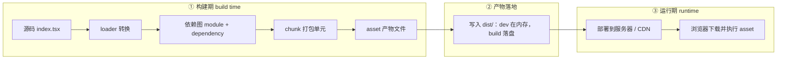

把这条主线拆成三个**时间节点**，概念就清楚了：

1. **构建期（build time）**：在你的电脑或 CI 上跑 `webpack` 的阶段。`module`、`dependency`、`chunk` 全是**这个阶段的内部概念**，是 webpack 在内存里的数据结构，你在硬盘上看不到它们。
2. **产物落地**：chunk 经过渲染变成 `asset`（真实文件）。开发模式默认把产物放在内存里、不写磁盘；只有生产构建才把 asset 写到 `dist/`。下一节把这套「dev 在内存 / 生产必须 build」展开。
3. **运行期（runtime）**：`dist/` 里的 asset 被部署到服务器或 CDN，用户访问时浏览器把它们下载下来执行。**浏览器拿到的，就是 build 出来的 asset。**

对应几个核心名词，记住这张对照表：

| 名词 | 是什么 | 属于哪个阶段 / 能否看到 |
| --- | --- | --- |
| **module（模块）** | webpack 处理的基本单位。一个 `.tsx` / `.css` / 图片经 loader 转换后都是一个 module | 构建期内部概念，看不到 |
| **dependency（依赖）** | 模块之间的引用关系（A `import` 了 B），是连接 module 的"边" | 构建期内部概念，看不到 |
| **chunk（代码块）** | 一组 module 的集合，打包器内部的"打包单元" | 构建期内部概念，看不到 |
| **asset（产物/资源）** | chunk 最终渲染成的**真实文件**，如 `main.abc123.js` | **落盘产物**，`build` 后在 `dist/`、被浏览器下载 |

> ⚠️ 厘清一组容易混淆的概念：**chunk 是打包器的"逻辑分组"（一组模块的集合），asset 是最终"输出的文件"。** 二者通常**高度对应**（一个 chunk 一般对应一个输出的 JS 文件），但不是同义词——同一个 chunk 也可能生成多个 asset（比如再拆出一个 source map 文件），而你在浏览器里请求到的是 asset。记住"逻辑分组 vs 输出文件"这个区分即可，3.5 节会细讲。

> **顺便回答几个常见疑问：**
> - **"build 后的产物就是 asset 吗？"** —— 是的。`npm run build` 写进 `dist/` 的那些真实文件（JS/CSS/图片）就是 asset。
> - **"服务器部署、浏览器拿到的也是 build 产物吗？"** —— 是的，浏览器下载的正是 build 出来的 asset。纯前端项目就是把整个 `dist/` 部署到服务器/CDN，浏览器请求哪个下载哪个。
> - **"为什么我的 Next.js 项目里也有 `chunks/` 目录？"** —— 因为 **chunk 是所有打包器的通用概念**，不是 webpack 独有。Next.js 底层也是打包器（现在默认用 Turbopack，见第五章），自然也有 chunk。但要注意区分：Next 里 `.next/static/` 下带 hash 的才是**发给浏览器的 asset**；而 `.next/server/`、`.next/build/` 下的是**构建期或跑在服务器上的产物**（如 SSR 代码、PostCSS 转换的辅助文件），并不会下发给浏览器。

## 一次打包：从 src 到浏览器

名词对照有了，先用一次完整打包把工程目录和开发体验钉死。后面 Compiler / loader / 运行时都是在解释这一趟里发生了什么。

### 目录约定：`src`、`node_modules`、`dist`、`public`

常见脚手架长这样：

| 路径 | 谁在用 | 会不会被 webpack 当模块分析 |
| --- | --- | --- |
| `src/` | 你写的源码（JS / 样式 / 图片） | 会。从入口出发，被 `import` / `require` 到的才会进依赖图 |
| `node_modules/` | npm 包装进来的第三方代码 | 会。`import 'jquery'` 和 `import './a.js'` 在依赖图里是同类边 |
| `public/` | 不需要走模块分析的静态文件 | 不会。原样复制到产物根目录（favicon、`robots.txt`、不会被改写的静态资源） |
| `dist/` | 生产构建的输出 | 这是结果，不是输入。开发阶段通常**看不到**这个目录 |

开发时你改的是 `src/`；用户线上跑的是 `dist/` 里那份优化过的结果。两边不是同一套文件，只是后者由前者变出来。

### 入口依赖树：一次打包具体在干什么

默认入口往往是 `src/main.js` 或 `src/index.tsx`。webpack 从这一个文件出发，递归收集所有依赖：`main.js` → `a.js` → `b.js`，CSS、图片只要被入口直接或间接引用，也会长到这棵树上。没挂上的文件——即使躺在 `src/` 里——打包时等于不存在。

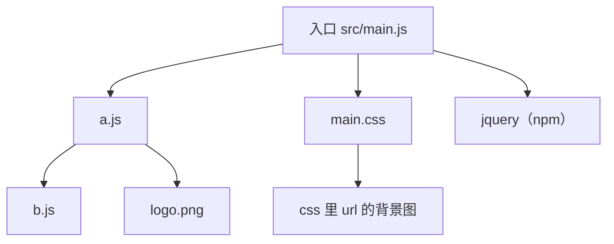

跑 `npm run build` 之后，`dist/` 里通常会出现：

- 合并压缩后的 JS（文件名带哈希，如 `app-13fa9.js`）
- 抽离出的 CSS（如 `main-d74f1.css`）
- 被复制或改名后的图片
- 一份自动生成的 `index.html`，已经写好对这些资源的引用

> 👉 **动手验证**：在最小 webpack 项目里从入口 `import` 一个 JS、一份 CSS、一张图，再故意在 `src/` 里放一个谁也不引用的 `orphan.js`。`npm run build` 后：`dist/` 里应有那三个资源，**不应**出现 `orphan.js`。

### 打包之后，日常写法变了什么

和第二章的蛮荒时代对比，变化最明显的是这三件：

- **模块语法可以混用**：同一个项目里 ESM 的 `import` 和 CommonJS 的 `require` 都能进依赖图。打包完成后模块语句消失，浏览器拿到的是普通 JS——所以"兼容不像模块"这件事，很大一块是打包器替你扛的，而不只是 Babel 在转语法。
- **前端可以直接用 npm，且不污染全局**：`import $ from 'jquery'` 会把 jQuery 打进 bundle，不再往 `window` 上挂 `$`。这和 2.1 节那种 `<script src="jquery.js">` 是两条路。
- **天然适合 SPA**：单页应用往往只有一个 HTML 壳，内容由 JS 动态创建。webpack 用 `public/index.html` 当模板，打包后自动注入带哈希的 JS / CSS 引用；模板里的 `<script>` 通常带 `defer`，先下载、等 HTML 解析完再执行，不必再把脚本硬塞到 `body` 末尾。

`public/` 和 `src/` 要分开记：

- `src/` 里的文件必须被依赖图挂上才会出现在产物里，路径也会被改写成带哈希的最终地址。
- `public/` 里除了当模板的 `index.html`，其余文件原样拷到 `dist/`，**不会**做模块解析，也不会改文件名。适合放 favicon、不会走 `import` 的静态资源。业务代码很少改这个目录。

`HtmlWebpackPlugin` 干的就是"以模板生成最终 HTML，并注入本次打包出的资源引用"。3.3 节讲 plugin 时还会再碰到它。

### 开发服务器：产物在内存里，改完即刷新

如果每次改一行都 `build` 再打开 `dist/index.html`，开发会慢得没法做。所以开发阶段跑的是 `npm run dev` / `webpack serve`：启动一个本地 HTTP 服务（默认常是 `localhost:8080`），**打包结果放在内存里，不写 `dist/`**。

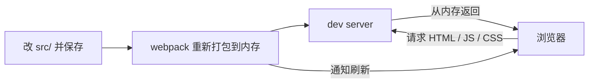

请求链很短：浏览器要 HTML → 再按页面里的引用要 JS / CSS → 全部由 dev server 从内存结果里返回。webpack 盯着 `src/`，文件一变就重新打包、刷新页面，形成「修改 → 打包 → 刷新」闭环。内存比落盘 IO 快，这是开发体验的一部分。

两件必须分清：

- **开发服务器只服务开发阶段。** 停掉进程（`Ctrl+C`）页面就没了，它也不会产出可上传的文件。
- **上线必须 `npm run build`。** 部署到服务器 / CDN 的是 `dist/` 里的真实文件。dev 和 build 不是同一条命令换个名字，而是"内存里预览"和"落盘后的生产产物"。

> 👉 **动手验证**：`npm run dev` 时看一眼项目根目录——通常没有新的 `dist/`，或里面不是这次热更新刚写出的文件。再跑一次 `npm run build`，`dist/` 才会出现带哈希的 JS / CSS 和注入好引用的 HTML。

## 3.1 整体流程与核心对象

上一节从工程目录走完一趟打包，这里看 webpack 内部怎么把那一趟跑起来。一次完整构建可以分成三个阶段：

1. **初始化**：读取配置 → 创建 `Compiler` 对象 → 注册所有插件。
2. **构建（build）**：从 `entry`（入口文件，如 `src/index.tsx`）出发，递归解析每个模块的依赖，构建出完整的**依赖图**（谁引用了谁的一张关系网）。
3. **生成（seal & emit）**：把模块按规则打包成 `chunk`（内部单元）→ 渲染成 `asset`（真实文件）→ 写入 `output` 目录（如 `dist/`）。`seal` 是"封装/定型"、`emit` 是"输出到磁盘"。

其中有两个最重要的对象，几乎所有插件都围绕它们工作：

### Compiler

`Compiler` 是**全局唯一**的对象，持有 webpack 的完整配置和整个生命周期的钩子（hooks）。你可以把它理解为"这次 webpack 进程的大管家"。它继承自 `Tapable`——这是 webpack 插件机制的基石，提供了一整套可供插件注册的事件钩子（[Plugin API 文档](https://webpack.js.org/api/plugins/)）。

一个最小的插件就是往 `Compiler` 的钩子上挂回调：

```js
class MyPlugin {
  apply(compiler) {
    // emit 钩子：在资源输出到磁盘之前触发
    compiler.hooks.emit.tap('MyPlugin', (compilation) => {
      console.log('即将输出资源，本次共', compilation.modules.size, '个模块')
    })
  }
}
```

这里有个容易说反的点：**`apply` 不是事件处理函数，而是注册入口。** webpack 在初始化阶段创建好唯一的 `Compiler` 之后，立刻对每个插件调用一次 `apply(compiler)`——整个进程里通常只跑这一回。你在 `apply` 里做的事，是往 `compiler.hooks.xxx` 上**登记**回调；真正干活，要等后面某个钩子被触发。所以它更像 `window.addEventListener`，不像 `window.onload` 本身。

登记的方式有三种，对应 [Tapable](https://webpack.js.org/api/plugins/) 的三类钩子：

| 方法 | 回调形态 | 什么时候用 |
| --- | --- | --- |
| `tap` | 同步函数 | 钩子本身是 Sync，或异步钩子里你没有 I/O |
| `tapAsync` | 最后多一个 Node 风格 `callback(err)` | 读文件、发请求，用回调收尾 |
| `tapPromise` | 返回 Promise / `async` 函数 | 同上，只是更顺手 |

同步钩子（如 `compile`）**只能** `tap`，乱写 `tapAsync` 会直接报错；异步钩子（如 `run`、`emit`）三种都能用。第一参是插件名，方便在统计和报错栈里认出是谁挂上去的。

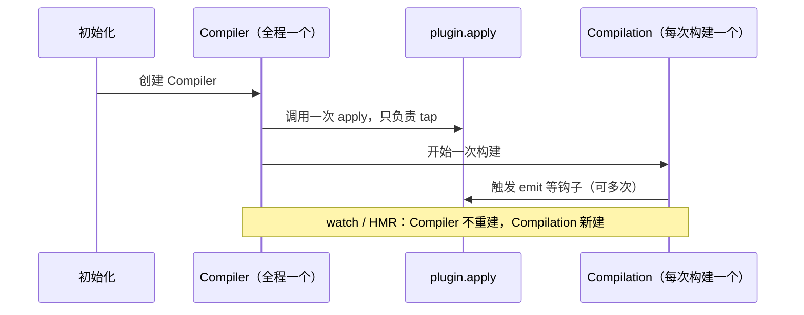

> webpack 5 更推荐在 `compilation.hooks.processAssets` 上改产物，而不是 `compiler.hooks.emit`。`emit` 还能跑，官方已标成偏旧的时机（[Compilation Hooks](https://webpack.js.org/api/compilation-hooks/)）。上面这份最小插件继续用 `emit`，只因为它最好读；新插件优先 `processAssets`。

### Compilation

`Compilation` 代表**一次具体的构建**。它持有本次构建的所有 `module`、`chunk`、`asset` 以及编译产生的信息。和 `Compiler` 的区别在于：`Compiler` 一个进程只有一个，而 `Compilation` 在 watch 模式下每次文件变更都会**重新创建一个**——每保存一次代码触发的重新编译，就是一个新的 `Compilation`。所以上面那条序列里，`apply` 不会再跑，但 `emit` / `processAssets` 会跟着每次 Compilation 再触发一遍。

整体的对象流转关系大致如下：

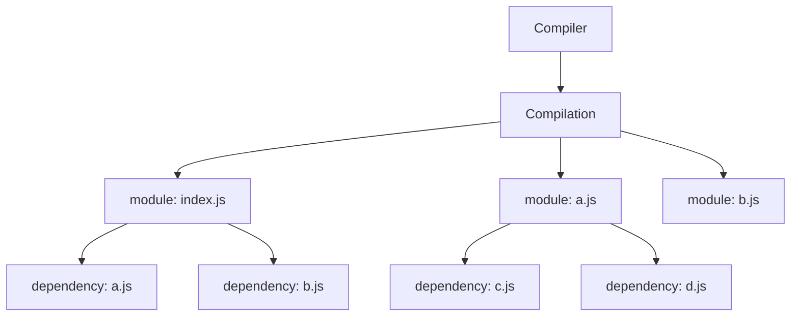

`Compilation` 从入口模块 `index.js` 开始，顺着 `dependency` 一路展开，最终得到项目所有模块。下面看这个"展开"过程具体怎么发生。

## 3.2 从 entry 到依赖图：module 与 dependency

构建阶段的核心，是**从 `entry` 递归建出依赖图**——前面「一次打包」那节从工程目录看到的那棵树，内部就是这样长出来的。这个过程可以用 webpack 内部的几个方法串起来（细节可参考作者 Tobias Koppers 的 [《How webpack works》](https://raw.githubusercontent.com/sokra/slides/master/data/how-webpack-works.pdf)）：

1. `Compilation` 从 `entry` 调用 `addEntry`，进而 `addModuleChain`——依赖链的起点。
2. `NormalModuleFactory` 用 `enhanced-resolve` 把请求路径（如 `./a.js`）解析成真实文件路径，并创建 `Module` 对象。
3. `buildModule` 调用 `module.build`：先读文件，再跑 loader 把内容转成 JS，**然后**才做 AST 解析，从树上收集 `import` / `require` 变成 `dependency`（下一节把这条时间线钉死）。
4. `processModuleDependencies` 遍历这些 `dependency`，对每一个递归回到第 2 步。

这里有一个关键优化：**相同的模块只会构建一次**。webpack 用模块的 identifier（可以理解为解析后的绝对路径）做去重——如果 `a.js` 和 `b.js` 都依赖了 `c.js`，`c.js` 只会被构建一次，第二次遇到时直接复用缓存里已存在的模块。这就是依赖图能收敛、不会无限膨胀的原因。

- **module**：一个模块，webpack 处理的基本单位。
- **dependency**：模块之间的依赖关系，是连接 module 的"边"。

module 是"点"、dependency 是"边"，两者共同构成依赖图。而把各种非 JS 文件也变成 module 的，是 loader。

## 3.3 loader 与 AST：模块转换的核心

webpack 本身只认识 JavaScript。想让它处理 `.css`、`.ts`、`.less`、图片，就得靠 **loader**——它本质是一个**文件转换器**：输入一种格式的内容，输出 webpack 能继续处理的内容。webpack 内核只负责「建依赖图、打成 chunk」；读不懂的语法、要抽 HTML、要在编译开始打一行日志，都得靠 loader / plugin 往外接。

先把 loader 插在流程的哪一格钉死，后面的「必须返回 JS」「Module parse failed」才说得通。


loader 的执行窗口是 **②**：文件已经读到内存，但 webpack **还没**开始语法分析。它拿到的是字符串，吐回去的也必须是字符串——而且最终要让 ③ 的解析器认得出。所以：

- 最左边、最后执行的那个 loader，**必须返回 JavaScript**。AST 这一步只吃 JS；你把 Less 转成 CSS 就停手，下一步会报 `Module parse failed`。
- 反过来：源码里出现 webpack 不认识的写法（TSX，或某个自定义语法），也是在 ③ 炸，提示你缺 loader，而不是依赖图建错了。

> 👉 **动手验证**：对一个 `.less` 文件只配 `less-loader`、不配后面能吐 JS 的 `css-loader` + `style-loader`（或 MiniCssExtract），`build` 时就会在解析阶段挂掉。补齐链之后，同样的文件就能进依赖图。

执行顺序是下一件容易记错的事。

**同一条 `use` 里，链是从右到左（数组里从后往前）执行的。** 比如处理 `.less`：

```js
// webpack.config.js
module.exports = {
  module: {
    rules: [
      {
        test: /\.less$/,
        // 执行顺序：less-loader → css-loader → style-loader
        use: ['style-loader', 'css-loader', 'less-loader'],
      },
    ],
  },
}
```

用图表示更直观（注意箭头方向：**内容从右边的源文件出发，依次经过每个 loader，最后从左边出来**）：


一步步看这条链子上"内容"是怎么变的：

1. **less-loader**：输入是你写的 `.less` 源码（带变量、嵌套等 Less 语法），输出是标准 CSS 字符串。
2. **css-loader**：输入上一步的 CSS。它的职责是**解析 CSS 里写的 `@import "./other.css"` 和 `url(./logo.png)`**——因为 CSS 里也会引用其他文件，css-loader 把这些引用也变成 webpack 认识的依赖（也就是让图片、其他 css 也进入依赖图），而不是原样丢给浏览器。
3. **style-loader**：输入处理好的 CSS，输出一段 **JS 代码**——这段 JS 在运行时会创建一个 `<style>` 标签把样式插进页面。为什么要变成 JS？因为 webpack 最终产物是 JS，样式得靠 JS 在运行时注入。

回扣开头那张时间线：`css-loader` 并不是让 webpack 去「读懂 CSS」，而是先把 `@import` / `url()` **改写成 JS 里的 `require` / `import`**，再交给 ③ 的 AST 收集依赖。图片能进依赖图，是 loader 先翻译、解析器后记账，两步扣在一起。

**记住两个端点：最后一个 loader（最右、最先执行）拿到的是原始文件内容；第一个 loader（最左、最后执行）必须返回 JavaScript。** 另外 loader 还有一个"从左到右"运行的 pitch 阶段，可以提前短路后续 loader，这里不展开（详见官方 [Writing a Loader](https://webpack.js.org/contribute/writing-a-loader/)）。

上面说的是**一条** `use` 数组。项目里通常有多条 `rules`，一个文件可能同时命中好几条——这时不是「哪条先写哪条先跑」这么简单，而是**先收集、再整条反向**：

1. 按 `rules` **从上到下**检查 `test`（匹配的是模块路径，如 `./src/index.js`）。
2. 命中的每条 rule，把它的 `use` **按书写顺序追加**进一个总数组。
3. 总数组形成后，**从后往前**执行——和单条 `use` 的右→左是同一条规则，只是数组更长。

```js
module.exports = {
  module: {
    rules: [
      { test: /\.js$/, use: ['loader1', 'loader2'] },
      { test: /index\.js$/, use: ['loader3', 'loader4'] },
    ],
  },
}
```

`index.js` 两条都中，总数组是 `[loader1, loader2, loader3, loader4]`，实际跑 **4 → 3 → 2 → 1**。`a.js` 只中第一条，总数组是 `[loader1, loader2]`，跑 **2 → 1**。入口和依赖模块走的链可以不一样——这是面试里很爱挖的坑。

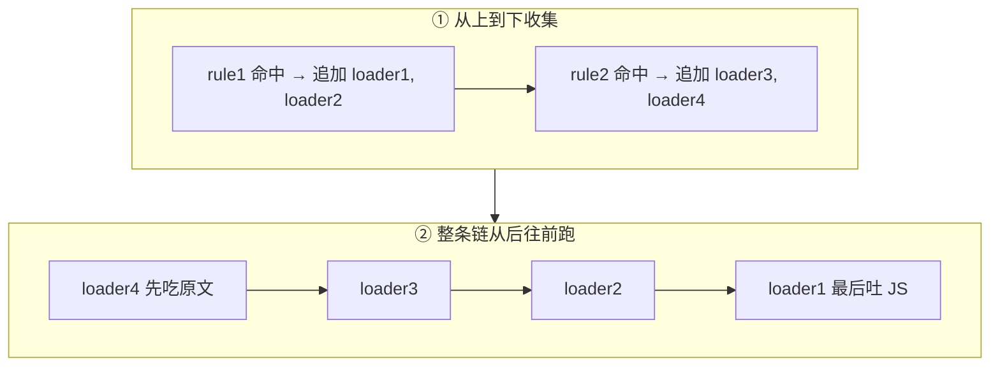

进阶一句：`enforce: 'pre' | 'post'` 会再把某些 loader 抽到整条链的最前或最后，社区里 `eslint-loader` 当年就常标 `pre`。没碰到再记即可。

**loader 函数内部的核心工作，往往还是 AST 变换。** 以最常见的 `babel-loader` 为例，它把源码交给 `@babel/parser` 解析成 **AST（抽象语法树）**，在树上做转换（如把箭头函数、可选链降级），再 `generate` 回字符串。"理解代码结构再改写"，靠的就是 AST，而不是字符串替换。注意这是 **loader 自己**在函数内部做的 AST，和前面流程图里 webpack 在 loader **之后**做的那次解析是两回事：webpack 那次是为了找依赖；Babel 这次是为了改语法。

一个最简单的 loader 其实就是一个导出函数。它跑在 **Node 里、构建期**，处理完就扔掉，**不会**打进浏览器拿到的 bundle。所以函数体里没有 `window`，`source` 才是「正在被翻译的那份源码」。

```js
// upper-loader.js：把源码里的注释标记替换掉（示意）
module.exports = function (source) {
  const { mark = '__MARK__' } = this.getOptions()
  // source 是上一个 loader 的输出（或原始文件内容）
  return source.replace(`// ${mark}`, '// processed by upper-loader')
}
```

参数不从函数签名里来，而从 **`this`（loader context）** 来。配置里可以写对象，也可以走老的查询串：

```js
// 完整对象（现在的常规写法）
{ loader: './upper-loader', options: { mark: '__MARK__' } }

// 简写：use: ['style-loader', 'css-loader']
// 更老：loader 路径后面拼 ?mark=__MARK__
```

这几条规则变过一轮，面试或翻旧文时很容易对不上。时间线比死记「现在的写法」有用：

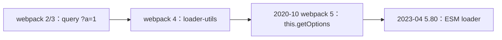

- **query 字符串**（`loader: './x?a=1'`，以及 `!!xxx-loader?a=1!./file.js` 这种内联写法）是 2/3 时代的主流。对象 `options` 后来成了正统，query 还在，但只适合传几个标量。
- **`loader-utils`**：webpack 4 官方推荐用它解析 `this.query`。它会把 `true` / `false` / `null` 收成字面量，还一度接受 JSON5（`?{arg:true}` 可以不写引号）。
- **webpack 5.0（2020-10-10）** 把 `this.getOptions([schema])` 做成内置 API，用来取代 `loader-utils.getOptions`（[迁移指南](https://webpack.js.org/migrate/5/#getoptions-method-for-loaders)、[Loader Interface](https://webpack.js.org/api/loaders/)）。解析改走 Node 原生 querystring，JSON5 那种宽松写法算废弃。
- **「loader 必须 CommonJS，不能写 `import`」**：在 webpack 4 和 5.0～5.79 基本成立——loader 由 Node `require` 加载。**2023-04-19 的 5.80.0** 才正式支持 ESM loader（[v5.80.0](https://github.com/webpack/webpack/releases/tag/v5.80.0)，PR [#15198](https://github.com/webpack/webpack/pull/15198)）：文件用 `.mjs` 或包上 `"type": "module"`。很多讲义还停在「必须 CJS」，说的是 5.80 之前的世界。
- **别和源码混**：`src/` 里的 ESM / CJS 是**被打包的代码**；loader / plugin 是**打包过程自己在 Node 里跑的代码**。前者转完给浏览器，后者从不进 bundle。

今天写新 loader：函数 + `this.getOptions()`，CJS 或 ESM 都行。翻到 `loader-utils` + `?a=1` 的旧 gist，按这条时间线对一下版本即可。

### loader 与 plugin 的区别

初学时很容易混淆，因为两者都是「扩展 webpack」。分界其实是能力边界：

- **loader**：作用在**单个文件**上，窗口就卡在「读完原文、尚未 AST」那一下，负责把 A 格式转成 B 格式。
- **plugin**：基于 `Tapable` 的事件钩子，**贯穿整个构建生命周期**。它不转换某个模块的源码，而是在某个时机做一件 loader 做不到的事。

loader 做不到的，正好就是 plugin 出场的理由：编译启动时打一行日志、在写出磁盘前再生成一份清单、改已经成型的 asset 文件名、注入 HTML——这些都不是「把这份字符串变成另一份字符串」。硬塞进 loader 里，既没有全局的 `compilation.assets`，也没有「所有模块都建完了」这个时机。

> webpack 构建过程里有很多"时机"（钩子），比如"开始编译前""每个模块构建完""所有资源即将写入磁盘时"。plugin 就是往这些时机上挂一段自己的逻辑。举几个具体例子：
> - `HtmlWebpackPlugin`：在资源生成后，以 `public/index.html` 为模板生成最终页面，并把本次打包出的、带哈希的 JS/CSS 自动引进去——也就是「一次打包」那节说的 SPA 壳；
> - `MiniCssExtractPlugin`：在合适的时机把 CSS 从 JS 里抽离成单独的 `.css` 文件（所以生产态往往不再走 `style-loader` 运行时插标签）；
> - `DefinePlugin`：在编译时把代码里的 `process.env.NODE_ENV` 替换成真实值。
>
> 回顾 3.1：`apply` 只在初始化登记一次，`tap` / `tapAsync` / `tapPromise` 才是钩子被触发时真正跑的函数。那份最小插件往 `compiler.hooks.emit` 上挂回调，就是这个模型。

一句话：**loader 管"翻译"（单个文件怎么转），plugin 管"编排"（整个流程的各个节点做什么）。**

## 3.4 资源模块：图片如何变成 base64

图片这类二进制资源，webpack 也当模块处理。webpack 5 之前常用 `url-loader`，之后内置了 **Asset Modules**，用 `type` 字段就能配置：

```js
// webpack.config.js
module.exports = {
  module: {
    rules: [
      {
        test: /\.(png|jpg|gif)$/,
        type: 'asset', // 关键：自动在 base64 内联与单独文件之间选择
        parser: {
          dataUrlCondition: {
            maxSize: 8 * 1024, // 阈值：小于 8KB 内联为 base64，否则输出成单独文件
          },
        },
      },
    ],
  },
}
```

这里的取舍很典型：**把小图片转成 base64 内联进 JS/CSS，可以省掉一次 HTTP 请求**；但 base64 编码会让体积膨胀约 33%，大图内联反而得不偿失。所以 `maxSize`（默认 8KB）就是这个权衡的开关——小图内联省请求，大图走单独文件（详见官方 [Asset Modules](https://webpack.js.org/guides/asset-modules/)）。

先厘清"内联 base64"和"单独文件"这两种结果的区别：

- **内联成 base64**：图片被编码成一长串字符串，直接写进 JS/CSS 里（形如 `data:image/png;base64,iVBOR...`）。好处是不用单独请求这张图，坏处是体积变大、且无法单独缓存。
- **单独文件**：图片仍是一个独立文件（如 `logo.a1b2.png`），HTML/CSS 里引用它的 URL。好处是能被浏览器单独缓存、体积不膨胀，坏处是多一次 HTTP 请求。

`type` 字段就是在这两种结果之间做选择，几个取值的区别：

| type 取值 | 行为 | 对应老写法 |
| --- | --- | --- |
| `asset` | 按 `maxSize` 阈值**自动二选一**（小图内联、大图单独文件） | `url-loader` + limit |
| `asset/inline` | **强制**内联成 base64 | `url-loader` |
| `asset/resource` | **强制**输出成单独文件 | `file-loader` |
| `asset/source` | 导出文件的**原始字符串内容**（如导入一个 `.txt`） | `raw-loader` |

另外 `generator.filename` 用来控制输出文件名和路径，比如 `'images/[hash][ext]'` 表示输出到 `images/` 下、用内容 hash 命名（利于长期缓存）。

## 3.5 生成阶段：chunk 与 asset

依赖图建好后，webpack 进入 **seal（封装）阶段**：把模块组织成 `chunk`，再渲染成最终 `asset` 写盘（生命周期钩子见官方 [Compilation Hooks](https://webpack.kr/api/compilation-hooks/)）。

- **chunk**：一组模块的集合，是 webpack 内部的"打包单元"。chunk 主要来自三处：每个 `entry`、动态 `import()` 切出的异步块、以及 `splitChunks` 拆出的公共块。
- **asset**：chunk 经过模板渲染后产出的**最终文件**（如 `main.abc123.js`）。

### chunk 与 asset 的关系

一个 chunk 通常渲染成一个 asset（也可能附带 source map 等额外 asset）。而当两个入口都用到同一份公共代码时，正确的处理方式**不是**让它们"共享一个文件"，而是**把公共代码抽成一个独立的 chunk，输出成独立 asset，再由多个入口/异步路径分别引用它**。看这个例子：

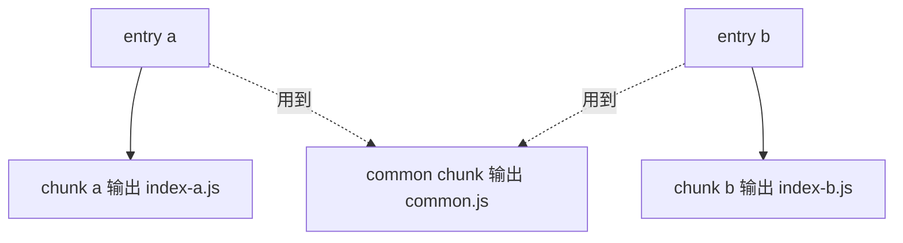

`entry a` 和 `entry b` 都依赖某段公共代码，于是它被抽成一个独立的 **common chunk**，输出为 `common.js` 这个 asset；两个入口页面各自再引用这个 `common.js`。这样公共代码只打包一份、只下载一次，还能被浏览器长期缓存。长期缓存靠的就是下一小节的 `contenthash`。至于 webpack 会不会默认抽出这张图，见下面「多 chunk 共享依赖」。

### contenthash：文件名变了，缓存才会让路

浏览器会把 JS / CSS / 图片当成静态资源做**长期缓存**（具体多久看响应头，常见是一年量级）。如果文件名永远叫 `app.js`，服务器上的内容更新了，用户还是用本地那份旧的——这就是"发版了页面却没变"的经典原因。

`contenthash` 的解法是把**内容指纹嵌进文件名**：

1. 首次请求 `/js/app-9ea93.js`，浏览器按这个 URL 缓存。
2. 源码改了，内容变，哈希变，产物变成 `/js/app-8b2c4.js`。
3. HTML 由插件自动改成引用新文件名，浏览器发现 URL 没见过，只能重新下载。

反过来说：内容没变，重新打包哈希也不变，旧缓存继续命中。开发者不用手改 HTML 里的引用——`HtmlWebpackPlugin` 每次都会注入当前这次的真实文件名。

> 注意区分三种常见占位符：`hash` 是整次构建的哈希，任一文件变了，大家可能一起变名；`chunkhash` 跟单个 chunk 绑定；`contenthash` 跟**这个文件自己的内容**绑定。要做长期缓存，优先 `contenthash`（官方 [output.filename](https://webpack.js.org/configuration/output/#outputfilename)）。

这和 3.7 把 runtime 拆成独立 chunk 是同一类问题：运行时一变，若它还和业务代码挤在同一个文件里，业务文件的 `contenthash` 也会跟着变，缓存就白做了。

### 多 chunk 共享依赖的问题

这里藏着一个经典问题：**如果多个 chunk 都引用了相同的依赖，而不做处理，这个依赖会被重复打进每个 chunk 的产物里**——既让体积冗余，又让缓存失效（改一个业务 chunk，公共库跟着变名）。

解法就是把公共依赖抽成独立 chunk，这正是 `SplitChunksPlugin` 能干的事（见 3.7；官方文档：[SplitChunksPlugin](https://webpack.js.org/plugins/split-chunks-plugin/)、[Code Splitting 指南](https://webpack.js.org/guides/code-splitting/)）。

> 注意：上面那张图是**目标形态**，不是 webpack 5 的默认结果。默认 `chunks: 'async'`，只处理动态 `import()` 切出来的块；两个**同步入口**共用的 jquery，并不会自动变成图里的 `common.js`。要抽同步公共库，得把 `chunks` 改成 `'all'`，或自己写 `cacheGroups`。3.7 会把这个默认钉死。

### chunk 的状态

从运行时的视角看，chunk 还有"加载状态"。webpack 用一个 `installedChunks` 对象记录每个 chunk 当前是：**未加载**、**加载中（一个 Promise）**、还是**已加载（标记为 0）**。这套状态机是异步加载的关键，下一节会看到它。

## 3.6 webpack 运行时：产物到底长什么样

很多人以为 webpack 的产物只是"把模块代码拼在一起"，其实不然——它还注入了一套**运行时（runtime）**，用来在浏览器里实现一个模块系统。理解这套运行时，才算真正理解 webpack。

### 项目初始化：三个核心结构

打开打包后 `dist/` 目录里的 `main.js`（也就是前面说的 **asset**——浏览器真正下载执行的那个文件），会看到三个关键东西：

```js
// 1) __webpack_modules__：除入口外的所有模块，key 是模块 id
var __webpack_modules__ = [
  ,
  /* 1 */ (module) => {
    module.exports = (...args) => args.reduce((x, y) => x + y, 0)
  },
]

// 2) __webpack_module_cache__：缓存已加载过的模块，保证模块只执行一次
var __webpack_module_cache__ = {}

// 3) __webpack_require__：webpack 自实现的 require
function __webpack_require__(moduleId) {
  // 命中缓存直接返回
  var cachedModule = __webpack_module_cache__[moduleId]
  if (cachedModule !== undefined) {
    return cachedModule.exports
  }
  // 未命中：创建 module 对象并放进缓存
  var module = (__webpack_module_cache__[moduleId] = { exports: {} })
  // 执行模块函数，把 module / exports / require 传进去
  __webpack_modules__[moduleId](module, module.exports, __webpack_require__)
  // 返回模块导出
  return module.exports
}
```

三者配合，就还原了一套 CommonJS 式的模块系统：`__webpack_modules__` 存代码、`__webpack_module_cache__` 保证单例、`__webpack_require__` 实现"按需执行 + 缓存"。

> 这段代码是概念化的整理版，真实产物会更啰嗦（带很多 `/******/` 注释和边界处理），但核心逻辑就是这三块。想亲眼看的话，建一个最小 demo（`index.js` + 一个 `a.js`），跑 `npx webpack`，打开 `dist/main.js` 就能对照。

### 入口模块与 IIFE

入口 chunk 的代码会被包在一个 **IIFE（Immediately Invoked Function Expression，立即执行函数表达式）**里——就是"定义完立刻就执行"的匿名函数 `(() => { ... })()`，作用是给这段代码开一个独立作用域，避免里面的变量污染全局。入口逻辑往往就是一句 `__webpack_require__` 触发整条依赖链：

```js
;(() => {
  // 这个入口需要用 IIFE 包裹，以便和 chunk 里其他模块隔离
  const sum = __webpack_require__(1)
  console.log(sum(3, 8)) // 11
})()
```

### 异步 chunk 加载（以 webpack 4 风格运行时为例）：`__webpack_require__.e` 与 `webpackJsonpCallback`

> 说明：运行时的**具体产物格式会随 webpack 大版本和配置（`target` 等）变化**，下面这套 `webpackJsonpCallback` 是 **webpack 4 时代**较易读的形式，用来讲清原理最合适；webpack 5 的真实格式略有不同（见本节末尾）。原理是相通的：**挂起 Promise → JSONP 加载 chunk → 回调里合并模块并 resolve**。

当你写 `import('./async-module')`（动态导入，用于路由懒加载、按需加载）时，webpack 会把它编译成 `__webpack_require__.e(...)`——`.e` 就是 "ensure chunk"，负责保证某个异步 chunk 被加载，返回一个 Promise：

```js
// 动态加载模块
__webpack_require__
  .e('asyncChunk')
  .then(__webpack_require__.bind(__webpack_require__, /* moduleId */ 42))
  .then((asyncModule) => {
    // 异步模块加载完成后使用
  })
```

> 这里返回 Promise、`.then` 链式调用的机制，如果不熟，可以先看这篇：[Promise手撕教程](/blog/promiseTutorial)。下面出现的"挂起 Promise、稍后 resolve"就是同一套东西。

**先解释 JSONP 是什么。** 异步 chunk 是通过 JSONP 的方式加载的。JSONP 的核心套路是：**动态往页面插入一个 `<script src="异步chunk.js">` 标签**，浏览器下载并执行这个 JS；而这个 JS 文件的内容被设计成"执行时会主动调用一个约定好的全局函数"，从而把数据交回给主程序。webpack 正是用这个套路加载异步 chunk——异步 chunk 文件被加载后，会调用全局的 `webpackJsonpCallback` 把自己的模块交出来。

先用**伪代码**理解 `webpackJsonpCallback` 干的两件事（真实源码更繁琐，看懂这个骨架就够了）：

```js
// 伪代码：异步 chunk 加载完成后，会调用这个回调，data 里带着 [chunk的id列表, 新模块]
function webpackJsonpCallback(data) {
  const [chunkIds, moreModules] = data
  const resolves = []

  // 第一件事：把这些 chunk 标记为"已加载"，并收集它们挂起的 resolve 函数
  for (const chunkId of chunkIds) {
    if (installedChunks[chunkId]) {
      resolves.push(installedChunks[chunkId][0]) // 取出之前挂起的 resolve
    }
    installedChunks[chunkId] = 0 // 0 表示"已加载"
  }

  // 第二件事：把异步 chunk 带来的新模块，合并进全局模块表
  for (const id in moreModules) {
    modules[id] = moreModules[id]
  }

  // 收尾：依次 resolve 掉挂起的 Promise —— 于是上面那个 .then 就能继续执行了
  resolves.forEach((resolve) => resolve())
}
```

下面是接近真实产物的版本（逻辑和上面伪代码一一对应）：

```js
function webpackJsonpCallback(data) {
  var chunkIds = data[0]
  var moreModules = data[1]
  var moduleId,
    chunkId,
    i = 0,
    resolves = []
  for (; i < chunkIds.length; i++) {
    chunkId = chunkIds[i]
    if (Object.prototype.hasOwnProperty.call(installedChunks, chunkId) && installedChunks[chunkId]) {
      resolves.push(installedChunks[chunkId][0])
    }
    // 将当前 chunk 标记为已加载
    installedChunks[chunkId] = 0
  }
  // 把异步 chunk 的模块合并进入口的 modules 中
  for (moduleId in moreModules) {
    if (Object.prototype.hasOwnProperty.call(moreModules, moduleId)) {
      modules[moduleId] = moreModules[moduleId]
    }
  }
  // 对 __webpack_require__.e 挂起的 Promise 依次 resolve
  while (resolves.length) {
    resolves.shift()()
  }
}
```

整个异步加载的时序可以这样看：

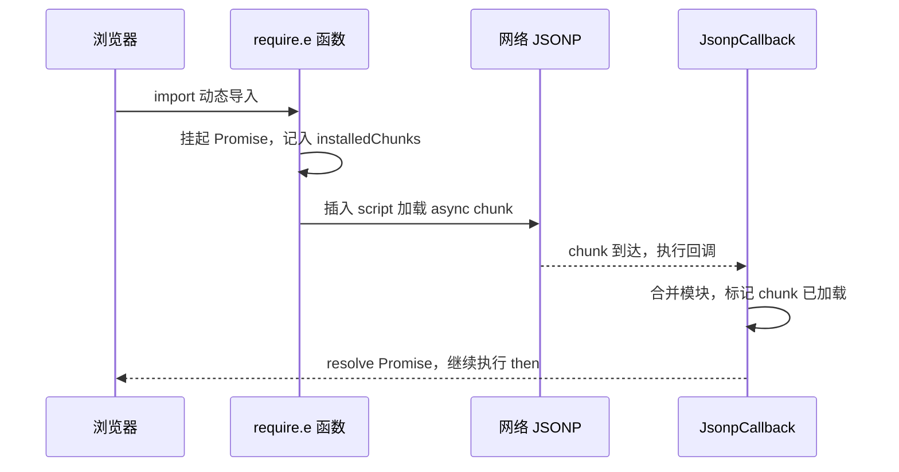

> 👉 **动手验证**：自建一个带动态 `import()` 的 webpack 最小项目，`npm install && npm run build` 后，打开切出来的异步 chunk 文件（形如 `dist/[name].[hash].chunk.js`），开头就是下面这段真实的 webpack 5 格式；入口 `dist/main.[hash].js` 和 `dist/runtime.[hash].js` 里能看到 `__webpack_require__` 的真身。（本文的下述产物是实测得到的。）

**webpack 5 的真实格式**：webpack 5 不再用 `webpackJsonpCallback` 这个具名全局函数，而是往一个全局数组 `self.webpackChunk_xxx` 上 `push`，由运行时重写这个数组的 `push` 方法来接管新到的 chunk。异步 chunk 文件大致长这样：

```js
// webpack 5 浏览器产物：异步 chunk 文件（示意）
;(self['webpackChunk_my_app'] = self['webpackChunk_my_app'] || []).push([
  ['asyncChunk'], // chunkIds
  {
    42: (module, exports, __webpack_require__) => {
      /* 该异步 chunk 里的模块代码 */
    },
  },
])
```

思路和 webpack 4 完全一致（chunkIds + 新模块 → 合并 → resolve 挂起的 Promise），只是"回调"从一个具名函数变成了"重写数组 `push`"。不同 `output.chunkFormat` / `target` 下格式还会再变，所以**不要把某一种产物当成唯一实现**——理解原理比记住某版代码更重要。

## 3.7 webpack 最佳实践

理解了原理，工程上就有的放矢了。这一节先讲为什么要拆、怎么看体积，再顺着手动分包（Dll）到自动分包（SplitChunks），最后到摇树和压缩。

先说结论：**先测量，再优化。** 分包、摇树、压缩解决的是三件不同的事——分包决定「切成几个文件、什么时候下载」；摇树决定「模块之间哪些导出根本不该打进去」；压缩决定「打进去的那些字符怎么再变短」。source map 是压完之后怎么调试。

### 为什么要分包

3.5 已经说过：多入口共用的代码，正确做法是抽成独立 chunk，而不是让每个入口各打一份。这里把「为什么值得抽」钉死。

假设 `pageA` 和 `pageB` 都 `import 'jquery'`：

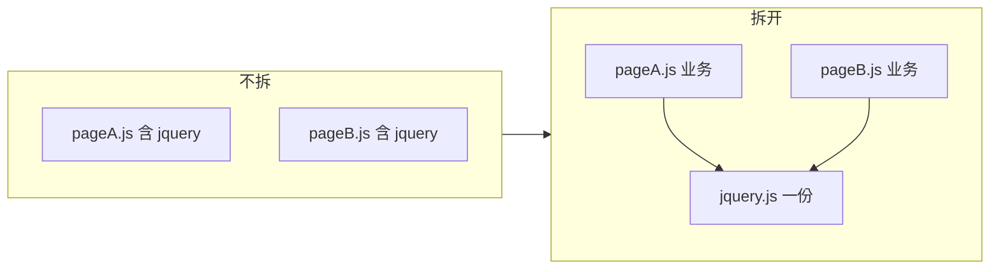

不拆的代价有三层：

1. **体积重复**：两个页面各带一份同样的库，用户切页等于再下一遍。
2. **缓存失效**：业务代码一改，整份含 jquery 的文件 `contenthash` 跟着变，半年不动的库也被重新下载。
3. **构建浪费**：同一份库被编译进多个 chunk。

所以分包的目的不是「文件越多越好」，而是：**去重、让不常变的代码吃长期缓存、业务源码不用改。** 小工具函数、天天改的业务代码，硬拆只会多请求、收益很小。

旧讲义里常出现「webpack 默认不分包」。那是 webpack 3 及更早、还在用 `CommonsChunkPlugin` 且得自己开的世界。**webpack 4 起内置 `SplitChunksPlugin`，默认就会拆异步 chunk**——只是默认比较克制，所以「没写配置」不等于「完全没拆」。

### 构建产物分析：webpack-bundle-analyzer

优化的第一步是看清楚体积花在哪。[webpack-bundle-analyzer](https://github.com/webpack-contrib/webpack-bundle-analyzer) 把每个 chunk / 模块画成矩形树图：面积越大，这块越该先动手。

```js
const { BundleAnalyzerPlugin } = require('webpack-bundle-analyzer')

module.exports = {
  plugins: [new BundleAnalyzerPlugin()],
}
```

怎么读图，比怎么挂插件重要：

| 开关 | 看的是什么 |
| --- | --- |
| **stat** | webpack 统计里、压缩前的体积 |
| **parsed** | 产物文件被解析后的实际体积（更接近磁盘上的 JS） |
| **gzipped** | 再做 gzip 之后的近似传输体积 |

默认 `server` 模式会起一个本地页；也可以 `analyzerMode: 'static'` 落一份 HTML。矩形是**相对大小**，别只看色块比例、不看旁边的 KB 数字——gzip 之后 50KB 和 500KB 观感差很多，图上可能都「挺大」。

先点最大的那几块：常见是整包 lodash / moment、没拆开的第三方库、某个路由把重图表库同步引进来了。然后才决定拆包、换 `lodash-es` / 按路径引入，还是改成 `import()`。analyzer 自己不优化，只提供决策依据。

图上的 gzip 数字和分包也是两件事：分包改变「下几个文件」；gzip / Brotli 改变「每个文件在网上有多胖」。传输层压缩通常由 CDN / Nginx 做，不一定要 webpack 再吐 `.gz`。

> 👉 **动手验证 + 待补图**：装上插件后 `npm run build`，对照 `stat` / `parsed` / `gzipped` 三档看最大矩形是谁。（📌 一张可视化截图待后续补到这里。）

### 手动分包：Dll（科普）

在 SplitChunks 成为默认之前，社区用 **DLL（Dynamic Link Library）** 这套「先打一份公共库、业务构建再引用」的办法。面试还可能问到，新项目不必再配。

三步：

1. 单独一份配置（如 `webpack.dll.config.js`），`entry` 写成 jquery / lodash，`output.library` 暴露全局变量。
2. `DllPlugin` 打出 `dll/jquery.js`，并生成 **manifest**（模块路径 → 全局变量名）。
3. 业务构建用 `DllReferencePlugin` 读 manifest：遇到这些模块就**不再打进 bundle**，改成读已经挂上的全局变量。HTML 还得自己先写 `<script src="./dll/jquery.js">`。

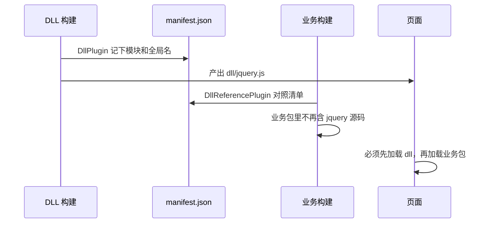

版本线：

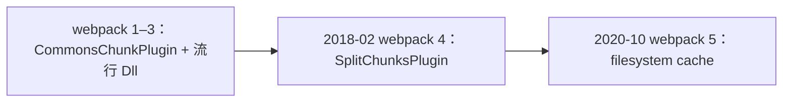

- **webpack 3 前后**：Dll 解决两件事——大库只编一次（加速二次构建）、产物拆开利于缓存。`CommonsChunkPlugin` 负责从多个入口抽公共代码，配置绕、和异步 chunk 容易打架。
- **webpack 4（2018-02）**：用内置的 `SplitChunksPlugin` 取代 `CommonsChunkPlugin`（[文档](https://webpack.js.org/plugins/split-chunks-plugin/)）。按体积和引用次数自动拆，不必再点名「把 jquery 抽出去」——但**默认只拆异步 chunk**，同步入口里的大库要把 `chunks` 改成 `'all'`，下一节把这个默认钉死。
- **webpack 5（2020-10）**：`cache: { type: 'filesystem' }` 把「大库别每次重编」这件事做掉了大半。Dll 还在（[DllPlugin](https://webpack.js.org/plugins/dll-plugin/)），但新项目用自动分包 + `contenthash` 即可。

局限也是它退出舞台的原因：要维护第二份配置、HTML 手动引脚本、更新库要重打 DLL 和 manifest、复杂依赖链很难点名。**今天把它当历史，不当作业。**

### 拆包优化：SplitChunksPlugin

现在的正统是 `optimization.splitChunks`（底层就是 `SplitChunksPlugin`）。先记住默认，再看下面那份「为了演示才写得很激进」的配置，才不会以为官方默认就是 `chunks: 'all'`。

webpack 5 的默认大致是（官方 [SplitChunksPlugin](https://webpack.js.org/plugins/split-chunks-plugin/)）：

```js
{
  chunks: 'async', // 只处理动态 import() 切出来的块
  minSize: 20000, // 约 20KB 以下不独立成文件
  minChunks: 1, // 顶层默认：被 1 个 chunk 用到就可能拆
  maxAsyncRequests: 30,
  maxInitialRequests: 30,
  cacheGroups: {
    defaultVendors: {
      test: /[\\/]node_modules[\\/]/,
      priority: -10,
      reuseExistingChunk: true,
    },
    default: {
      minChunks: 2, // 业务公共代码：至少被 2 个 chunk 引用
      priority: -20,
      reuseExistingChunk: true,
    },
  },
}
```

几条容易对不上号的：

- **`chunks` 默认 `'async'`。** 只有同步入口、没有 `import()` 时，你会觉得「没拆」。示例里写 `'all'`，是为了让同步的 jquery 也能抽出来。三个取值：`async` 只拆异步块；`initial` 只拆首屏同步加载的那些 chunk（不含 `import()`）；`all` 两边都拆。生产里多入口 / 要抽 vendor，才常改成 `all`。
- **`minSize`**：webpack 4 默认约 **30KB**（旧讲义那个数字），webpack 5 改成 **20KB**。小于阈值的公共模块宁可重复，也不换一次 HTTP。
- **`minChunks` 有两层。** 顶层默认是 1；真正管「业务公共代码」的是默认组 `default` 的 `minChunks: 2`。所以「两个入口都引用的小工具函数没被拆」——先看体积够不够 `minSize`，再看是不是落进了 `default` 组。
- **`maxSize`**：超过就尝试再切，但**切割单位是模块**，单个 200KB 的 jquery 切不开。拆多了不减传输量，只加请求，实际意义有限。
- **默认缓存组**：`defaultVendors` 吃 `node_modules`（priority -10），`default` 吃被 2 个 chunk 引用的其余模块（-20）。webpack 4 里前者叫 `vendors`，**5 改名为 `defaultVendors`**，避免和用户自己写的 `vendors` 撞名。缓存组继承顶层选项，也可以覆盖；设成 `false` 就关掉该默认组。

下面这份配置是**为了讲解逐字段列出的，`minSize` / 请求数上限刻意缩小到不合理的程度**（只为触发拆分方便演示），**请勿照抄到生产**：

```js
// ⚠️ 演示用配置：数值为方便演示而刻意缩小，非推荐默认值
module.exports = {
  optimization: {
    splitChunks: {
      chunks: 'all', // 作用范围：all（全部）/ initial（同步）/ async（异步）
      minChunks: 2, // 一个模块至少被 2 个 chunk 引用，才会被拆出去（不是"被引用 2 次"）
      maxInitialRequests: 2, // 入口起点的最大并行请求数
      maxAsyncRequests: 2, // 按需加载时的最大并行请求数
      minSize: 100, // 生成 chunk 的最小体积（字节）——演示值极小，生产别这么写
      maxSize: 100, // 超过则尝试进一步拆分——同上，演示值
    },
  },
}
```

> ⚠️ 两个容易踩的点：
> - `minChunks: 2` 的准确含义是**"这个模块至少被 2 个 chunk 引用才拆分"**，不是"被引用超过 2 次"。
> - `minSize: 100` / 请求数上限设成 2 这类值只是为了演示时容易触发拆分，**照抄到生产会拆出一堆过小的碎文件、适得其反**。

实际项目里，更推荐直接用 webpack 5 的默认值，只按需覆盖。多入口或要抽同步 vendor 时，常只改这一处：

```js
// 生产可参考：多数值用 webpack 默认，只做必要覆盖
module.exports = {
  optimization: {
    splitChunks: {
      chunks: 'all', // 覆盖默认的 async，让同步入口里的公共库也能抽
      // minSize 默认 20KB；maxInitialRequests / maxAsyncRequests / minChunks 一般不用改
    },
  },
}
```

### 常见分包策略

上一节默认组里已经出现过这两件事，这里把社区叫法钉死：

- **vendor**：指第三方依赖（`node_modules` 里的 React、lodash 等），因为它们不常变，适合单独打成一个包长期缓存。"vendor" 是社区约定俗成的叫法，意为"供应商代码"。
- **`cacheGroups`**：`splitChunks` 里用来**定义"分组规则"**的字段。默认的 `defaultVendors` / `default` 就是两组；你也可以再写自己的规则，告诉 webpack"符合条件的模块归到哪个 chunk、叫什么名字"。

一个典型配置长这样：

```js
module.exports = {
  optimization: {
    splitChunks: {
      chunks: 'all',
      cacheGroups: {
        // 规则一：所有 node_modules 里的模块 → 打成 vendors 包
        vendors: {
          test: /[\\/]node_modules[\\/]/, // 匹配路径含 node_modules 的模块
          name: 'vendors',
          priority: 10, // 优先级：一个模块同时命中多条规则时，用优先级高的
        },
        // 规则二：被 2 处以上引用的业务代码 → 合并成 common 包
        common: {
          minChunks: 2,
          name: 'common',
          priority: 5,
        },
      },
    },
  },
}
```

这是在**覆盖默认组**，不是从零发明：`priority` 比默认的 -10 / -20 高，会抢走本该进 `defaultVendors` / `default` 的模块。`name: 'vendors'` 会把命中的第三方收成**一个**文件；默认组不写死 `name` 时，文件名往往带上关联的入口，粒度更碎、缓存更细，也更容易请求变多。

对应到实践中通常这样设置：

- **针对 `node_modules`**：用 `cacheGroups` 把第三方依赖单独打成 vendor 文件，避免业务代码变更影响 npm 包的缓存（业务代码天天改，但 React 版本很久才动一次，分开打包，React 那个文件的 hash 就能长期不变）。`maxSize` 可以设阈值防止 vendor 过大，但切不开单个大模块。
- **针对业务代码**：设一个 common 分组，通过 `minChunks` 把使用率较高的资源合并为 common；首屏用不上的代码尽量用异步 `import()` 引入（见后面「懒加载」）。
- **runtime chunk**：把 `optimization.runtimeChunk` 设为 `true`（或 `{ name: 'runtime' }`），将 webpack 运行时代码拆成独立资源。这样运行时变动就不会牵连其他 chunk 的 `contenthash`，缓存更稳定。

### 两种分包思路：split-by-module vs split-by-experience

再往上抽象一层，分包其实有两种思路：

- **split-by-module（按模块拆）**：按 `node_modules`、按包名、按引用次数机械地拆（vendor、common）。实现简单，但**拆得过细**会导致请求数增多，**拆得过粗**又会让缓存命中率变低。
- **split-by-experience（按体验拆）**：按路由、首屏、交互优先级、加载时机（同步首屏 vs 异步次要）来拆，目标是"首屏最小、其余按需"，更贴近真实用户体验。

实践中两者常结合：用 split-by-module 处理第三方库，用 split-by-experience 规划业务代码的加载节奏。

### 懒加载：和分包怎么配合

运行时怎么把异步 chunk 拉回来，3.6 已经用 JSONP / `webpackChunk` 讲过。这里只补工程侧：`import()` 就是 split-by-experience 的落点。

```js
button.addEventListener('click', async () => {
  const { chart } = await import(/* webpackChunkName: "chart" */ './chart')
  chart.render()
})
```

- webpack 看到动态 `import()`，会切出 **async chunk**；浏览器先跑主包，用户点了再下载。这和「编译期把公共库抽到 vendor」是两件事：一个决定**何时加载**，一个决定**别重复打包**。
- 默认 `chunks: 'async'` 吃的就是这些异步块——所以你即使不写 `splitChunks`，懒加载切出来的大依赖，仍然可能被再抽一层。
- `/* webpackChunkName: "chart" */` 是 webpack 的魔法注释，产物文件名带上可读前缀，analyzer 里也好认。它不是语言标准。
- `import()` 早年是提案，**2020 年进了 ES2020**，现在就是标准动态导入，返回 Promise。旧讲义写「草案」是当时的世界。

和 Tree Shaking 打架的典型坑：`await import('lodash')` 会把整个 lodash 打进那个异步块，静态分析看不到你只用了其中一个函数。做法是**自己写一个只具名导出用到的函数的中间模块**，再动态导入这个中间模块；或者继续用 `import debounce from 'lodash/debounce'` 这种路径级按需，而不是动态导入整个库。

> 👉 **动手验证**：给入口加一个点击后才 `import('./heavy')` 的按钮，`npm run build` 后 `dist/` 里应多出一个独立 chunk；DevTools 的 Network 里，这个文件要等点击之后才出现请求。

### Tree Shaking：模块之间的无用导出

先说和压缩的分工：**压缩处理一个模块内部**（空白、短变量名、确定走不到的分支）；**Tree Shaking 处理模块之间**（`myMath` 导出了 `add` / `sub`，入口只 `import` 了 `add`，`sub` 不该出现在产物里）。生产构建里两者接在一起：webpack 先标记，压缩器再删。


依赖 ESM 的静态结构：`import` / `export` 必须在模块顶层、路径必须是字符串字面量、绑定不能重新赋值。CommonJS 的 `require(可变路径)`、条件 `require`，构建期没法确定导出表，一般摇不掉。这就是「同样一个 lodash，CJS 版整包进来，`lodash-es` 才能按函数摇」的原因。

生产模式默认会打开 `optimization.usedExports`（以及 `sideEffects` 分析）。打开之后，产物里常能搜到 `/* unused harmony export sub */` 这类注释——**标记还不是删除**。真正拿掉字符，要等 Terser（或现在的 SWC minify）做 Dead Code Elimination。所以开发模式关掉压缩时，你会觉得「摇树没生效」。

写法上的差别很大：

```js
// 好摇：具名导出，用哪个拿哪个
export function add() {}
export function sub() {}
import { add } from './myMath'

// 难摇：默认导出一个对象，运行时还可能 obj[name]()
export default { add, sub }
```

`package.json` 的 `sideEffects` 是另一道闸：即使没人用这个模块的导出，只要它**进模块就有副作用**（改全局、导入 CSS、打 polyfill），就不能整文件删掉。`"sideEffects": false` 是在对打包器说「这些文件除了导出都没副作用」；更稳的是数组列出例外，如 `["*.css", "./src/polyfill.js"]`。标错了会静默丢样式或 polyfill。

webpack 4 时代有个 `webpack-deep-scope-plugin`，用来补「函数内部其实没用到的依赖还被留下」——作者后来直接写：**别用了，会弄坏代码，请上 webpack 5。** webpack 5 的内部图分析已经覆盖它想做的事。CSS 也不能当无副作用 JS 来摇；旧讲义里的 PurgeCSS 是另一套「对照 HTML / JS 字符串删选择器」，和 ESM 摇树不是同一条路，CSS Modules 的哈希类名会让它误伤，这里不展开。

> 👉 **动手验证**：一个文件 `export` `add` / `sub`，入口只 `import { add }`，`mode: 'production'` 构建后搜 `sub` 的函数体，不应再出现。把导出改成 `export default { add, sub }` 再打一次，往往就删不干净。

### 代码压缩：模块内部变短

生产环境 `mode: 'production'` 会打开 `optimization.minimize`，开发默认不压——否则你在 DevTools 里看到的全是一行。压缩同时干两件：减小体积、把标识符搅短（提高阅读成本，不是加密）。

工具史：


UglifyJS 老版本吃不了 ES6，官方建议先 Babel 再压。社区 fork 出 uglify-es，维护跟不上，**Terser** 从那条线接着做。webpack **4.26.0（2018-11-19）** 把默认压缩器换成 Terser（[v4.26.0](https://github.com/webpack/webpack/releases/tag/v4.26.0)）；webpack 5 继续内置，一般不用自己再装一遍。

Terser 里两个开关别混：

- **compress**：删空白、合并语句、常量折叠、**DCE**（`return` 后面的代码、`if (false)` 分支、标记为纯的未使用调用）。
- **mangle**：把 `userName` 收成 `a`。可以 `reserved` 保住几个全局名。

「纯函数」才会被当成可删 / 可折叠：相同输入相同输出、不改外部。`fetch`、写 `localStorage`、改传入对象，都有副作用，默认不敢动。源码里可用 `/*#__PURE__*/` 提示某次调用没副作用。

CSS 要另接压缩器。webpack 4 常用 `optimize-css-assets-webpack-plugin`；**webpack 5 请换官方的 [css-minimizer-webpack-plugin](https://webpack.js.org/plugins/css-minimizer-webpack-plugin/)**，旧插件依赖的钩子已经废弃。

```js
const CssMinimizerPlugin = require('css-minimizer-webpack-plugin')

module.exports = {
  optimization: {
    minimize: true,
    minimizer: [
      '...', // webpack 5：保留默认的 Terser，不要把 JS 压缩弄丢
      new CssMinimizerPlugin(),
    ],
  },
}
```

注意：一旦自己写 `minimizer` 数组，就等于接管整份压缩名单。漏掉 `'...'` 或不显式放回 `TerserPlugin`，JS 可能不再压缩。

摇完再压：Tree Shaking 标出来的 unused export，要靠这一步从文件里消失。压完之后怎么调试，就是下一节的 source map。

### source map：压缩代码怎么映回源码

3.5 提过：一个 chunk 除了 JS asset，**配置打开时**常常还多出一个 `.map` 文件。压缩、混淆之后，变量变成 `e`、`n`，多行折成一行，报错栈若只指向 `app-36067.js:1:38421`，人眼没法看。

**source map（源码地图）** 就是这份对照表。打包时 webpack 生成同名的 `.map`（如 `app-36067.js.map`），里面用 VLQ 编码记录"产物第几列 ↔ 源码哪一行"，浏览器还能从 `sourcesContent` 读到原始源码。运行的仍是压缩后的文件；DevTools 发现有 map，就把红字映射回 `src/main.js` 第 26 行。


开发模式默认会开某种 source map（webpack 常是 `eval`，代码嵌在产物里，**不一定**落成 `.map` 文件），不然打包后的报错几乎没法对回你写的那一行。生产环境要单独做决定：

- **打开**：线上报错能还原到源码，排障快；代价是多一份体积，且 map 若可公开访问等于把源码交出去。
- **关掉或单独上传到监控平台**：更常见。`devtool: false` 或不把 `.map` 部署到 CDN，只交给 Sentry 这类服务。

配置入口是 `devtool`（官方 [Devtool](https://webpack.js.org/configuration/devtool/)）。开发用 `eval-cheap-module-source-map` 一类够快的；生产若要生成 map，用 `source-map` 并确保它不会被随便下载。

> 👉 **动手验证**：生产模式默认 `devtool: false`，光 `npm run build` **不会**出现 `.map`。加上 `devtool: 'source-map'` 再构建，`dist/` 里才会成对出现 `.js` 和 `.js.map`。用压缩后的文件制造一个运行时错误，打开 DevTools 的 Sources / 调用栈——有 map 时应跳到你的源码行，删掉 `.map` 再刷新，栈会停在产物文件上。

### 构建性能优化：缓存与并行

除了产物优化，构建速度本身也能优化（官方 [Build Performance](https://webpack.js.org/guides/build-performance/)）。前面 Dll 想加速的「大库别每次重编」，今天优先靠持久化缓存，而不是再维护一份 dll 配置。

**持久化缓存**：webpack 5 内置了文件系统缓存，把模块和 chunk 的编译结果落盘，二次构建直接复用：

```js
module.exports = {
  cache: {
    type: 'filesystem', // 落盘缓存；对比 'memory' 只在当次进程有效
  },
}
```

**并行提升 CPU 利用率**：更严谨地说——**同一条 loader 链内部是有顺序的（串行）**，但 webpack 对不同模块的构建本身存在一定并发；瓶颈更多在于 JS 单线程下 CPU 密集的转换（如 Babel 解析大量文件）。可以用 [thread-loader](https://webpack.js.org/loaders/thread-loader/) 把耗时的 loader 放进独立的 worker 池并行跑：

```js
module.exports = {
  module: {
    rules: [
      {
        test: /\.js$/,
        use: [
          'thread-loader', // 放在最前面：后续 loader 会在 worker 池里并行执行
          {
            loader: 'babel-loader',
            options: { cacheDirectory: true }, // babel 自身也缓存转译结果
          },
        ],
      },
    ],
  },
}
```

> 注意 `thread-loader` 要放在 loader 链的**最前面**（即最先 pitch、最后执行），它之后的 loader 才会被放到 worker 池里。**是否真有收益，取决于"转换本身的 CPU 成本"与"开 worker + 进程间通信的开销"谁大**——小项目里通信开销可能反而拖慢，所以别无脑加。

### 面试高频优化清单

上面讲的拆包、摇树、压缩、缓存是重点，这里再收成一份**面试速查**，分两类记忆：

**一、减小产物体积（优化加载）**

- **Tree Shaking**：见上文「Tree Shaking」。抓 ESM 静态结构、`usedExports` 只是标记、真正删除靠压缩器、`sideEffects` 别标错。
- **代码分割 + 路由懒加载**：见上文「懒加载」。动态 `import()` 按路由 / 组件拆，首屏只加载核心 chunk——最常被问、收益最大。
- **按需引入**：像 lodash、组件库不要整包 `import`，只引用到的部分（`import debounce from 'lodash/debounce'`），这是路径级少打进去；摇树是导出级再删。
- **压缩**：见上文「代码压缩」。JS 默认 Terser，CSS 用 `css-minimizer`；传输层再开 **Gzip/Brotli**（CDN / Nginx，或 `compression-webpack-plugin` 预生成 `.gz`）。
- **`contenthash` 长期缓存**：产物名带内容 hash，内容不变文件名不变，浏览器缓存长期命中。

**二、加快构建速度（优化构建）**

- **缩小 loader 处理范围**：用 `include` / `exclude` 精确命中（如 `exclude: /node_modules/`），别让 babel 去转译第三方库。
- **持久化缓存**：`cache: { type: 'filesystem' }`（前面讲过）+ `babel-loader` 的 `cacheDirectory`。
- **多进程**：`thread-loader` 并行跑 loader，`TerserPlugin` 的 `parallel` 并行压缩。
- **`DllPlugin`（了解即可）**：见「手动分包」科普。webpack 5 有了持久化缓存后必要性已下降，别当现行方案。
- **`resolve` 优化**：合理配置 `extensions`（少写后缀）、`alias`（直接指向库的产物），减少模块查找耗时。

> 一个高频追问：**"这么多手段，先做哪个？"** 通常先用 `webpack-bundle-analyzer` 定位体积大头，再针对性地拆包 / 按需引入 / 懒加载——**先测量，再优化**，别上来就堆配置。

### 三类 chunk 概念梳理

最后统一一下前面出现的三个 chunk 概念：

- **initial chunk**：入口同步加载的 chunk（`entry` 直接产出）。
- **async chunk**：动态 `import()` 产生的、运行时按需加载的 chunk。默认 `splitChunks.chunks: 'async'` 处理的就是这类。
- **runtime chunk**：webpack 运行时代码单独拆出的 chunk（`runtimeChunk`）。

`SplitChunksPlugin` 抽出来的 vendor / common 也是 chunk，只是来源是「公共依赖」而不是入口或 `import()`；它可能挂在 initial 上，也可能挂在 async 上。

理解了 webpack 这套"依赖图 → chunk → 运行时"的完整机制，再看 Vite 会轻松很多——因为它选了一条几乎相反的路。

# 四、Vite：基于原生 ESM 的新一代构建工具

Vite（法语里是"快"的意思）的核心思路一句话就能说清：**开发时用浏览器原生 ESM 免打包，生产时才交给打包器做优化。**

这个思路直接命中了 webpack 的痛点——webpack 必须先把整棵依赖图打包成 bundle 才能把页面吐给浏览器，项目越大，冷启动越慢。Vite 把这件事反过来了。

## 4.1 双引擎架构：开发 vs 生产

Vite 经典的架构（2.x–7.x）是**两个引擎各管一段**：

- **开发环境**：用 [esbuild](https://esbuild.github.io/)（Go 编写，极快）做依赖预构建和 TS/JSX 语法转译，配合**浏览器原生 ESM**（还记得第 2.3 节吗——浏览器自己认识 `import`、会自己发请求加载模块）做一个 no-bundle 的 dev server，冷启动几乎"秒开"。
- **生产环境**：用 [Rollup](https://rollupjs.org/) 打包，做 Tree Shaking、代码分割、压缩等产物优化。

> ⚠️ **这套"双引擎"是 Vite 7 及以前的经典架构，但现在已经变了。** 2026 年 3 月发布的 [Vite 8](https://vite.dev/blog/announcing-vite8) 用统一的 Rust 内核 **Rolldown** 同时接管了开发和生产，不再是"dev 用 esbuild / prod 用 Rollup"两套引擎。本节先讲经典双引擎（它更能说清 Vite 的设计思想），这场变革的来龙去脉放在第六章展开。截至本文（2026-08），最新稳定版是 Vite 8。

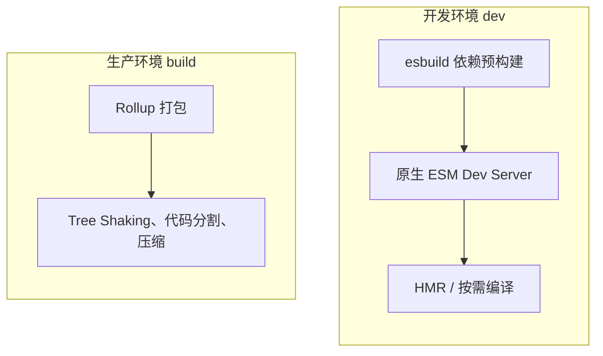

为什么这样能快？关键在于**启动时间和模块数量解耦了**。webpack 要先打包全部模块，Vite 的 dev server 只处理浏览器当前真正请求到的那几十个模块。用甘特图对比启动时序最直观：

```mermaid
gantt
  title webpack vs Vite 冷启动时序对比（示意）
  dateFormat X
  axisFormat %s

  section webpack
  扫描并打包全部模块 :w1, 0, 8
  启动完成可访问     :milestone, 8, 0

  section Vite
  esbuild 预构建依赖 :v1, 0, 1
  启动 dev server    :milestone, 1, 0
  按需编译当前页模块 :v2, 1, 2
```

> 需要说明的是，图里的秒数只是示意量级，实际因项目而异。要点是：webpack 的启动耗时随模块数增长，Vite 基本恒定。

## 4.2 no-bundle 的 ESM Dev Server

先解释标题里的 **no-bundle**：字面意思是"不打包"。传统 webpack 的 dev server 会先把所有模块打包成 bundle 再给浏览器；而 Vite 开发时**不做这一步打包**，直接把源文件（转译后）通过原生 ESM 一个个交给浏览器，用到哪个才给哪个。这就是 no-bundle。

那 Vite 的 dev server 到底做了什么？两件事：

1. **语法编译**：把 `.tsx` / `.jsx` / `.ts` 实时转译成浏览器能执行的 JS。
2. **路径映射**：把浏览器发来的模块请求映射到对应的源文件，返回一个合法的 ES module。

它本质是一个 HTTP Server，内部集成了 Proxy（代理）、Cache（缓存）、Middleware（中间件）、HMR（热更新）等能力。

工作流程很简单：浏览器加载 HTML，遇到 `<script type="module" src="/src/main.tsx">`，就发请求；Vite 收到后即时编译 `main.tsx` 返回；浏览器解析后发现里面还有 `import`，再发下一个请求……**整个过程没有"预先打包"这一步，需要哪个模块才编译哪个。**

```html
<!-- 浏览器实际请求到的 index.html -->
<body>
  <div id="root"></div>
  <script type="module" src="/src/main.tsx"></script>
</body>
```

## 4.3 依赖预构建（Pre-Bundle）

既然开发时不打包，为什么还需要 esbuild 做一次"预构建"？因为有两个问题绕不开（详见官方 [依赖预构建](https://cn.vitejs.dev/guide/dep-pre-bundling.html)）：

**其一，第三方包的格式不统一。** 很多 npm 包至今只提供 CommonJS 或 UMD 格式，浏览器的原生 ESM 根本没法直接 `import`。比如 React 的入口就是典型的 CommonJS：

```js
// react 入口文件——只有 CommonJS 格式
if (process.env.NODE_ENV === 'production') {
  module.exports = require('./cjs/react.production.min.js')
} else {
  module.exports = require('./cjs/react.development.js')
}
```

Vite 用 esbuild 在启动时把这些包预构建成 ESM，浏览器才能直接用。

**其二，请求瀑布（waterfall）导致页面卡顿。** 有些包（如 `lodash-es`）内部拆成了几百个小模块，如果按 no-bundle 逻辑走，浏览器会为一个包发几百个请求，网络面板瞬间被打满。预构建会把这种包**合并成少量文件**，大幅减少请求数。

预构建的产物会缓存在 `node_modules/.vite/deps` 下，后续启动直接复用，不会每次都重新构建。

> 👉 **动手验证**：在一个 Vite 项目里 `npm run dev`，打开浏览器 DevTools 的 Network 面板刷新页面——你会看到 `App.tsx`、`math.ts` 等**源文件被一个个单独请求**（no-bundle 的原生 ESM 请求链），而 `react` 的请求路径带着 `.vite/deps`（预构建产物）。触发一次 `import('./heavy')` 之类的动态导入，Network 里会**新增一个请求**，这就是异步 chunk 的按需加载。

## 4.4 Rollup 在 Vite 里承担什么角色

一句话：**生产构建的打包器就是 Rollup。**

开发态可以不打包，但生产环境不可能让浏览器发几千个请求，必须打包、Tree Shaking、代码分割、压缩。这些活儿 Vite 交给了 Rollup，因为它产物干净、scope hoisting 做得好，而且**插件 API 设计得非常优雅**——事实上，Vite 的整个插件生态就是建立在 Rollup 插件 API 之上的（这也是后面 Rolldown 要兼容 Rollup API 的原因）。

所以 Vite 更像一个"编排者"：开发态编排 esbuild + 原生 ESM，生产态编排 Rollup，自己专注在 dev server、HMR 和插件机制上。

## 4.5 通用拆包策略

生产构建同样面临"怎么拆包"的问题。Vite/Rollup 提供两种方式：

**手动拆包 `manualChunks`**：在 `build.rollupOptions.output.manualChunks` 里手动指定哪些模块拆到哪个 chunk（官方 [manualChunks](https://rollupjs.org/configuration-options/#output-manualchunks)）。比如把 React 相关拆成 `react-vendor`。

> ⚠️ **一个 Vite 8 的真实差异**：Vite 8 底层换成 Rolldown 后，`manualChunks` **只接受函数形式** `manualChunks(id) { ... }`，不再支持 Rollup 时代 `{ 'react-vendor': ['react'] }` 的对象写法（否则报 `manualChunks is not a function`）。这是"Vite 8 换 Rolldown"在配置层面能实际摸到的一个变化——实测得到，配置时留意即可。

**用插件声明式配置**：手写 `manualChunks` 略繁琐，社区的 [vite-plugin-chunk-split](https://github.com/sanyuan0704/vite-plugin-chunk-split) 让拆包更直观：

```ts
// vite.config.ts
import { chunkSplitPlugin } from 'vite-plugin-chunk-split'

export default {
  plugins: [
    chunkSplitPlugin({
      // 指定拆包策略
      customSplitting: {
        // 1. 支持填包名。react 和 react-dom 会被打包到名为 react-vendor 的
        //    chunk 里（包括它们的依赖，如 object-assign）
        'react-vendor': ['react', 'react-dom'],
        // 2. 支持填正则。src 中 components 和 utils 下的所有文件
        //    会被打包为 component-util 的 chunk
        'components-util': [/src\/components/, /src\/utils/],
      },
    }),
  ],
}
```

拆包思路和前面 webpack 那套 split-by-module / split-by-experience 是相通的——底层逻辑不变，只是配置形态不同。

## 4.6 循环依赖问题

最后讲一个 no-bundle + 原生 ESM 场景下**更容易暴露**的坑：循环依赖。

设想 `a.js` 引用 `b.js`，`b.js` 又反过来引用 `a.js`：


问题出在**执行顺序**上，但 ESM 和 CommonJS 的具体表现**并不相同**，别混为一谈：

- **ESM**：模块间是"先建立绑定（live binding）、再按顺序求值"。如果 `b.js` 在 `a.js` 那个 `export const x = ...` 还没执行到时就去读 `x`，读到的是一个处于 **TDZ（Temporal Dead Zone，暂时性死区）** 的 `let`/`const` 绑定，会直接抛 **`ReferenceError`**——而不是安静地拿到 `undefined`。
- **CommonJS**：`require` 返回的是当前这一刻的 `module.exports` **快照**。循环依赖时，`b` 可能拿到 `a` **执行到一半、还不完整的 `module.exports`**（缺了后面才赋值的属性，读出来是 `undefined`），程序不报错但值不对——更隐蔽。

一句话区分：**ESM 更可能"直接报错"（TDZ），CommonJS 更可能"拿到不完整的值"。**

规避办法（两者通用）：

- **延迟引用**：把对循环依赖的读取放到函数内部（真正调用时才读），而不是模块顶层。
- **打破环**：把两个模块共同依赖的部分抽成第三个公共模块。
- **避免顶层互相依赖**：设计上尽量让依赖是单向的。

> 为什么放在 Vite 章节讲？因为 webpack 打包后模块被合进同一作用域，有时会"意外掩盖"循环依赖；而 Vite 开发态是浏览器原生 ESM 按真实顺序加载，循环依赖的问题往往更早、更直接地暴露出来。

# 五、其他新一代工具：Rspack 与 Turbopack

webpack 和 Vite 之外，还有几个绕不开的名字。这里不展开源码，只讲清"是什么、为什么快、适合谁"。

## 5.1 Rspack：webpack API 的 Rust 实现

[Rspack](https://rspack.rs/zh/guide/start/introduction) 是一个 [MIT 完全开源](https://github.com/web-infra-dev/rspack)、由字节团队主导发起的项目（性质类似 Vite 之于 VoidZero——公司主导、社区开源中立）。它的出发点非常直接：**解决大型/巨石应用里 webpack "构建十几分钟"的性能问题。**

它为什么快？官方给了几个原因：

- **Rust 原生代码**：编译成 Native Code，天然比 JS 快。
- **高度并行架构**：模块图生成、代码生成等阶段多线程并行，吃满多核 CPU（JS 的单线程在这里很吃亏）。
- **大部分功能内置**：webpack 常靠一堆 JS loader/plugin，而这些往往是性能瓶颈；Rspack 把常用功能内置，减少 JS 侧的通信开销。
- **增量编译**：HMR 阶段用增量策略，热更新很快。

最关键的是**兼容性**：Rspack 提供现代化的 webpack API，可以近似"无缝替换"，兼容社区几乎所有 loader，下载量最高的 50 个 webpack 插件里 85%+ 可用或有替代。围绕它还有一套 Rstack 全家桶——Rsbuild（上层构建工具，类比 Vite 之于 Rollup）、Rslib（库开发）、Rspress（文档站）、Rsdoctor（构建分析）。2024 年 8 月发布的 1.0 已达到生产稳定。

## 5.2 Turbopack：Next.js 专属，函数级增量

[Turbopack](https://nextjs.org/docs/app/api-reference/turbopack) 由 webpack 的作者 Tobias Koppers 在 Vercel 主导，专为 Next.js 设计，用 Rust + SWC 编写。

它最有意思的地方是核心思想——**函数级缓存 / 增量计算**：把每个转换都表达成一个函数，只要输入相同就命中缓存，代码变更时只重算受影响的模块及其依赖链。二次构建因此极快。

现状是：2025 年 10 月发布的 [Next.js 16](https://nextjs.org/blog/next-16) 已把 Turbopack 定为 **`next dev` 和 `next build` 的双默认打包器**（想回退 webpack 需显式加 `--webpack`）。但它**强绑定 Next.js**，作为独立通用打包器的能力弱于 Rspack 和 Vite。

## 5.3 底层引擎层：esbuild / SWC / Oxc

再往下一层，还有"引擎"级别的工具，它们通常不直接当打包器用，而是被上层工具集成：

- **esbuild**（Go，2020）：转译速度百倍提升的启蒙者，Vite 的 dev 依赖预构建就用它。
- **SWC**（Rust）：Next.js、部分工具链的转译器，替代 Babel。
- **Oxc**（Rust）：VoidZero 的 parser / resolver / transformer / minifier 一体化底座，支撑着 Rolldown。

这正好呼应第二章说的"编译器层从 Babel 走向 SWC / Oxc"的演进。

# 六、2024–2026：构建工具的"原生化元年"

如果说前面讲的是 2023 年之前的格局，那么接下来这几年，剧情急转直下。

一句话概括：**2020 年 esbuild 证明了"换种语言能快 100 倍"之后，2024–2026 集中爆发的不是"又出了新工具"，而是"同一批工具被用 Rust/Go 重写了一遍"。** 这是一次代际更替。

| 工具 | 重写前 | 重写后 | 时间线 |
| --- | --- | --- | --- |
| esbuild | —（一上来就是 Go） | Go | 2020 |
| SWC | TS | Rust | 2021 |
| Rspack | — | Rust | 2023 起，2024-08 发 1.0 |
| Rolldown | — | Rust | 2024 开源 |
| TypeScript 7 | TS | Go | 2025 底官宣 |
| Vite 8 | JS(Rollup) | Rust(Rolldown) | 2026-03 |

## 6.1 VoidZero 与工具链统一（2023 起）

Vue 和 Vite 的作者尤雨溪在 2023 年创立了 [VoidZero](https://voidzero.dev/)，目标是终结 Vite 生态里"构建、测试、lint、format 各自为政"的碎片化，做一套**统一的高速工具链**。它的产出包括：Rolldown（Rust 打包器）、Oxc（Rust 语言工具链）、Oxlint / Oxfmt（对标 ESLint / Prettier）。

## 6.2 Vite 8：删掉 esbuild + Rollup，换上 Rolldown（2026-03）

2026 年 3 月，[Vite 8 稳定版发布](https://vite.dev/blog/announcing-vite8)，做了一件"自我否定"的大事：**用统一的 Rust 内核 [Rolldown](https://rolldown.rs/) 取代原来的 esbuild + Rollup 双引擎**，官方称构建快 10–30x，同时保持对 Rollup 插件的兼容。

这正好回扣第四章讲的双引擎架构——**那套"dev esbuild / prod Rollup"既是 Vite 成名的招牌，也逐渐变成了两套转换管线、两套语义、大量胶水代码的技术债。** Vite 8 把这笔债一次性还清。（8.1 还引入了实验性的 Bundled Dev Mode，开发期也打包，进一步统一 dev/build 行为。）

## 6.3 Vite+ 与 Cloudflare 收购 VoidZero（2026）

VoidZero 还推出了 [Vite+](https://viteplus.dev/)（`vp` 命令），把 runtime 管理、包管理、dev / test / lint / format / build 收敛到一个入口，2026 年 8 月发布 [Beta](https://www.infoq.com/news/2026/08/vite-plus-beta/)。

更大的新闻是：2026 年 6 月 4 日，[Cloudflare 收购了 VoidZero](https://voidzero.dev/posts/voidzero-cloudflare)。官方承诺 Vite / Vitest / Rolldown / Oxc / Vite+ 继续保持 MIT 开源、社区中立。

## 6.4 更大的原生化浪潮

这股"原生化"不止发生在打包器（以下均为**截至本文发布（2026-08）的公开信息**，快速演进中，请以官方最新公告为准）：

- **TypeScript 7** 的编译器用 Go 重写（[microsoft/typescript-go](https://github.com/microsoft/typescript-go)，官方主导），目标是把类型检查/编译提速约一个数量级。
- **Bun**（Zig 编写的运行时/工具链）被 Anthropic 收购、并作为 Claude Code 的底层执行环境——这条属于新闻性信息，请以 [Bun 官方博客](https://bun.sh/blog) 与 Anthropic 官方公告为准。
- **Biome / Oxlint** 正在成为 ESLint / Prettier 的高性能替代。
- **AI / Agent 时代对工具链速度的需求**成了新推力——Agent 高频跑构建、测试、lint，慢工具的成本被放大。

> 一个更深的主线是：JS 时代信奉 Unix 哲学"每个工具只做一件事"；Rust 时代则转向"共享一棵 AST、只解析一次"的垂直整合（Biome 合并 lint+format，Oxc 想统一 parse/transform/lint/format/minify）。两条路各有道理，但当下的势头明显偏向整合。

## 6.5 横向对比与选型建议

铺垫了这么多，最后落到最实际的问题：**这么多工具，到底怎么选？**

先用一张表看清全貌：

| 工具 | 底层语言 | 插件生态 | 核心优势 | 主要短板 | 适用场景 |
| --- | --- | --- | --- | --- | --- |
| webpack | JS | 最成熟 | 生态最广、配置最灵活 | 慢 | 存量大型项目、需极致定制 |
| Rspack | Rust | 兼容 webpack | 近乎无缝替换 + 数量级提速 | 生态仍在补齐 | 给存量 webpack 项目提速 |
| Vite (Rolldown) | Rust | Rollup 生态 | DX 最好、生态最广 | 历史双引擎的语义边角料 | 新项目、框架无关首选 |
| Turbopack | Rust | 自有（webpack 兼容有限） | 函数级增量缓存 | 强绑定 Next.js | Next.js 项目 |
| Rollup / Rolldown | JS / Rust | 优雅 | 产物干净、Tree Shaking 强 | 偏库打包 | 类库、SDK 发布 |
| esbuild | Go | 较弱 | 转译极快 | 不做复杂产物优化 | 转译 / 预构建 / 小工具 |

**决策速查**（按场景一句话给结论）：

- 存量 webpack 大项目要提速 → **Rspack**（改动最小、收益最大）
- 全新项目 / 框架无关 → **Vite（Rolldown）**
- Next.js 项目 → **Turbopack**（基本不用选）
- 发布类库 / 组件库 → **Rollup / Rolldown / tsdown**
- 只要转译或极简打包 → **esbuild**

**最后是我的个人判断**（仅供参考，请结合团队现状选型）：

- **最看好落地的是 Rspack。** 它不是"又一个新工具"，而是 webpack 的 Rust 转世——`module.rules`、`plugins` 这套心智几乎零迁移成本，却能换来数量级的提速。加上巨石应用的实战淬炼和 Rstack 全家桶，属于"上限高、风险低"的一档。
- **最看好未来的是 Rolldown / Oxc 体系。** 它走的是"共享一棵 AST、一个工具链统一 parse / transform / lint / format / bundle"的整合路线，代表下一个十年的方向。

一句话总结：**要立刻落地，选 Rspack；要押注趋势，看 Rolldown / Oxc。** 至于 webpack，短期不会消失（存量和生态还在），但新项目的默认位，已经让给了 Rust 新一代。

> 提醒：文中的性能倍数都以各自官方 benchmark 为准，且因项目而异；选型别只看跑分，要结合团队的存量代码、框架绑定和维护成本综合判断。

# 参考资料

**webpack 官方**

- [Plugin API / Tapable](https://webpack.js.org/api/plugins/)
- [Writing a Loader（pitch、右到左执行）](https://webpack.js.org/contribute/writing-a-loader/)
- [Loader Interface（`this.getOptions`）](https://webpack.js.org/api/loaders/)
- [webpack 5 迁移：getOptions 取代 loader-utils](https://webpack.js.org/migrate/5/#getoptions-method-for-loaders)
- [webpack 5.80.0：支持 ESM loader](https://github.com/webpack/webpack/releases/tag/v5.80.0)
- [Compilation Hooks（seal / optimize / chunk 生命周期）](https://webpack.kr/api/compilation-hooks/)
- [SplitChunksPlugin](https://webpack.js.org/plugins/split-chunks-plugin/)
- [DllPlugin](https://webpack.js.org/plugins/dll-plugin/)
- [Tree Shaking](https://webpack.js.org/guides/tree-shaking/)
- [webpack 4.26.0：默认压缩器换成 Terser](https://github.com/webpack/webpack/releases/tag/v4.26.0)
- [css-minimizer-webpack-plugin](https://webpack.js.org/plugins/css-minimizer-webpack-plugin/)
- [Asset Modules](https://webpack.js.org/guides/asset-modules/)
- [optimization.runtimeChunk](https://webpack.js.org/configuration/optimization/#optimizationruntimechunk)
- [output.filename / contenthash](https://webpack.js.org/configuration/output/#outputfilename)
- [Devtool（source map）](https://webpack.js.org/configuration/devtool/)
- [Build Performance（filesystem cache / 并行）](https://webpack.js.org/guides/build-performance/)
- [thread-loader](https://webpack.js.org/loaders/thread-loader/)
- [webpack-bundle-analyzer](https://github.com/webpack-contrib/webpack-bundle-analyzer)
- [Tobias Koppers《How webpack works》slides](https://raw.githubusercontent.com/sokra/slides/master/data/how-webpack-works.pdf)

**Vite / Rollup**

- [Vite 官方：为什么选 Vite](https://cn.vitejs.dev/guide/why.html)
- [Vite 官方：依赖预构建](https://cn.vitejs.dev/guide/dep-pre-bundling.html)
- [Rollup manualChunks](https://rollupjs.org/configuration-options/#output-manualchunks)
- [vite-plugin-chunk-split](https://github.com/sanyuan0704/vite-plugin-chunk-split)

**Rspack / 新一代与 2024–2026 事件**

- [Rspack 官方介绍](https://rspack.rs/zh/guide/start/introduction) ｜ [Rspack 开源仓库](https://github.com/web-infra-dev/rspack)
- [Vite 8.0 发布公告（Rolldown 成为默认打包器）](https://vite.dev/blog/announcing-vite8)
- [Vite 6.0 发布公告（VoidZero 成立）](https://cn.vitejs.dev/blog/announcing-vite6)
- [VoidZero is Joining Cloudflare](https://voidzero.dev/posts/voidzero-cloudflare)
- [VoidZero Releases Vite+ Beta（InfoQ）](https://www.infoq.com/news/2026/08/vite-plus-beta/)
- [Rolldown 官网](https://rolldown.rs/) ｜ [Oxc 官网](https://oxc.rs/)
- [The JavaScript Tooling Stack Is Rewriting Itself in Rust](https://rustify.rs/resources/guide-js-tooling-rust)

**综述文章**

- [前端打包构建工具深度解析](https://juejin.cn/post/7661941440507527183)
- [前端构建工具进化史：从 Grunt/Gulp 到 Webpack 再到 Vite](https://www.cnblogs.com/SATinnovation/p/19997977)
- [前端构建工具与工程化生态全面梳理](https://juejin.cn/post/7519309100191973417)
