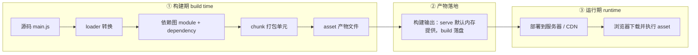
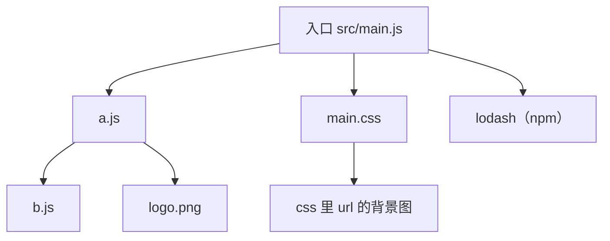
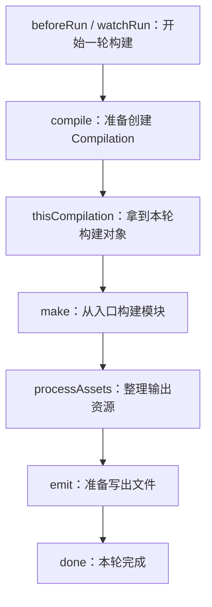
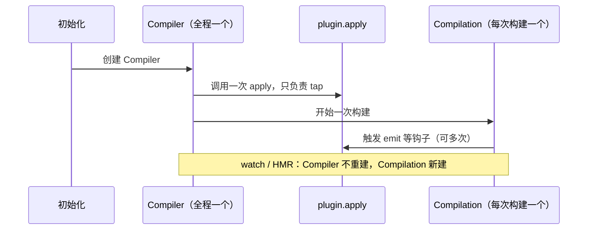
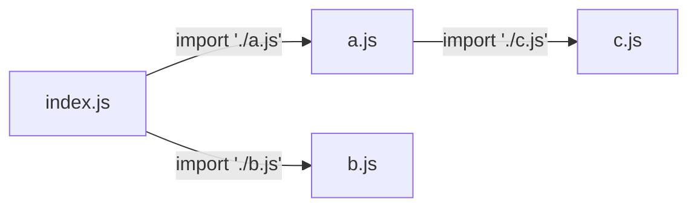
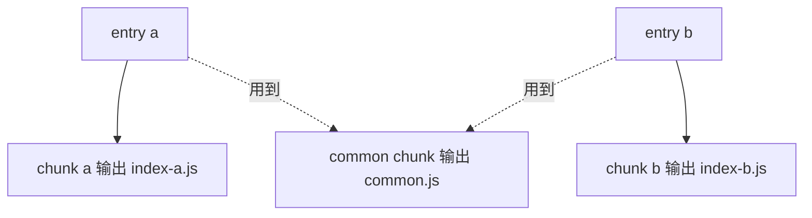
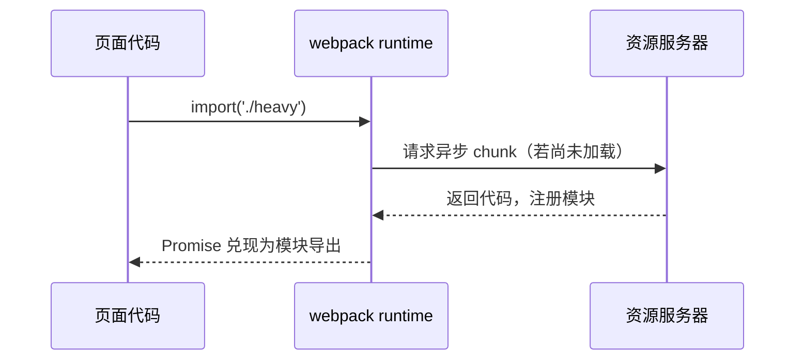
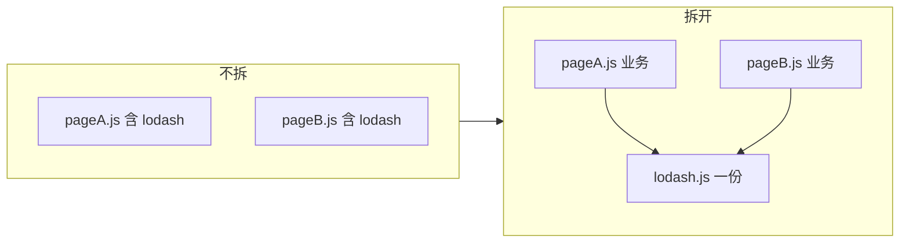
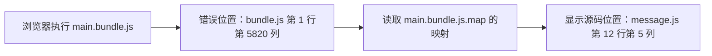
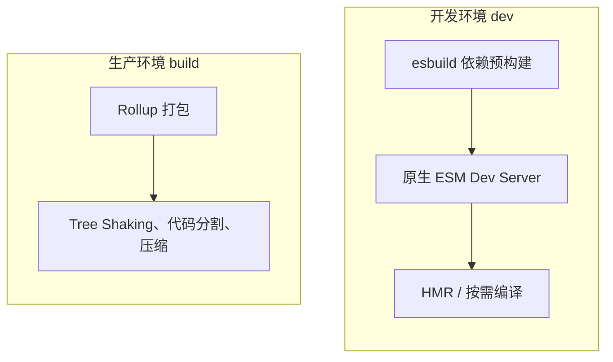

> 本文AI率约80%，所有内容均已人工审核qwq

每天 `npm run dev`、`npm run build`，我们都在和构建工具打交道，但很少有人停下来问一句：它到底做了什么？

这篇文章围绕两条线展开：**源码怎样变成浏览器能运行的文件，以及开发阶段怎样更快地看到修改结果。**

先从模块化出发，用一次真实打包区分源码、依赖图和产物；再沿 webpack 的构建流程理解 loader、chunk 与 runtime；最后对照 Vite 的按需模块服务与生产构建。优化部分只保留能通过产物、Network 或计时验证的做法。

阅读时可以一直带着三个问题：**输入是什么，工具做了什么，浏览器最终拿到什么？** loader 编写、生成源码考据和工具趋势留给独立专题。

# 一、为什么需要构建工具

**构建工具的存在，是为了抹平"我们想怎么写代码"和"浏览器能跑什么"之间的鸿沟。**

先补一句心态上的判断，免得后面把工程化讲成"凡是前端都必须上 webpack"。**简单项目可以不工程化。** 一个轮播图、一份只有几个 `<script>` 的静态页，硬套脚手架反而制造复杂度。工程化不是来给开发添麻烦的，而是复杂项目里那些问题——模块依赖、兼容、缓存、资源路径——已经存在了，工具只是把它们摊开并系统解决。判断标准很粗：页面还靠人肉维护得过来，就可以先不工程化；一旦变成多人协作、SPA、还要接一堆 npm 包，再上构建工具。

具体来说，复杂项目里它至少要解决这几件事：

- **模块化**：我们希望把代码拆成一个个模块、用 `import` 组织依赖，但早期浏览器并不认识这套语法，也没有依赖管理。
- **请求数**：一个页面几百个模块，如果每个都单独发一个 HTTP 请求，首屏会被瀑布式请求拖垮。
- **语法降级**：TypeScript、JSX、ES2022 的新语法，浏览器不一定支持，需要转译成兼容的 JS。
- **资源优化**：压缩、Tree Shaking 删无用代码、按需加载、文件指纹缓存——这些手动做既费力又易错。

## 编译、打包、构建分别在做什么

讲工具之前，先把三个容易混用的词分开：

- **编译 / 转译**：把一种源码变成另一种可处理或可运行的代码。例如 TS 去类型、JSX 变 JS 调用、Less 变 CSS。它回答的是「这一份文件怎样转换」。
- **打包**：从入口解析模块间的依赖，把需要的模块组织成一个或多个供浏览器加载的文件。它回答的是「哪些文件有关系，最后如何分组」。
- **构建**：从读取配置、解析依赖、编译、打包、优化，到输出 HTML / JS / CSS / 图片的整条生产流程。它回答的是「项目怎样变成可交付的产物」。

它们不是每次都按「先编译所有文件，再一次性打包」机械排队：比如webpack 通常从入口边解析依赖，边对遇到的模块执行 loader，最后组织 chunk 并产出 asset。开发服务器还可能把结果放在内存里。
配套实验用同一份文章列表，观察 JS 依赖、CSS 和图片如何变成浏览器实际请求的文件。TS / JSX / Less 的转换属于延伸例子，不要求在主线中逐个演示。

把这些需求串起来，就是一部构建工具的进化史。下面从"没有工具"的年代讲起。

# 二、模块化演进：从无模块化到原生 ESM

构建工具的演进，本质上是**模块化方案**的演进。可以粗分成三个时代。

## 2.1 早期页面：手动维护脚本和依赖

早期页面直接用 `<script>` 加载多个 JS 文件。如果业务脚本依赖某个工具库，就要先引入库，再引入业务代码；代码当然能运行，问题在于项目变大后，这些关系都需要人工维护。

主要有三个问题：

- **顺序容易出错**：依赖还没加载，业务代码就开始执行。
- **全局名字容易冲突**：普通脚本里的全局变量和函数可能互相覆盖。
- **依赖关系不明确**：只看一个文件，不容易知道它需要哪些其他文件。

模块系统让代码明确声明导入与导出，构建工具再根据这些关系处理依赖。这里了解问题即可，不需要学习某个旧库的 API。

## 2.2 社区方案：重点认识 CommonJS

在语言级模块标准普及之前，社区先约定了声明依赖和导出内容的写法。这里重点认识今天仍会遇到的 **CommonJS**：它是 Node.js 早期采用的模块系统，通过 `require()` 引入、`module.exports` 导出。下面是两个文件的最小例子：

```js
// math.cjs
module.exports = { add: (a, b) => a + b }

// main.cjs
const { add } = require('./math.cjs')
console.log(add(1, 2))
```

`require()` 同步加载并执行模块，拿到导出结果后继续往下运行。浏览器的普通脚本或原生 ESM 不会直接提供这套 API；前端使用这类 npm 包时，通常需要构建工具处理。现代 Node.js 也支持 ESM，并不是只能写 CommonJS，具体规则见 [Node.js 模块文档](https://nodejs.org/api/modules.html)。

其他名字只需知道它们解决过什么问题：

- **AMD / CMD**：曾用于浏览器模块加载，代表实现是 RequireJS / SeaJS；这里不展开语法。
- **Grunt / Gulp**：把合并、压缩等重复操作串成任务；任务编排和按模块依赖打包是不同职责。
- **Browserify**：沿 CommonJS 的依赖关系打包，让这类模块用于浏览器。

后面的实验以 ESM 为主。webpack 能处理 ESM 和 CommonJS，所以业务源码可以使用 `import`，第三方依赖仍可能使用 `require`；不需要为理解打包再补学所有历史规范。

## 2.3 原生模块化时代：ESM 与 importmap

ES Module（ESM）在 2015 年成为 JavaScript 语言标准，使用 `import` / `export` 声明依赖和导出。现代浏览器也支持这套模块机制：HTML 通过 `<script type="module">` 加载入口，浏览器再沿着 `import` 请求其他模块。

配套文章列表实验不需要 React 或外部 CDN。在 `native.html` 中写：

```html
<main id="app"></main>
<script type="importmap">
  { "imports": { "@course/data": "./src/data.js" } }
</script>
<script type="module" src="./src/native.js"></script>
```

入口 `src/native.js`：

```js
import { posts } from '@course/data'
import { renderArticles } from './render.js'

renderArticles(posts)
```

浏览器认识相对路径，却不知道 `@course/data` 这个裸模块名对应哪个 URL。**importmap 就是「导入名 → 模块 URL」的映射表**：这里把它解析为 `./src/data.js`，随后浏览器发请求加载该模块。它不安装 npm 包、不转换 CommonJS，也不编译或打包文件；规则见 [MDN import map](https://developer.mozilla.org/en-US/docs/Web/HTML/Reference/Elements/script/type/importmap)。

> **实验观察**：启动静态 HTTP 服务，打开 Network，能看到 `native.js`、`data.js`、`render.js`、`utils.js` 分别被请求。删除 importmap 后，裸模块名解析失败；恢复映射，页面恢复。浏览器此时直接加载模块，没有先生成 bundle。

所以，**浏览器直接加载文件并不是打包之后才有的能力**：普通脚本早就能直接请求；原生 ESM 则进一步提供了标准模块加载机制。

既然已经能运行，为什么还要构建工具？大型应用通常还需要：

- 转换浏览器不能直接执行的 TS / JSX 等源码，并按目标环境处理兼容性；
- 处理第三方包格式、样式和图片引用；
- 做 Tree Shaking、压缩、代码分割和缓存文件命名等生产优化。

HTTP/2 / HTTP/3 降低了多个请求的开销，但深层依赖产生的加载瀑布、转换和缓存策略仍值得优化。简单页面可以直接发布原生 ESM；复杂项目是否打包，要看实际需求，不能说所有生产页面都必须打包。

接下来保持文章列表不变，用 webpack 生成产物，再对照浏览器请求，观察构建工具具体增加了什么能力。

# 三、webpack 深度解析

webpack 官方的一句话定位是：把**有依赖关系的模块**（`.js`、`.css`、`.jade`、`.coffee`、图片……）当作输入，输出**浏览器能用的静态资源**（`.js`、`.css`、`.png`……）。

这里的 `.coffee` 是 **CoffeeScript 源文件**，CoffeeScript 是一种会编译成 JavaScript 的语言，并非咖啡相关资源；`.jade` 是旧版 Jade 模板（后来更名为 Pug）的文件后缀。它们只是说明 webpack 可以借助相应 loader 接入不同类型的源码，今天的入门实验无需安装它们；[CoffeeScript 官方文档](https://coffeescript.org/)也用 `coffee -c` 将 `.coffee` 编译为 `.js`。

它最核心的理念是**「万物皆模块」**——不只是 JS，CSS、图片、字体都能通过 loader 变成模块纳入依赖图。这一章先用一次真实打包把 `src` / `dist` / 开发服务器讲清楚，再把 webpack 从头到尾拆开：整体流程、依赖图、loader、资源处理、chunk 生成，最后看它打出来的运行时到底长什么样，以及工程上怎么优化。


图中的非 JS 类型是示意；它们如何进入依赖图、最终产出什么资源，取决于 loader 或 webpack 内置的模块类型配置。

## 先建立一张全景图：源码怎样变成浏览器里的文件

正式拆解之前，先用一条主线把后面所有名词串起来，避免陷进细节后 chunk / dependency / asset 分不清。理解它们最好的角度是**按"时间节点"（生命周期）来看**——同一个东西在不同阶段有不同形态：


```mermaid
flowchart LR
  subgraph BUILD["① 构建期 build time"]
    direction TB
    SRC["源码 main.js"] --> L["loader 转换"]
    L --> DEP["依赖图 module + dependency"]
    DEP --> CHUNK["chunk 打包单元"]
    CHUNK --> ASSET["asset 产物文件"]
  end
  subgraph OUT["② 产物落地"]
    direction TB
    DIST["构建输出：serve 默认内存提供，build 落盘"]
  end
  subgraph RUN["③ 运行期 runtime"]
    direction TB
    DEPLOY["部署到服务器 / CDN"] --> BROWSER["浏览器下载并执行 asset"]
  end
  ASSET --> DIST
  DIST --> DEPLOY
```

把这条主线拆成三个**时间节点**，概念就清楚了：

1. **构建期（build time）**：在你的电脑或 CI 上跑 `webpack` 的阶段。`module`、`dependency`、`chunk` 全是**这个阶段的内部概念**，是 webpack 在内存里的数据结构，你在硬盘上看不到它们。
2. **产物落地**：chunk 经过渲染变成 `asset`（真实文件）。`webpack serve` 通常从内存中提供产物；直接执行 `webpack --mode development` 或 `webpack --mode production` 都可以把 asset 写入 `dist/`。要分清「开发/生产优化模式」和「是否启动开发服务器」，下一节再结合实验观察，参见 [webpack 开发指南](https://webpack.js.org/guides/development/)。
3. **运行期（runtime）**：`dist/` 里的 asset 被部署到服务器或 CDN，用户访问时浏览器把它们下载下来执行。**浏览器拿到的，就是 build 出来的 asset。**

对应几个核心名词，记住这张对照表：

| 名词 | 是什么 | 属于哪个阶段 / 能否看到 |
| --- | --- | --- |
| **module（模块）** | webpack 处理的基本单位。一个 `.tsx` / `.css` / 图片经 loader 转换后都是一个 module | 构建期内部概念，看不到 |
| **dependency（依赖）** | 模块之间的引用关系，例如 `index.js` 导入了 `a.js` | 构建期内部概念，看不到 |
| **chunk（代码块）** | 一组 module 的集合，打包器内部的"打包单元" | 构建期内部概念，看不到 |
| **bundle.js（JS 打包文件）** | 打包后输出的某个 JavaScript 文件名，例如 `main.abc123.bundle.js`；一个构建可以有多个 bundle | 是实际文件，也是 JS 类型的 asset；浏览器可以请求它 |
| **asset（产物/资源）** | chunk 最终渲染成的**真实文件**，如 `main.abc123.js` | 构建输出；可由内存提供，落盘后通常位于 `dist/`，供浏览器请求 |

> ⚠️ 厘清一组容易混淆的概念：**chunk 是构建期的逻辑分组；`bundle.js` 是输出的 JS 文件；asset 是所有输出文件的总称。** 一个 chunk 常对应一个 JS bundle，但还可能伴随 source map、CSS 等其他 asset。`bundle.js` 只是示例文件名，不是 webpack 固定要求的名字；配套文章列表实验的生产产物使用 `main.[contenthash].js` 等文件名，具体输出由配置决定。

> **顺便回答几个常见疑问：**
> - **"build 后的产物就是 asset 吗？"** —— 是的。在本实验中，`npm run build` 写进 `dist/` 的文件（JS/CSS/图片）就是 asset；开发服务器也可以从内存提供 asset。
> - **"服务器部署、浏览器拿到的也是 build 产物吗？"** —— 是的，浏览器下载的正是 build 出来的 asset。纯前端项目就是把整个 `dist/` 部署到服务器/CDN，浏览器请求哪个下载哪个。
> - **"为什么我的 Next.js 项目里也有 `chunks/` 目录？"** —— 因为 **chunk 是所有打包器的通用概念**，不是 webpack 独有。Next.js 也使用打包器（例如 Turbopack，见第五章），自然也有 chunk。但要注意区分：Next 里 `.next/static/` 下带 hash 的才是**发给浏览器的 asset**；而 `.next/server/`、`.next/build/` 下的是**构建期或跑在服务器上的产物**（如 SSR 代码、PostCSS 转换的辅助文件），并不会下发给浏览器。

## 一次打包：从 src 到浏览器

名词对照有了，先用一次完整打包把工程目录和开发体验钉死。后面 Compiler / loader / 运行时都是在解释这一趟里发生了什么。

### 目录约定：`src`、`node_modules`、`dist`、`public`

常见脚手架长这样：

| 路径 | 谁在用 | 会不会被 webpack 当模块分析 |
| --- | --- | --- |
| `src/` | 你写的源码（JS / 样式 / 图片） | 会。从入口出发，被 `import` / `require` 到的才会进依赖图 |
| `node_modules/` | npm 包装进来的第三方代码 | 会。`import 'lodash'` 和 `import './a.js'` 在依赖图里是同类边 |
| `public/` | 常用来放静态文件；不是 webpack 的内置复制约定 | 通常由上层工具或复制插件处理，不能仅凭目录名判断 |
| `dist/` | 此项目的构建输出 | 是结果；开发模式 build 也会写入，开发服务器通常服务内存产物 |

开发时你改的是 `src/`；用户线上跑的是 `dist/` 里那份优化过的结果。两边不是同一套文件，只是后者由前者变出来。

### 入口依赖树：一次打包具体在干什么

默认入口往往是 `src/main.js` 或 `src/index.tsx`。webpack 从这一个文件出发，递归收集所有依赖：`main.js` → `a.js` → `b.js`，CSS、图片只要被入口直接或间接引用，也会长到这棵树上。没挂上的文件——即使躺在 `src/` 里——打包时等于不存在。


```mermaid
flowchart TB
  E["入口 src/main.js"] --> A["a.js"]
  E --> CSS["main.css"]
  A --> B["b.js"]
  A --> IMG["logo.png"]
  E --> LIB["lodash（npm）"]
  CSS --> BG["css 里 url 的背景图"]
```

跑 `npm run build` 之后，`dist/` 里通常会出现：

- 合并压缩后的 JS（文件名带哈希，如 `app-13fa9.js`）
- 抽离出的 CSS（如 `main-d74f1.css`）
- 被复制或改名后的图片
- 一份自动生成的 `index.html`，已经写好对这些资源的引用

> 👉 **动手验证**：在最小 webpack 项目里从入口 `import` 一个 JS、一份 CSS、一张图，再故意在 `src/` 里放一个谁也不引用的 `orphan.js`。`npm run build` 后：`dist/` 里应有那三个资源，**不应**出现 `orphan.js`。

如果是第一次体验构建，可以先不追配置细节，按「改一处源码 → 预测产物 → 运行构建 → 对照结果」做四轮观察：

| 动作 | 构建后看哪里 | 要弄明白什么 |
| --- | --- | --- |
| 从入口导入一个 JS 模块，再放一个没人导入的 `orphan.js` | 产物 JS、构建统计 | 构建从入口沿依赖图走，不是把 `src/` 整目录复制过去 |
| 导入 CSS 和图片 | 页面效果、`dist/` 中的 CSS / 图片 | 非 JS 资源如何进入依赖图；是否抽出 CSS、是否单独输出图片取决于配置 |
| 导入一个 npm 包 | 产物 JS、Network | `node_modules/` 里的依赖也需要被解析、转换或打包 |
| 执行 `npm run dev`，再执行 `npm run build` | 浏览器请求、磁盘上的 `dist/` | 开发服务器提供即时预览，生产构建生成可部署文件 |


### 打包之后，日常写法变了什么

和第二章的蛮荒时代对比，变化最明显的是这三件：

- **模块语法可以混用**：同一个项目里 ESM 的 `import` 和 CommonJS 的 `require` 都能进依赖图。打包完成后模块语句消失，浏览器拿到的是普通 JS——所以"兼容不像模块"这件事，很大一块是打包器替你扛的，而不只是 Babel 在转语法。
- **第三方包也进入依赖图**：例如 `import _ from 'lodash'`，构建工具会解析这个 npm 包，并按配置组织进产物。业务代码通过模块导入获取它，不必依赖页面先挂一个全局名字。
- **天然适合 SPA**：单页应用往往只有一个 HTML 壳，内容由 JS 动态创建。项目可以配置 `HtmlWebpackPlugin` 使用 HTML 模板，打包后自动注入 JS / CSS 产物引用；模板里的 `<script>` 通常带 `defer`，先下载、等 HTML 解析完再执行，不必再把脚本硬塞到 `body` 末尾。

`public/` 和 `src/` 要分开记：

- `src/` 里的文件必须被依赖图挂上才会出现在产物里，路径也会被改写成带哈希的最终地址。
- `public/` 常用来放 favicon 等直接复制的静态资源；是否复制、怎样复制由具体工具或插件决定。当前实验没有这个目录，根目录 `index.html` 由 HTML 插件读取为模板。

`HtmlWebpackPlugin` 干的就是"以模板生成最终 HTML，并注入本次打包出的资源引用"。3.3 节区分 loader 与 plugin 时还会再碰到它。`public/` 的复制和 HTML 模板处理是具体工具或插件提供的行为，并不是 webpack 仅凭目录名就会自动完成。

### 开发服务器：产物在内存里，改完即刷新

如果每次改一行都 `build` 再打开 `dist/index.html`，开发会慢得没法做。所以开发阶段跑的是 `npm run dev` / `webpack serve`：启动一个本地 HTTP 服务（默认常是 `localhost:8080`，也可以改），**打包结果放在内存里，不写 `dist/`**。


请求链很短：浏览器要 HTML → 再按页面里的引用要 JS / CSS → 全部由 dev server 从内存结果里返回。webpack 盯着 `src/`，文件一变就重新打包、刷新页面，形成「修改 → 打包 → 刷新」闭环。内存比落盘 IO 快，这是开发体验的一部分。

两件必须分清：

- **开发服务器只服务开发阶段。** 停掉进程（`Ctrl+C`）页面就没了，它也不会产出可上传的文件。
- **上线必须 `npm run build`。** 部署到服务器 / CDN 的是 `dist/` 里的真实文件。dev 和 build 不是同一条命令换个名字，而是"内存里预览"和"落盘后的生产产物"。

> 👉 **动手验证**：`npm run dev` 时看一眼项目根目录——通常没有新的 `dist/`，或里面不是这次热更新刚写出的文件。再跑一次 `npm run build`，`dist/` 才会出现带哈希的 JS / CSS 和注入好引用的 HTML。

### 热更新：为什么改了文件有时不用整页刷新

上面说的「改完即刷新」是最容易观察到的开发体验，但**监听文件并重新编译**与 **HMR（Hot Module Replacement，热模块替换）**不是同一件事。前者负责生成新代码；后者尝试在页面还运行着的时候替换受影响的模块。大致过程是：

1. webpack 监听到文件变化，基于上一次结果重新编译，生成更新清单和更新代码。开发服务器通常把这些文件保存在内存中。
2. dev server 通过与浏览器的连接（通常是 WebSocket）通知客户端：有新版本了。
3. 浏览器里的 HMR runtime 拉取更新清单与更新 chunk，找出变动模块，沿依赖关系寻找能够接受更新的边界。
4. 找到接受边界，就运行旧模块的清理逻辑、替换模块并执行接受回调；如果一路传到入口仍无人接受，开发服务器通常退回到整页刷新。

所以 **HMR 不是「所有修改都不刷新」**。CSS 更新通常容易直接看到样式替换；JS 能否保持页面状态，取决于对应模块或框架集成是否接受更新。`webpack-dev-server` 的 `hot` 模式会先尝试 HMR，失败后再尝试整页刷新；这条链路见 [webpack 官方 HMR 原理](https://webpack.js.org/concepts/hot-module-replacement/)。

> 👉 **动手验证**：打开 DevTools 的 Network，保留日志。先改一处 CSS，再改一处 JS，观察是否出现 `hot-update.json` / `hot-update.js` 请求，以及页面状态是否保留。若没看到 HMR，请先确认开发服务器启用了热更新、所用 loader 或框架集成支持接受更新；不要仅凭页面「自动变了」就断定发生了 HMR。

## 3.1 整体流程与核心对象

上一节从工程目录走完一趟打包，这里看 webpack 内部怎么把那一趟跑起来。一次完整构建可以分成三个阶段：

1. **初始化**：读取配置 → 创建 `Compiler` 对象 → 注册所有插件。
2. **构建（build）**：从 `entry`（入口文件，如 `src/index.tsx`）出发，递归解析每个模块的依赖，构建出完整的**依赖图**（谁引用了谁的一张关系网）。
3. **生成（seal & emit）**：把模块按规则打包成 `chunk`（内部单元）→ 渲染成 `asset`（真实文件）→ 写入 `output` 目录（如 `dist/`）。`seal` 是"封装/定型"、`emit` 是"输出到磁盘"。


图中的两个局部对应后文 3.2～3.3 节：先按规则找出 loader 并转换单个模块，**再由 webpack 解析转换结果的 AST、记录依赖**。loader 自己也可能使用 AST 做语法转换，但那是它内部的另一轮解析。

其中有两个最重要的对象，几乎所有插件都围绕它们工作：

### Compiler

`Compiler` 是**全局唯一**的对象，持有 webpack 的完整配置和整个生命周期的钩子（hooks）。你可以把它理解为"这次 webpack 进程的大管家"。它继承自 `Tapable`——这是 webpack 插件机制的基石，提供了一整套可供插件注册的事件钩子（[Plugin API 文档](https://webpack.js.org/api/plugins/)）。

**hook 就是 webpack 在某个时刻发出的事件。** [Compiler Hooks 官方清单](https://webpack.js.org/api/compiler-hooks/#hooks)很长，不适合逐个背；先按一次构建的时间顺序记住下面几个：


```mermaid
flowchart TB
  A["beforeRun / watchRun：开始一轮构建"] --> B["compile：准备创建 Compilation"]
  B --> C["thisCompilation：拿到本轮构建对象"]
  C --> D["make：从入口构建模块"]
  D --> E["processAssets：整理输出资源"]
  E --> F["emit：准备写出文件"]
  F --> G["done：本轮完成"]
```

| 先认识的 hook | 拿它做什么 | 属于谁 |
| --- | --- | --- |
| `compile` | 新一轮编译即将开始，适合观察开始时机 | `compiler.hooks` |
| `thisCompilation` | 拿到本轮 `Compilation`，在上面继续注册本轮专属的监听 | `compiler.hooks` |
| `make` | 入口和模块构建开始，插件可在这一阶段加入模块 | `compiler.hooks` |
| `processAssets` | 已形成资源，检查或修改产物 | `compilation.hooks` |
| `emit` / `done` | 即将输出 / 一轮构建完成 | `compiler.hooks` |

图是**教学主线**，不是所有 hook 的完整调用清单；真实构建还会穿插模块解析、优化等更多事件。在 watch 模式下，文件变化会开启下一轮构建，再次走过这条主线。配套实验的 `docs/选讲.md` 有一个只观察插件注册与 Compilation 轮次的短例子；主线不逐个演示这些钩子。

一个最小的插件就是往 `Compiler` 的钩子上挂回调：

```js
class MyPlugin {
  apply(compiler) {
    // emit 钩子：在资源输出到磁盘之前触发
    compiler.hooks.emit.tap('MyPlugin', (compilation) => {
      console.log('即将输出资源，本次共', compilation.modules.size, '个模块')
    })
  }
}
```

这里有个容易说反的点：**`apply` 不是事件处理函数，而是注册入口。** webpack 在初始化阶段创建好唯一的 `Compiler` 之后，立刻对每个插件调用一次 `apply(compiler)`——整个进程里通常只跑这一回。你在 `apply` 里做的事，是往 `compiler.hooks.xxx` 上**登记**回调；真正干活，要等后面某个钩子被触发。所以它更像 `window.addEventListener`，不像 `window.onload` 本身。

登记回调有三种写法，关键区别是 webpack **需不需要等待你的回调完成**：

| 方法 | 回调形态 | 什么时候用 |
| --- | --- | --- |
| `tap` | 普通同步函数，函数返回就算做完 | 打日志、读已有统计等立即结束的工作 |
| `tapAsync` | 函数最后接收 `callback(err)`，调用它才算做完 | 需要异步工作，且使用回调风格 API |
| `tapPromise` | 返回 Promise，Promise 完成才算做完 | 需要异步工作，使用 `async/await` |

文档里写的 `SyncHook` / `AsyncSeriesHook` 是**hook 自身的类型**，不是让你无条件选择的函数名。`compile` 是 `SyncHook`，只能 `tap`；`emit` 是 `AsyncSeriesHook`，可以 `tap`（回调同步结束），也可以 `tapPromise`（等异步任务结束）。例如只打印 `compilation.getAssets().length` 时用 `tap`；若要异步写一份报告，用 `tapPromise('MyPlugin', async () => { await writeFile(...) })`。这里判断的是**是否需要等待异步操作**，不是「代码里有没有 I/O」四个字。


```mermaid
sequenceDiagram
  participant Init as 初始化
  participant C as Compiler（全程一个）
  participant P as plugin.apply
  participant Comp as Compilation（每次构建一个）
  Init->>C: 创建 Compiler
  C->>P: 调用一次 apply，只负责 tap
  C->>Comp: 开始一次构建
  Comp->>P: 触发 emit 等钩子（可多次）
  Note over C,Comp: watch / HMR：Compiler 不重建，Compilation 新建
```

> webpack 5 更推荐在 `compilation.hooks.processAssets` 上改产物，而不是 `compiler.hooks.emit`。`emit` 还能跑，官方已标成偏旧的时机（[Compilation Hooks](https://webpack.js.org/api/compilation-hooks/)）。上面这份最小插件继续用 `emit`，只因为它最好读；新插件优先 `processAssets`。

### Compilation

`Compilation` 代表**一次具体的构建**。它持有本次构建的所有 `module`、`chunk`、`asset` 以及编译产生的信息。和 `Compiler` 的区别在于：`Compiler` 一个进程只有一个，而 `Compilation` 在 watch 模式下每次文件变更都会**重新创建一个**——每保存一次代码触发的重新编译，就是一个新的 `Compilation`。所以上面那条序列里，`apply` 不会再跑，但 `emit` / `processAssets` 会跟着每次 Compilation 再触发一遍。

直接读具体代码：`index.js` 里 `import './a.js'`，webpack 就记录「`index.js` 依赖 `a.js`」；接着打开 `a.js`，继续查它导入了谁。`Compilation` 保存这一轮找到的模块、依赖关系和输出资源。图里的箭头都表示**源码里的导入关系**：


```mermaid
flowchart LR
  I["index.js"] -->|"import './a.js'"| A["a.js"]
  I -->|"import './b.js'"| B["b.js"]
  A -->|"import './c.js'"| C["c.js"]
```

`Compilation` 从入口模块 `index.js` 开始，顺着 `dependency` 一路展开，最终得到项目所有模块。下面看这个"展开"过程具体怎么发生。

## 3.2 从 entry 到依赖图：module 与 dependency

构建阶段的核心，是**从 `entry` 递归建出依赖图**——前面「一次打包」那节从工程目录看到的那棵树，内部就是这样长出来的。这个过程可以用 webpack 内部的几个方法串起来（细节可参考作者 Tobias Koppers 的 [《How webpack works》](https://raw.githubusercontent.com/sokra/slides/master/data/how-webpack-works.pdf)）：

1. `Compilation` 从 `entry` 调用 `addEntry`，进而 `addModuleChain`——依赖链的起点。
2. `NormalModuleFactory` 用 `enhanced-resolve` 把请求路径（如 `./a.js`）解析成真实文件路径，并创建 `Module` 对象。
3. `buildModule` 调用 `module.build`：先读文件，再跑 loader 把内容转成 JS，**然后**才做 AST 解析，从树上收集 `import` / `require` 变成 `dependency`（下一节把这条时间线钉死）。
4. `processModuleDependencies` 遍历这些 `dependency`，对每一个递归回到第 2 步。

这里有一个关键优化：**相同的模块只会构建一次**。webpack 用模块的 identifier（可以理解为解析后的绝对路径）做去重——如果 `a.js` 和 `b.js` 都依赖了 `c.js`，`c.js` 只会被构建一次，第二次遇到时直接复用缓存里已存在的模块。这就是依赖图能收敛、不会无限膨胀的原因。

- **module**：一个模块，webpack 处理的基本单位。
- **dependency**：源码中的 `import` / `require` 等产生的依赖记录，告诉 webpack 当前模块还要去找哪个模块。

webpack 顺着这些记录递归查找，得到完整的依赖图。CSS 等非 JS 文件能否参与、如何转换，取决于 webpack 版本与 loader / 内置模块类型配置。

## 3.3 loader 与 AST：模块转换的核心

传统 webpack 项目常靠 **loader** 把 `.ts`、`.less` 等源码转换成后续模块处理能接受的内容；webpack 5 对图片等资源已有内置 Asset Modules。loader 本质是一个**文件转换器**。而生成 HTML、在编译开始打印日志这类跨模块工作，通常由 plugin 完成。

先把 loader 插在流程的哪一格钉死，后面的「必须返回 JS」「Module parse failed」才说得通。


```mermaid
flowchart LR
  R["① 读出文件原文"] --> L["② 跑匹配到的 loader 链"]
  L --> A["③ 对结果做 AST 解析"]
  A --> D["④ 记录 import / require"]
  D --> S["⑤ 存下转换后的模块"]
```

loader 的执行窗口是 **②**：文件已经读到内存，但 webpack **还没**开始语法分析。它拿到的是字符串，吐回去的也必须是字符串——而且最终要让 ③ 的解析器认得出。所以：

- 对常见的 `javascript/*` 模块处理链，最后交给 webpack 的内容必须是它能解析的 JavaScript；如果只把 Less 转成 CSS 却仍按 JS 模块解析，通常会报 `Module parse failed`。但 webpack 的内置 CSS / Asset Modules 等模块类型有各自规则，不能概括成「所有 loader 最后都必须吐 JS」。
- **「TSX 一定在第 ③ 步报缺 loader」不准确。** 如果先前连 `.tsx` 路径都没解析到，会报模块找不到；解析到文件但没有合适的转换，可能在 webpack 解析语法时出现 `Module parse failed: Unexpected token`；若 Babel/TS loader 配置错误，也可能先在 loader 内报错。应根据实际错误判断失败发生在**路径解析、loader 转换还是转换后解析**，不要把所有问题归为「缺 loader」。

> 👉 **动手验证**：对一个 `.less` 文件只配 `less-loader`、不配后面能吐 JS 的 `css-loader` + `style-loader`（或 MiniCssExtract），`build` 时就会在解析阶段挂掉。补齐链之后，同样的文件就能进依赖图。

执行顺序是下一件容易记错的事。

**同一条 `use` 里，链是从右到左（数组里从后往前）执行的。** 比如处理 `.less`：

```js
// webpack.config.js
module.exports = {
  module: {
    rules: [
      {
        test: /\.less$/,
        // 执行顺序：less-loader → css-loader → style-loader
        use: ['style-loader', 'css-loader', 'less-loader'],
      },
    ],
  },
}
```

用图表示更直观（注意箭头方向：**内容从右边的源文件出发，依次经过每个 loader，最后从左边出来**）：


```mermaid
flowchart RL
  SRC["源文件 style.less"] -->|"less-loader"| L1["CSS 字符串"]
  L1 -->|"css-loader"| L2["处理 @import/url 后的 CSS"]
  L2 -->|"style-loader"| OUT["最终 JS module"]
```

一步步看这条链子上"内容"是怎么变的：

1. **less-loader**：输入是你写的 `.less` 源码（带变量、嵌套等 Less 语法），输出是标准 CSS 字符串。
2. **css-loader**：输入上一步的 CSS。它的职责是**解析 CSS 里写的 `@import "./other.css"` 和 `url(./logo.png)`**——因为 CSS 里也会引用其他文件，css-loader 把这些引用也变成 webpack 认识的依赖（也就是让图片、其他 css 也进入依赖图），而不是原样丢给浏览器。
3. **style-loader**：输入处理好的 CSS，输出一段 **JS 代码**——这段 JS 在运行时会创建一个 `<style>` 标签把样式插进页面。为什么要变成 JS？因为 webpack 最终产物是 JS，样式得靠 JS 在运行时注入。

回扣开头那张时间线：`css-loader` 并不是让 webpack 去「读懂 CSS」，而是先把 `@import` / `url()` **改写成 JS 里的 `require` / `import`**，再交给 ③ 的 AST 收集依赖。图片能进依赖图，是 loader 先翻译、解析器后记账，两步扣在一起。

**记住两个端点：最右侧 loader 先接收原始内容，最左侧 loader 最后输出转换结果。** 对这里的普通 JS 模块处理链，最终结果应是 webpack 能解析的 JavaScript。

loader 内部也可能使用 AST。例如 Babel 先解析源码、转换语法，再生成代码；webpack 随后解析转换结果以收集依赖。**前一次解析服务于语法转换，后一次服务于依赖建图。** loader / plugin 运行在构建环境中，不会因为参与打包就自动进入浏览器产物。

### loader 与 plugin 的区别

初学时很容易混淆，因为两者都是「扩展 webpack」。分界其实是能力边界：

- **loader**：作用在**单个文件**上，窗口就卡在「读完原文、尚未 AST」那一下，负责把 A 格式转成 B 格式。
- **plugin**：基于 `Tapable` 的事件钩子，**贯穿整个构建生命周期**。它不转换某个模块的源码，而是在某个时机做一件 loader 做不到的事。

loader 做不到的，正好就是 plugin 出场的理由：编译启动时打一行日志、在写出磁盘前再生成一份清单、改已经成型的 asset 文件名、注入 HTML——这些都不是「把这份字符串变成另一份字符串」。硬塞进 loader 里，既没有全局的 `compilation.assets`，也没有「所有模块都建完了」这个时机。

> webpack 构建过程里有很多"时机"（钩子），比如"开始编译前""每个模块构建完""所有资源即将写入磁盘时"。plugin 就是往这些时机上挂一段自己的逻辑。举几个具体例子：
> - `HtmlWebpackPlugin`：在资源生成后，根据项目指定的 HTML 模板生成最终页面（本实验是根目录 `index.html`），并把本次打包出的、带哈希的 JS/CSS 自动引进去——也就是「一次打包」那节说的 SPA 壳；
> - `MiniCssExtractPlugin`：在合适的时机把 CSS 从 JS 里抽离成单独的 `.css` 文件（所以生产态往往不再走 `style-loader` 运行时插标签）；
> - `DefinePlugin`：在编译时把代码里的 `process.env.NODE_ENV` 替换成真实值。
>
> 回顾 3.1：`apply` 只在初始化登记一次，`tap` / `tapAsync` / `tapPromise` 才是钩子被触发时真正跑的函数。那份最小插件往 `compiler.hooks.emit` 上挂回调，就是这个模型。

一句话：**loader 管"翻译"（单个文件怎么转），plugin 管"编排"（整个流程的各个节点做什么）。**

## 3.4 资源模块：图片如何变成 base64

图片这类二进制资源，webpack 也当模块处理。webpack 5 之前常用 `url-loader`，之后内置了 **Asset Modules**，用 `type` 字段就能配置：

```js
// webpack.config.js
module.exports = {
  module: {
    rules: [
      {
        test: /\.(png|jpg|gif)$/,
        type: 'asset', // 关键：自动在 base64 内联与单独文件之间选择
        parser: {
          dataUrlCondition: {
            maxSize: 8 * 1024, // 阈值：小于 8KB 内联为 base64，否则输出成单独文件
          },
        },
      },
    ],
  },
}
```

这里的取舍很典型：**把小图片转成 base64 内联进 JS/CSS，可以省掉一次 HTTP 请求**；但 base64 编码会让体积膨胀约 33%，大图内联反而得不偿失。所以 `maxSize`（默认 8KB）就是这个权衡的开关——小图内联省请求，大图走单独文件（详见官方 [Asset Modules](https://webpack.js.org/guides/asset-modules/)）。

先厘清"内联 base64"和"单独文件"这两种结果的区别：

- **内联成 base64**：图片被编码成一长串字符串，直接写进 JS/CSS 里（形如 `data:image/png;base64,iVBOR...`）。好处是不用单独请求这张图，坏处是体积变大、且无法单独缓存。
- **单独文件**：图片仍是一个独立文件（如 `logo.a1b2.png`），HTML/CSS 里引用它的 URL。好处是能被浏览器单独缓存、体积不膨胀，坏处是多一次 HTTP 请求。

`type` 字段就是在这两种结果之间做选择，几个取值的区别：

| type 取值 | 行为 | 对应老写法 |
| --- | --- | --- |
| `asset` | 按 `maxSize` 阈值**自动二选一**（小图内联、大图单独文件） | `url-loader` + limit |
| `asset/inline` | **强制**内联成 base64 | `url-loader` |
| `asset/resource` | **强制**输出成单独文件 | `file-loader` |
| `asset/source` | 导出文件的**原始字符串内容**（如导入一个 `.txt`） | `raw-loader` |

另外 `generator.filename` 用来控制输出文件名和路径，比如 `'images/[hash][ext]'` 表示输出到 `images/` 下、用内容 hash 命名（利于长期缓存）。

## 3.5 生成阶段：chunk 与 asset

依赖图建好后，webpack 进入 **seal（封装）阶段**：把模块组织成 `chunk`，再渲染成最终 `asset` 写盘（生命周期钩子见官方 [Compilation Hooks](https://webpack.kr/api/compilation-hooks/)）。

- **chunk**：一组模块的集合，是 webpack 内部的"打包单元"。chunk 主要来自三处：每个 `entry`、动态 `import()` 切出的异步块、以及 `splitChunks` 拆出的公共块。
- **asset**：chunk 经过模板渲染后产出的**最终文件**（如 `main.abc123.js`）。

### chunk 与 asset 的关系

一个 chunk 通常渲染成一个 asset（也可能附带 source map 等额外 asset）。而当两个入口都用到同一份公共代码时，正确的处理方式**不是**让它们"共享一个文件"，而是**把公共代码抽成一个独立的 chunk，输出成独立 asset，再由多个入口/异步路径分别引用它**。看这个例子：


```mermaid
flowchart TB
  EA["entry a"] --> CA["chunk a 输出 index-a.js"]
  EB["entry b"] --> CB["chunk b 输出 index-b.js"]
  EA -.用到.-> SHARED["common chunk 输出 common.js"]
  EB -.用到.-> SHARED
```

`entry a` 和 `entry b` 都依赖某段公共代码，于是它被抽成一个独立的 **common chunk**，输出为 `common.js` 这个 asset；两个入口页面各自再引用这个 `common.js`。这样公共代码只打包一份、只下载一次，还能被浏览器长期缓存。长期缓存靠的就是下一小节的 `contenthash`。至于 webpack 会不会默认抽出这张图，见下面「多 chunk 共享依赖」。

### contenthash：文件名变了，缓存才会让路

浏览器会把 JS / CSS / 图片当成静态资源做**长期缓存**（具体多久看响应头，常见是一年量级）。如果文件名永远叫 `app.js`，服务器上的内容更新了，用户还是用本地那份旧的——这就是"发版了页面却没变"的经典原因。

`contenthash` 的解法是把**内容指纹嵌进文件名**：

1. 首次请求 `/js/app-9ea93.js`，浏览器按这个 URL 缓存。
2. 源码改了，内容变，哈希变，产物变成 `/js/app-8b2c4.js`。
3. HTML 由插件自动改成引用新文件名，浏览器发现 URL 没见过，只能重新下载。

反过来说：内容没变，重新打包哈希也不变，旧缓存继续命中。开发者不用手改 HTML 里的引用——`HtmlWebpackPlugin` 每次都会注入当前这次的真实文件名。

> 注意区分三种常见占位符：`hash` 是整次构建的哈希，任一文件变了，大家可能一起变名；`chunkhash` 跟单个 chunk 绑定；`contenthash` 跟**这个文件自己的内容**绑定。要做长期缓存，优先 `contenthash`（官方 [output.filename](https://webpack.js.org/configuration/output/#outputfilename)）。

这和 3.7 把 runtime 拆成独立 chunk 是同一类问题：运行时一变，若它还和业务代码挤在同一个文件里，业务文件的 `contenthash` 也会跟着变，缓存就白做了。

### 多 chunk 共享依赖的问题

这里藏着一个经典问题：**如果多个 chunk 都引用了相同的依赖，而不做处理，这个依赖会被重复打进每个 chunk 的产物里**——既让体积冗余，又让缓存失效（改一个业务 chunk，公共库跟着变名）。

解法就是把公共依赖抽成独立 chunk，这正是 `SplitChunksPlugin` 能干的事（见 3.7；官方文档：[SplitChunksPlugin](https://webpack.js.org/plugins/split-chunks-plugin/)、[Code Splitting 指南](https://webpack.js.org/guides/code-splitting/)）。

> 注意：上面那张图是**目标形态**，不是 webpack 5 的默认结果。默认 `chunks: 'async'`，只处理动态 `import()` 切出来的块；两个**同步入口**共用的 lodash，并不会自动变成图里的 `common.js`。要抽同步公共库，得把 `chunks` 改成 `'all'`，或自己写 `cacheGroups`。3.7 会把这个默认钉死。

### chunk 的状态

从运行时的视角看，chunk 还有"加载状态"。webpack 用一个 `installedChunks` 对象记录每个 chunk 当前是：**未加载**、**加载中（一个 Promise）**、还是**已加载（标记为 0）**。这套状态机是异步加载的关键，下一节会看到它。

## 3.6 webpack 运行时：浏览器怎样执行产物

构建期负责把模块分组并生成文件；到了浏览器里，还需要一小段 **runtime** 协调模块执行与异步加载。理解它的职责即可，不必先读完整生成源码。

它主要做三件事：

1. **执行模块**：找到模块对应的代码，执行并取得导出。
2. **缓存结果**：同一份模块在当前运行时中通常只初始化一次，后续引用复用结果。
3. **加载异步 chunk**：遇到动态 `import()`，加载尚未到达的代码，注册其中的模块，再兑现 Promise；加载失败则拒绝 Promise。


```mermaid
sequenceDiagram
  participant App as 页面代码
  participant Runtime as webpack runtime
  participant Network as 资源服务器
  App->>Runtime: import('./heavy')
  Runtime->>Network: 请求异步 chunk（若尚未加载）
  Network-->>Runtime: 返回代码，注册模块
  Runtime-->>App: Promise 兑现为模块导出
```

常见的浏览器配置通过动态插入 script 加载异步 JS，但具体生成格式取决于 webpack 版本、target 和输出配置。这里要记住的是 **「下载文件 → 注册模块 → 执行并返回导出」**，而不是某个版本的全局回调名。

> **动手验证**：在入口中添加点击后才执行的 `import('./heavy')`。构建后先打开页面，确认 Network 尚未请求该异步资源；点击按钮后观察请求和模块执行。构建时生成了文件，不代表页面启动时已经下载了它。

## 3.7 webpack 最佳实践

理解了原理，工程上就有的放矢了。这一节先讲为什么要拆、怎么看体积，再看自动分包（SplitChunks）、摇树和压缩。

先说结论：**先测量，再优化。** 分包、摇树、压缩解决的是三件不同的事——分包决定「切成几个文件、什么时候下载」；摇树决定「模块之间哪些导出根本不该打进去」；压缩决定「打进去的那些字符怎么再变短」。source map 是压完之后怎么调试。

### 为什么要分包

3.5 已经说过：多入口共用的代码，正确做法是抽成独立 chunk，而不是让每个入口各打一份。这里把「为什么值得抽」钉死。

假设 `pageA` 和 `pageB` 都 `import 'lodash'`：


```mermaid
flowchart LR
  subgraph before ["不拆"]
    A1["pageA.js 含 lodash"]
    B1["pageB.js 含 lodash"]
  end
  subgraph after ["拆开"]
    A2["pageA.js 业务"]
    B2["pageB.js 业务"]
    J["lodash.js 一份"]
    A2 --> J
    B2 --> J
  end
  before --> after
```

不拆的代价有三层：

1. **体积重复**：两个页面各带一份同样的库，用户切页等于再下一遍。
2. **缓存失效**：业务代码一改，整份含 lodash 的文件 `contenthash` 跟着变，半年不动的库也被重新下载。
3. **构建浪费**：同一份库被编译进多个 chunk。

所以分包的目的不是「文件越多越好」，而是：**去重、让不常变的代码吃长期缓存、业务源码不用改。** 小工具函数、天天改的业务代码，硬拆只会多请求、收益很小。

旧讲义里常出现「webpack 默认不分包」。**webpack 4 起内置 `SplitChunksPlugin`，默认就会处理异步 chunk**——只是默认比较克制，所以「没写配置」不等于「完全没拆」。

### 构建产物分析：webpack-bundle-analyzer

优化的第一步是看清楚体积花在哪。[webpack-bundle-analyzer](https://github.com/webpack-contrib/webpack-bundle-analyzer) 把每个 chunk / 模块画成矩形树图：面积越大，这块越该先动手。

```js
const { BundleAnalyzerPlugin } = require('webpack-bundle-analyzer')

module.exports = {
  plugins: [new BundleAnalyzerPlugin()],
}
```

怎么读图，比怎么挂插件重要：

| 开关 | 看的是什么 |
| --- | --- |
| **stat** | webpack 统计里、压缩前的体积 |
| **parsed** | 产物文件被解析后的实际体积（更接近磁盘上的 JS） |
| **gzipped** | 再做 gzip 之后的近似传输体积 |

默认 `server` 模式会起一个本地页；也可以 `analyzerMode: 'static'` 落一份 HTML。矩形是**相对大小**，别只看色块比例、不看旁边的 KB 数字——gzip 之后 50KB 和 500KB 观感差很多，图上可能都「挺大」。

先点最大的那几块：常见是整包 lodash / moment、没拆开的第三方库、某个路由把重图表库同步引进来了。然后才决定拆包、换 `lodash-es` / 按路径引入，还是改成 `import()`。analyzer 自己不优化，只提供决策依据。

图上的 gzip 数字和分包也是两件事：分包改变「下几个文件」；gzip / Brotli 改变「每个文件在网上有多胖」。传输层压缩通常由 CDN / Nginx 做，不一定要 webpack 再吐 `.gz`。

> 👉 **动手验证 + 待补图**：装上插件后 `npm run build`，对照 `stat` / `parsed` / `gzipped` 三档看最大矩形是谁。（📌 一张可视化截图待后续补到这里。）

### 拆包优化：只覆盖必要配置

`import()` 创建按需加载边界；`SplitChunksPlugin` 则进一步抽取公共依赖，减少重复。webpack 默认的 `splitChunks.chunks` 是 `'async'`，主要处理异步 chunk；同步入口的公共依赖不会仅凭这项默认设置就被抽出。

需要同时分析同步与异步 chunk 时，先保留默认阈值，只覆盖作用范围（见 [SplitChunksPlugin 文档](https://webpack.js.org/plugins/split-chunks-plugin/)）：

```js
module.exports = {
  optimization: {
    splitChunks: {
      chunks: 'all',
    },
  },
}
```

这不是保证每个公共模块都会独立成文件：体积、引用关系和请求数等条件仍影响结果。先对照产物分析确认重复的大依赖，再决定是否添加 `cacheGroups`；不要为了看到更多文件而把阈值调得极小。

规划分包时看两个维度：**公共依赖是否值得复用缓存，业务功能是否需要在首屏加载。** 第三方依赖可以按复用关系抽取，次要路由或重组件则用 `import()` 延迟加载。具体分组不必在入门阶段堆成一份复杂配置。

### 懒加载：和分包怎么配合

3.6 已经说明异步资源由 runtime 加载。工程侧用 `import()` 声明「等到这里再加载」的边界：

```js
button.addEventListener('click', async () => {
  const { chart } = await import(/* webpackChunkName: "chart" */ './chart')
  chart.render()
})
```

- webpack 看到动态 `import()`，会切出 **async chunk**；浏览器先跑主包，用户点了再下载。这和「编译期把公共库抽到 vendor」是两件事：一个决定**何时加载**，一个决定**别重复打包**。
- 默认 `chunks: 'async'` 吃的就是这些异步块——所以你即使不写 `splitChunks`，懒加载切出来的大依赖，仍然可能被再抽一层。
- `/* webpackChunkName: "chart" */` 是 webpack 的魔法注释，产物文件名带上可读前缀，analyzer 里也好认。它不是语言标准。
- `import()` 早年是提案，**2020 年进了 ES2020**，现在就是标准动态导入，返回 Promise。旧讲义写「草案」是当时的世界。

和 Tree Shaking 打架的典型坑：`await import('lodash')` 会把整个 lodash 打进那个异步块，静态分析看不到你只用了其中一个函数。做法是**自己写一个只具名导出用到的函数的中间模块**，再动态导入这个中间模块；或者继续用 `import debounce from 'lodash/debounce'` 这种路径级按需，而不是动态导入整个库。

> 👉 **动手验证**：给入口加一个点击后才 `import('./heavy')` 的按钮，`npm run build` 后 `dist/` 里应多出一个独立 chunk；DevTools 的 Network 里，这个文件要等点击之后才出现请求。

### Tree Shaking：模块之间的无用导出

先说和压缩的分工：**压缩处理一个模块内部**（空白、短变量名、确定走不到的分支）；**Tree Shaking 处理模块之间**（`myMath` 导出了 `add` / `sub`，入口只 `import` 了 `add`，`sub` 不该出现在产物里）。生产构建里两者接在一起：webpack 先标记，压缩器再删。


```mermaid
flowchart LR
  ESM["ESM 静态 import / export"] --> Mark["usedExports 标成 unused"]
  Mark --> Terser["压缩器做 DCE，真正删掉"]
```

依赖 ESM 的静态结构：`import` / `export` 必须在模块顶层、路径必须是字符串字面量、绑定不能重新赋值。CommonJS 的 `require(可变路径)`、条件 `require`，构建期没法确定导出表，一般摇不掉。这就是「同样一个 lodash，CJS 版整包进来，`lodash-es` 才能按函数摇」的原因。

生产模式默认会打开 `optimization.usedExports`（以及 `sideEffects` 分析）。打开之后，产物里常能搜到 `/* unused harmony export sub */` 这类注释——**标记还不是删除**。真正拿掉字符，要等 Terser（或现在的 SWC minify）做 Dead Code Elimination。所以开发模式关掉压缩时，你会觉得「摇树没生效」。

写法上的差别很大：

```js
// 好摇：具名导出，用哪个拿哪个
export function add() {}
export function sub() {}
import { add } from './myMath'

// 难摇：默认导出一个对象，运行时还可能 obj[name]()
export default { add, sub }
```

`package.json` 的 `sideEffects` 是另一道闸：即使没人用这个模块的导出，只要它**进模块就有副作用**（改全局、导入 CSS、打 polyfill），就不能整文件删掉。`"sideEffects": false` 是在对打包器说「这些文件除了导出都没副作用」；更稳的是数组列出例外，如 `["*.css", "./src/polyfill.js"]`。标错了会静默丢样式或 polyfill。

> 👉 **动手验证**：一个文件 `export` `add` / `sub`，入口只 `import { add }`，`mode: 'production'` 构建后搜 `sub` 的函数体，不应再出现。把导出改成 `export default { add, sub }` 再打一次，往往就删不干净。

### 代码压缩：让产物更小

webpack 的生产模式默认启用 JS 压缩。压缩器会缩短变量名、折叠常量、合并语句，并删除能确定无用的代码；Tree Shaking 的分析结果也需要在产物优化阶段落实。**压缩不等于加密，也不能替代按需加载。**

CSS 的抽离与压缩是两个步骤：抽离生成独立文件，压缩减少文件体积。需要额外配置 CSS 压缩器时，再按项目工具链接入；若自定义 webpack 的 `minimizer` 数组，要保留默认 JS 压缩器，避免覆盖后丢掉原有能力。

最后再看 CDN 或服务器是否启用了 gzip / Brotli：它减少传输体积，和构建时的代码压缩属于不同阶段。

### source map：压缩代码怎么映回源码

3.5 提过：一个 chunk 对应的 JS asset，**配置打开时**还可能配一份 `.map` 文件。生产 JS 往往被压成一行：浏览器报 `main.abc.bundle.js:1:5820`，你却想知道「我写的 `src/message.js` 哪一行出错了」。

**source map 就是产物位置与源码位置之间的索引。** 可以把它想成一本书的「新版页码 → 原稿页码」对照表：浏览器**仍执行压缩后的 JS**，DevTools 或错误监控系统额外读取 map，才把 `bundle.js:1:5820` 映回 `src/message.js:12:5`。map 不会让代码运行得更快，也不是浏览器执行代码的必需品；它解决的是**调试和线上错误定位**。

`.map` 通常是 JSON，常见字段有 `sources`（源码文件名）、`mappings`（位置映射的编码数据），还可能有 `sourcesContent`（**原始源码文本**）。后者是安全边界：即使 JS 被压缩，只要公开提供包含 `sourcesContent` 的 map，别人就可能直接读到原始源码。它不是「map 会自动泄漏」，而是「把含源码的 map 发布到了可公开下载的位置」。[MDN 的 source map 说明](https://developer.mozilla.org/en-US/docs/Glossary/Source_map)和 [webpack 的 devtool 文档](https://webpack.js.org/configuration/devtool/)都描述了这一点。


```mermaid
flowchart LR
  RUN["浏览器执行 main.bundle.js"] --> ERR["错误位置：bundle.js 第 1 行第 5820 列"]
  ERR --> MAP["读取 main.bundle.js.map 的映射"]
  MAP --> SRC["显示源码位置：message.js 第 12 行第 5 列"]
```

开发模式常用某种 source map，**不一定**生成独立 `.map` 文件，以便把错误定位回源码。生产环境要单独做决定：

- **不生成**：`devtool: false`，部署简单，但线上调用栈只指向压缩产物。
- **生成并单独上传给错误监控**：可用 `hidden-source-map`；它不在 JS 末尾写 `sourceMappingURL` 注释，**但这不等于保密**。若 `.map` 仍被公开部署，猜到文件名的人还是能下载。关键是部署流程只发布 JS/CSS 等运行所需文件，map 只交给可信的错误监控系统。
- **公开可访问的 map**：DevTools 可以直接显示源码位置；若包含 `sourcesContent`，也可能暴露原始源码。`nosources-source-map` 不附带原始源码文本，但文件名和结构仍可能暴露。

> 👉 **动手验证**：在配套 `febuild` 项目中分别执行 `npm run build` 与 `npm run build:map`。前者的 `dist/` 没有 `.map`，后者的 `dist-map/` 有 `.map`；打开一个 map，搜 `sourcesContent` 和 `源码进入依赖图`，就能看到为什么不能把教学用的 `dist-map/` 直接公开部署。再点击页面的错误按钮，对比有无 map 时 DevTools 显示的位置。

### 构建性能优化：缓存与并行

除了产物优化，构建速度本身也能优化（官方 [Build Performance](https://webpack.js.org/guides/build-performance/)）。频繁重复转换的大型依赖，可以先考虑持久化缓存，并测量二次构建是否受益。

**持久化缓存**：webpack 5 内置了文件系统缓存，把模块和 chunk 的编译结果落盘，二次构建直接复用：

```js
module.exports = {
  cache: {
    type: 'filesystem', // 落盘缓存；对比 'memory' 只在当次进程有效
  },
}
```

缓存之外，先缩小 loader 的处理范围，再定位 CPU 密集的转换步骤。只有测量确认转换成本明显高于 worker 启动和通信开销时，再评估并行工具；同一条 loader 链仍需遵守转换顺序。

对比时分别记录冷构建、缓存后的二次构建和文件修改后的更新耗时，避免把不同场景的数字混在一起。

### 三类 chunk 概念梳理

最后统一一下前面出现的三个 chunk 概念：

- **initial chunk**：入口同步加载的 chunk（`entry` 直接产出）。
- **async chunk**：动态 `import()` 产生的、运行时按需加载的 chunk。默认 `splitChunks.chunks: 'async'` 处理的就是这类。
- **runtime chunk**：webpack 运行时代码单独拆出的 chunk（`runtimeChunk`）。

`SplitChunksPlugin` 抽出来的 vendor / common 也是 chunk，只是来源是「公共依赖」而不是入口或 `import()`；它可能挂在 initial 上，也可能挂在 async 上。

理解了 webpack 这套"依赖图 → chunk → 运行时"的完整机制，再看 Vite 会轻松很多——因为它选了一条几乎相反的路。

## 3.8 用七道高频题复盘编译构建

这些题适合在看完一次真实构建后回答。先说观察到的输入、转换和输出，再补术语；以下是可以展开讲、也可以在面试里压缩成一分钟的答题骨架。

1. **说说你对 webpack 的理解，它解决了什么问题？** webpack 是以入口为起点构建依赖图、把模块组织成 chunk 并输出浏览器可用 asset 的构建工具。它解决模块依赖管理、资源处理、代码分割和生产优化等问题；TS / JSX 等语法转换通常借助 loader 和相关编译器完成。最直观的证据是：入口能到达的模块进入产物，孤立文件不会因为放在 `src/` 就自动进入产物。

2. **webpack 的热更新如何做到？** 文件变化触发增量编译，dev server 通知浏览器，HMR runtime 下载更新清单和代码；能找到接受边界就替换模块，否则可能整页刷新。回答时要区分「监听与重新编译」「把更新通知浏览器」「运行时接受并替换」三个阶段；具体机制见上面的热更新实验。

3. **webpack 的构建流程是什么？** 读取配置并创建 Compiler → 从 entry 出发创建 Compilation → 解析请求、读取文件、执行匹配的 loader → 分析依赖并递归建图 → 将模块组织成 chunk、做优化 → 生成 asset 并输出。`Compiler` 代表构建进程，`Compilation` 代表一次构建结果；watch 模式下可发生多次 Compilation。回答到这条主线即可，钩子的完整名单无需硬背。

4. **常见 loader 有哪些，解决什么问题？** `babel-loader` 接入 Babel 转换 JS 语法，`ts-loader` 处理 TypeScript，`less-loader` / `sass-loader` 把预处理语言转成 CSS，`css-loader` 处理 CSS 中的导入和资源引用，`style-loader` 把样式注入页面。它们按链配合，例如 Less → CSS → 可被 webpack 处理的模块。webpack 5 已内置 Asset Modules，处理普通图片不必一律安装旧的 `file-loader` / `url-loader`；新版 webpack 也在探索内置 CSS 能力，具体以项目版本和配置为准。

5. **常见 plugin 有哪些，解决什么问题？** `HtmlWebpackPlugin` 根据模板生成 HTML 并注入产物引用，`MiniCssExtractPlugin` 抽离独立 CSS，`DefinePlugin` 在编译时注入常量，`BundleAnalyzerPlugin` 将产物体积可视化。plugin 通过 `apply` 注册构建生命周期的钩子，处理跨模块、跨阶段的事情；loader 主要转换单个模块的内容。说具体工具前，先讲清「为什么 loader 不够」更重要。

6. **如何借助 webpack 优化前端性能？** 先分清**用户加载性能**和**开发构建速度**。前者先测量 bundle 与请求，再按路由或交互点用 `import()` 懒加载，结合 Tree Shaking、压缩、合理分包和 `contenthash` 缓存；后者可缩小 loader 匹配范围、启用持久化缓存，必要时评估并行转换。每做一步都对照构建统计、Network 或计时结果，避免把配置项堆叠当成优化成果。

7. **与 webpack 类似的工具有哪些，怎么区别？** Vite 更偏向完整的开发服务器与构建体验，Rspack 更关注兼容 webpack 配置和生态，Rollup / Rolldown 是打包器，esbuild 常用于高速转换或轻量打包，Turbopack 与 Next.js 深度集成。比较时看项目是新建还是迁移、开发阶段怎么服务模块、生产产物怎么生成、插件是否兼容；不要只报一个没有同条件测试的速度倍数。Vite 的历史双引擎和 Vite 8 的 Rolldown 架构要分开讲。

如果是面向初学者的讲解，**第 1、3、4、5 题是主线，第 2 题用一次 Network 演示讲清，第 6 题挑懒加载和产物分析，第 7 题最后用场景对比带过**。复盘时先回答构建流程和浏览器行为，源码实现与工具年表可留到专题阅读。

# 四、Vite：基于原生 ESM 的新一代构建工具

Vite（法语里是"快"的意思）的核心思路一句话就能说清：**开发时用浏览器原生 ESM 免打包，生产时才交给打包器做优化。**

这个思路直接命中了 webpack 的痛点——webpack 必须先把整棵依赖图打包成 bundle 才能把页面吐给浏览器，项目越大，冷启动越慢。Vite 把这件事反过来了。

## 4.1 双引擎架构：开发 vs 生产

Vite 经典的架构（2.x–7.x）是**两个引擎各管一段**：

- **开发环境**：用 [esbuild](https://esbuild.github.io/)（Go 编写，极快）做依赖预构建和 TS/JSX 语法转译，配合**浏览器原生 ESM**（还记得第 2.3 节吗——浏览器自己认识 `import`、会自己发请求加载模块）做一个 no-bundle 的 dev server，冷启动几乎"秒开"。
- **生产环境**：用 [Rollup](https://rollupjs.org/) 打包，做 Tree Shaking、代码分割、压缩等产物优化。

> ⚠️ **这套"双引擎"是 Vite 7 及以前的经典架构，但现在已经变了。** 2026 年 3 月发布的 [Vite 8](https://vite.dev/blog/announcing-vite8) 用统一的 Rust 内核 **Rolldown** 同时接管了开发和生产，不再是"dev 用 esbuild / prod 用 Rollup"两套引擎。本节先讲经典双引擎（它更能说清 Vite 的设计思想），这里保留版本差异，工具发展与公司动态不在课程主线展开。


```mermaid
flowchart TB
  subgraph DEV["开发环境 dev"]
    direction TB
    E1["esbuild 依赖预构建"] --> S1["原生 ESM Dev Server"]
    S1 --> H1["HMR / 按需编译"]
  end
  subgraph PROD["生产环境 build"]
    direction TB
    R1["Rollup 打包"] --> R2["Tree Shaking、代码分割、压缩"]
  end
```

为什么这样能快？关键在于**启动时间和模块数量解耦了**。webpack 要先打包全部模块，Vite 的 dev server 只处理浏览器当前真正请求到的那几十个模块。用甘特图对比启动时序最直观：


```mermaid
gantt
  title webpack vs Vite 冷启动时序对比（示意）
  dateFormat X
  axisFormat %s

  section webpack
  扫描并打包全部模块 :w1, 0, 8
  启动完成可访问     :milestone, 8, 0

  section Vite
  esbuild 预构建依赖 :v1, 0, 1
  启动 dev server    :milestone, 1, 0
  按需编译当前页模块 :v2, 1, 2
```

> 需要说明的是，图里的秒数只是示意量级，实际因项目而异。要点是：Vite 可按请求转换业务模块，不必先把所有业务模块组织成 bundle；但启动耗时仍受依赖预构建、插件和项目规模影响，不能说基本恒定。

## 4.2 no-bundle 的 ESM Dev Server

先解释标题里的 **no-bundle**：字面意思是"不打包"。传统 webpack 的 dev server 会先把所有模块打包成 bundle 再给浏览器；而 Vite 开发时**不做这一步打包**，直接把源文件（转译后）通过原生 ESM 一个个交给浏览器，用到哪个才给哪个。这就是 no-bundle。

那 Vite 的 dev server 到底做了什么？两件事：

1. **语法编译**：把 `.tsx` / `.jsx` / `.ts` 实时转译成浏览器能执行的 JS。
2. **路径映射**：把浏览器发来的模块请求映射到对应的源文件，返回一个合法的 ES module。

它本质是一个 HTTP Server，内部集成了 Proxy（代理）、Cache（缓存）、Middleware（中间件）、HMR（热更新）等能力。

工作流程很简单：浏览器加载 HTML，遇到 `<script type="module" src="/src/main.tsx">`，就发请求；Vite 收到后即时编译 `main.tsx` 返回；浏览器解析后发现里面还有 `import`，再发下一个请求……**整个过程没有"预先打包"这一步，需要哪个模块才编译哪个。**

```html
<!-- 浏览器实际请求到的 index.html -->
<body>
  <div id="root"></div>
  <script type="module" src="/src/main.tsx"></script>
</body>
```

## 4.3 依赖预构建（Pre-Bundle）

在 Vite 2～7 的经典架构中，既然开发时不打包，为什么还需要 esbuild 做一次"预构建"？因为有两个问题绕不开（详见官方 [依赖预构建](https://vite.dev/guide/dep-pre-bundling.html)）。Vite 8 仍有依赖预构建这一步，但底层已换为 Rolldown，不能再把「esbuild 预构建」当成当前版本的固定答案。

**其一，第三方包的格式不统一。** 很多 npm 包至今只提供 CommonJS 或 UMD 格式，浏览器的原生 ESM 根本没法直接 `import`。比如 React 的入口就是典型的 CommonJS：

```js
// react 入口文件——只有 CommonJS 格式
if (process.env.NODE_ENV === 'production') {
  module.exports = require('./cjs/react.production.min.js')
} else {
  module.exports = require('./cjs/react.development.js')
}
```

在 Vite 2～7 中，esbuild 会在启动时把这些包预构建成 ESM，浏览器才能直接用；Vite 8 由 Rolldown 负责这一步。

**其二，请求瀑布（waterfall）导致页面卡顿。** 有些包（如 `lodash-es`）内部拆成了几百个小模块，如果按 no-bundle 逻辑走，浏览器会为一个包发几百个请求，网络面板瞬间被打满。预构建会把这种包**合并成少量文件**，大幅减少请求数。

预构建的产物会缓存在 `node_modules/.vite/deps` 下，后续启动直接复用，不会每次都重新构建。

> 👉 **动手验证**：在一个 Vite 项目里 `npm run dev`，打开浏览器 DevTools 的 Network 面板刷新页面——你会看到 `App.tsx`、`math.ts` 等**源文件被一个个单独请求**（no-bundle 的原生 ESM 请求链），而 `react` 的请求路径带着 `.vite/deps`（预构建产物）。触发一次 `import('./heavy')` 之类的动态导入，Network 里会出现该模块及相关依赖的新请求。这里观察的是开发态模块请求；生产构建才进一步组织成供加载的 chunk，不能把两者直接等同。

## 4.4 Rollup 在 Vite 2～7 里承担什么角色

一句话：**在 Vite 2～7 中，生产构建的打包器是 Rollup；Vite 8 改为 Rolldown。**

开发态可以不打包，但生产环境仍要考虑模块加载瀑布、Tree Shaking、代码分割和压缩。在经典架构里，这些活儿 Vite 交给了 Rollup；它的插件 API 也成了 Vite 插件生态的基础，这正是后来 Rolldown 要兼容 Rollup API 的原因。

因此「开发态 esbuild + 原生 ESM，生产态 Rollup」是理解 Vite 起点的一张历史架构图；讲当前版本时，要把底层引擎替换为 Rolldown，同时保留「开发时按需服务、生产时优化产物」这条主线。


# 五、认识工具的职责边界

理解 webpack 和 Vite 后，再认识几个名字即可，不需要背工具年表或速度排名：

- **Rspack**：提供与 webpack 接近的配置和 API，迁移时重点检查 loader / plugin 兼容性。见 [官方介绍](https://rspack.rs/guide/start/introduction)。
- **Turbopack**：与 Next.js 深度集成，模块转换和增量计算由框架工具链协调。见 [Next.js 文档](https://nextjs.org/docs/app/api-reference/turbopack)。
- **Rollup / Rolldown**：模块打包器。Vite 在它们之上还提供开发服务器、HMR 和框架集成，因此不能把上层开发工具与底层打包器完全等同。
- **Babel / SWC / Oxc**：提供语法解析和转换等能力；具体接入方式取决于上层工具。esbuild 同时具备转换和打包能力，工具职责可能有交集。

回到开头的三个问题：源码是输入，依赖分析与转换是过程，浏览器加载的文件是输出。无论换哪个工具，都可以先沿这条链观察它，再比较开发体验、产物和迁移成本。

# 参考资料

- [webpack：依赖图](https://webpack.js.org/concepts/dependency-graph/)
- [webpack：Loader](https://webpack.js.org/concepts/loaders/) 与 [Plugin](https://webpack.js.org/concepts/plugins/)
- [webpack：Asset Modules](https://webpack.js.org/guides/asset-modules/)
- [webpack：SplitChunksPlugin](https://webpack.js.org/plugins/split-chunks-plugin/)
- [webpack：Tree Shaking](https://webpack.js.org/guides/tree-shaking/)
- [webpack：source map 配置](https://webpack.js.org/configuration/devtool/)
- [webpack：构建性能](https://webpack.js.org/guides/build-performance/)
- [webpack-bundle-analyzer](https://github.com/webpack-contrib/webpack-bundle-analyzer)
- [Vite：为什么选择 Vite](https://vite.dev/guide/why.html)
- [Vite：依赖预构建](https://vite.dev/guide/dep-pre-bundling.html)
- [Vite 8：统一打包器架构](https://vite.dev/blog/announcing-vite8)
- [Rollup](https://rollupjs.org/) 与 [Rolldown](https://rolldown.rs/guide/introduction)
