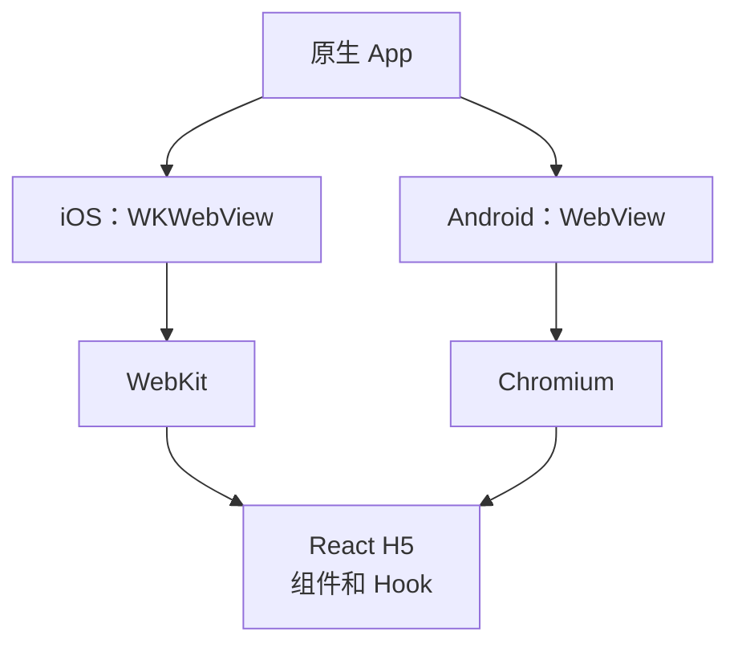
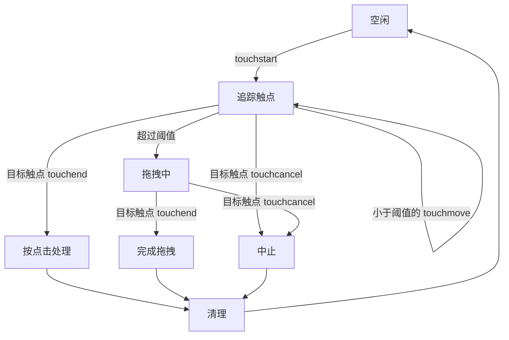
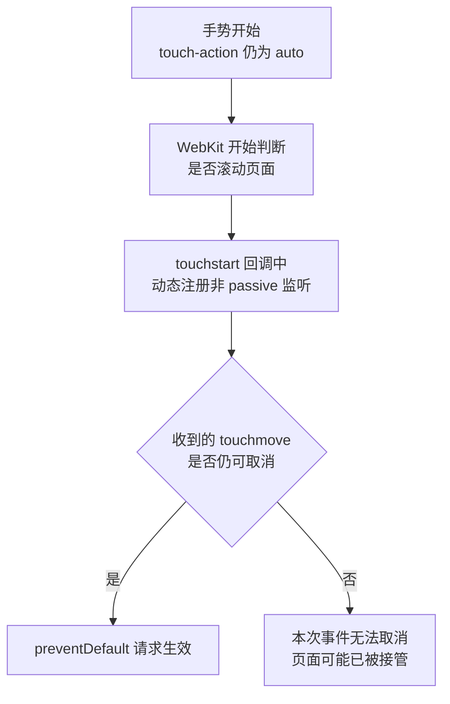

如果要你实现一个可拖拽的移动端挂件，你会怎么写？

最直觉的答案是：在手指按下时记录起点，移动时计算距离，再用 `transform` 改变挂件位置。可真正上线时，它通常还要同时满足：

- 轻点能打开挂件，手指轻微抖动不能误判成拖拽；
- 纵向拖动要跟手，也不能越过上下边界；
- 手指滑出挂件后，拖拽仍能继续；
- 拖挂件时，下面的页面不能跟着滚；
- 系统打断触摸或组件卸载时，监听必须被清理。

先看最小接入：只需要给出可拖动范围和点击动作。

```tsx
const drag = useVerticalDrag({
  minOffsetY: 16,
  maxOffsetY: 560,
  onTap: onOpen,
})
```

这里的 `initialOffsetY` 是可选项，省略时从 `0` 开始；`onDragEnd` 也只在“拖完要保存位置”时才传入。把它们都塞进开场示例，反而会掩盖这个 Hook 最核心的三个输入：**范围下限、范围上限、点击动作**。

下面就按真实的开发顺序来实现它：先补齐必要概念，再拆解一次手势，写到滚动穿透出现时，继续追到 iOS WKWebView 的手势仲裁。

# 开始前，先补齐最少的前置知识

## WebView 体系：容器和引擎不要混

排查 H5 手势时，先区分“App 用什么组件装网页”和“网页由什么引擎运行”。iOS 与 Android 的常见组合如下：

| 平台 / 名称 | 它是什么 | 常见引擎 |
| --- | --- |
| WebView | App 内展示网页的原生视图的统称 | 取决于平台 |
| iOS 的 `WKWebView` | Apple 提供的 WebView 组件 | WebKit |
| Android 的 `WebView` / Android System WebView | Android 应用内嵌网页的组件 | Chromium |
| Chrome | 完整浏览器 App，不是与 `WKWebView` 对等的 Android SDK 组件 | Chromium |

本文所说的 H5，就是运行在 App WebView 里的网页。`WKWebView` 是 iOS 组件名，WebKit 是它的网页引擎；Android 的对应组件叫 `WebView`，官方文档明确说明它使用 Chromium 内核。[Apple 的 WKWebView 文档](https://developer.apple.com/documentation/webkit/wkwebview/) 与 [Android WebView 文档](https://developer.android.com/develop/ui/views/layout/webapps/webview) 可以交叉参考。

有时会听到“Chrome WebView”，通常是在泛指 Chromium 内核或用 Chrome DevTools 调试 Android WebView；它不是一个和 `WKWebView` 并列的标准 API 名称。真正决定手势细节的，是目标设备上实际运行的 WebView 组件和内核版本。



这层关系稍后会派上用场：React 处理事件时，WebKit 或 Chromium 也在判断这次手势是否应该滚动页面。本文重点讨论 iOS 的 WebKit 时序，但 Android 也应真机回归。

## 一次触摸会发生什么

Touch Events 把一次触摸拆成四类事件：

| 事件 | 时机 | 拖拽中的任务 |
| --- | --- | --- |
| `touchstart` | 手指按下 | 记录起点 |
| `touchmove` | 手指移动 | 计算并更新位置 |
| `touchend` | 手指正常离开 | 完成点击或拖拽 |
| `touchcancel` | 触摸被系统或浏览器取消 | 中止手势并清理 |

事件里最容易混淆的是 `TouchList`。它是“像数组一样能按下标取值”的触点列表，但不是普通 JavaScript 数组；这也是后文使用 `Array.from(...).find(...)` 的原因。

| 字段 | 它包含什么 | 两指场景里的用途 |
| --- | --- | --- |
| `touches` | 此刻仍在屏幕上的**全部**触点 | A 手指按住挂件后，B 手指再按下，列表会同时包含 A 和 B |
| `changedTouches` | **这一次事件**真正发生变化的触点 | B 刚按下、移动或抬起时，这个列表里是 B；A 没动就不在里面 |
| `targetTouches` | 仍在屏幕上且最初按在当前事件目标上的触点 | 多个元素都能触摸时，用它区分“从这个挂件开始”的触点 |
| `identifier` | 同一根手指在这次会话里的稳定编号 | 不依赖 `touches[0]`，始终找到最初开始拖拽的 A |

举个完整过程：A 先按住挂件，`touchstart` 时 `touches` 和 `changedTouches` 都包含 A；A 仍按着时 B 在别处按下，新的事件里 `touches` 包含 A、B，`changedTouches` 只包含 B；B 松手后，`touches` 仍有 A，而 `changedTouches` 是 B。列表的下标顺序不该承担业务语义——不要假设 `touches[0]` 永远是最早按下的手指，应该保存 A 的 `identifier` 后再查找它。[Touch Events 规范](https://www.w3.org/community/reports/touchevents/CG-FINAL-touch-events-20240704/) 对这些字段和事件目标有完整定义。

[Touch Events 社区规范](https://www.w3.org/community/reports/touchevents/CG-FINAL-touch-events-20240704/) 已将其视为遗留 API；面向现代浏览器的新项目，应优先评估 Pointer Events。本文继续使用 Touch Events，是因为它正是大量存量 React H5 和旧 WebView 拖拽代码面对的事件模型。

## state 和 ref 怎样分工

挂件位置会影响画面，需要用 React state 保存，变化后触发渲染。触点编号、起始坐标等数据只服务于事件计算，不需要每次变化都重新渲染，更适合放在 ref 中。

可以把 ref 理解成一个“跨渲染保留的可变盒子”：修改 `ref.current` 不会触发渲染，但下一次事件仍能读到新值。

# 先定义 Hook 的坐标和职责

这篇文章只实现纵向拖拽。所有位置都表示元素相对原始布局位置的 `translateY`，单位是 CSS 像素，而不是元素在屏幕中的绝对 Y 坐标。

```ts
interface UseVerticalDragOptions {
  initialOffsetY?: number
  minOffsetY: number
  maxOffsetY: number
  disabled?: boolean
  onTap: () => void
  onDragEnd?: (offsetY: number) => void
}
```

Hook 负责识别点击与拖拽、计算位置、管理监听；组件负责外观和打开页面等业务动作。这样手势逻辑可以独立复用。

# 按生命周期拆解一次手势

## `touchstart`：创建手势会话

先定义一次手势需要保存的数据：

```ts
interface DragSession {
  identifier: number
  startClientX: number
  startClientY: number
  startOffsetY: number
  hasDragged: boolean
}

const DRAG_THRESHOLD_PX = 8
const [offsetY, setOffsetY] = useState(initialOffsetY)
const currentOffsetRef = useRef(initialOffsetY)
const sessionRef = useRef<DragSession | null>(null)
```

`offsetY` 驱动画面渲染，`currentOffsetRef` 则同步保存最新位置，让连续到来的原生事件不用等待下一次 React 渲染。手指按下时，记录“哪根手指从哪里按下”和“挂件原来在哪里”：

```ts
const touch = event.changedTouches[0] ?? event.touches[0]
if (!touch) return

sessionRef.current = {
  identifier: touch.identifier,
  startClientX: touch.clientX,
  startClientY: touch.clientY,
  startOffsetY: currentOffsetRef.current,
  hasDragged: false,
}
```

整个会话的状态变化如下：



## `touchmove`：找回触点，计算并限制位置

移动时先取出会话、用 `identifier` 找回同一根手指，再计算它相对起点的距离：

```ts
const session = sessionRef.current
if (!session) return

const touch = Array.from(event.touches).find(
  item => item.identifier === session.identifier,
)
if (!touch) return

const deltaX = touch.clientX - session.startClientX
const deltaY = touch.clientY - session.startClientY
const distance = Math.hypot(deltaX, deltaY)
```

人的手指很难完全静止。这里用 8 CSS px 作为示例阈值，在它以内仍按点击处理；实际值要结合目标设备和挂件尺寸验证。阈值按二维移动距离判断，避免一次很远的横滑因为 `deltaY` 很小而被误判成点击；挂件的位置仍然只使用纵向的 `deltaY`。

```ts
if (!session.hasDragged && distance < DRAG_THRESHOLD_PX) {
  return
}

session.hasDragged = true

const nextOffsetY = Math.min(
  maxOffsetY,
  Math.max(minOffsetY, session.startOffsetY + deltaY),
)

currentOffsetRef.current = nextOffsetY
setOffsetY(nextOffsetY)
```

这里使用“起始位置 + 总位移”，而不是把每次 `touchmove` 的差值连续累加，可以避免中间漏掉事件后产生累计误差。

## 为什么后续监听放在 `document`

`onTouchStart` 适合作为 React 组件的手势入口。会话开始后，我们再临时用原生 `addEventListener` 监听 `touchmove`、`touchend` 和 `touchcancel`。这不是伪代码，浏览器原生事件就是这样注册的；`passive: false` 是第三个参数里的监听选项，后面会专门拆开解释。

Touch Events 序列的目标通常仍是手指最初按下的元素，即使手指已经滑出它；事件会继续向上冒泡到 `document`。把后续监听集中在 `document`，主要有三个工程原因：

1. 可以精确配置稍后要用到的 `passive`；
2. 移动、结束和取消都由同一个会话管理；
3. 监听只在手势期间存在，结束后立即移除。

```ts
document.addEventListener(
  "touchmove",
  handleMove,
  { passive: false }, // 监听器可能调用 preventDefault()
)
document.addEventListener("touchend", handleFinish, { passive: false })
document.addEventListener("touchcancel", handleFinish)
```

原生监听还有一个限制：移除时必须使用注册时的同一个函数引用，并保持相同的 `capture` 值。这里没有设置 `capture`，增加和移除时都使用默认的 `false`。

React 重新渲染会创建新的普通函数，所以最终代码使用“稳定监听函数 + 最新逻辑 ref”：外层函数引用始终不变，内部通过自定义的 `useLatest` 读取最新逻辑。这既能正确解绑，也能避免闭包读到过期配置。

## `touchend` 和 `touchcancel`：不要混为一谈

两者都会结束会话，但语义不同：

- `touchend` 是正常结束：未超过阈值就触发 `onTap`，超过阈值则触发 `onDragEnd`；
- `touchcancel` 是意外中止：示例保留挂件当下位置，但不触发任何完成回调。

两种事件的 `changedTouches` 都可能只包含部分触点，所以必须先核对 `identifier`。不能因为任意一根手指结束或取消，就终止当前追踪的拖拽。

# 写到这里，问题出现了：挂件动了，页面也在滚

上面的计算足以让挂件移动，但浏览器还保留着自己的默认行为：页面滚动。因此在可滚动页面里，挂件和背景可能一起移动。

这通常被称为“拖拽滚动穿透”。更准确地说，它是**自定义拖拽与浏览器默认滚动发生了手势竞争**。

## 先理解 `passive`、`preventDefault` 和 `cancelable`

你平时在 React 组件里更常见的是：

```tsx
<div onTouchMove={handleMove} />
```

这会由 React 帮你注册和分发事件，但 JSX 没有地方让你声明监听选项。这里需要直接监听 `document`，并且必须明确告诉浏览器“这个 `touchmove` 可能取消默认滚动”，所以才使用原生写法：

```ts
document.addEventListener("touchmove", handleMove, {
  passive: false,
})
```

第三个参数是一个配置对象；`passive` 不是 Touch Events 独有字段，也不是 React props。

| 概念 | 它真正表达的意思 |
| --- | --- |
| `{ passive: false }` | 告诉浏览器：这个监听器**可能**调用 `preventDefault()`，不要把它当成纯观察者 |
| `preventDefault()` | 请求浏览器取消滚动等默认行为；它不负责阻止事件冒泡 |
| `event.cancelable` | 当前事件是否允许取消默认行为；为 `false` 时，调用 `preventDefault()` 没有效果 |

当 `passive: true` 时，监听器承诺不会取消默认行为；浏览器就可以为了滚动性能不等待 JavaScript，此时调用 `preventDefault()` 会被忽略。部分浏览器会把根节点（如 `document`）上的 `touchmove` 默认视作 passive，因此这里必须显式写 `false`。

再用一句更直白的话收束：`passive: false` 只是让浏览器**给 JavaScript 一个叫停的机会**；`preventDefault()` 才是说“这次别滚”；`cancelable` 则是浏览器回答“现在还来得及吗”。它不能让已经不可取消的事件重新变得可取消，也不保证浏览器会停下早已接管的滚动。标准语义可以参考 [WHATWG DOM Standard](https://dom.spec.whatwg.org/)。

`stopPropagation()` 只阻止事件继续传播，不能代替 `preventDefault()` 处理页面滚动。

## 阈值不能决定何时阻止滚动

一种看似合理的写法，是超过拖拽阈值后才调用 `preventDefault()`：

```ts
const deltaY = touch.clientY - session.startClientY
const distance = Math.hypot(
  touch.clientX - session.startClientX,
  deltaY,
)

if (distance < DRAG_THRESHOLD_PX) {
  return
}

event.preventDefault()
```

但阈值以内的几个 `touchmove` 已经能让浏览器判断“手指正在纵向移动”，页面可能就此开始滚动。正确顺序是：只要手势从拖拽区域开始，就先处理默认行为，再判断它最终属于点击还是拖拽。

```ts
// 必须配合注册监听时的 { passive: false }。
if (event.cancelable) {
  event.preventDefault()
}

const deltaY = touch.clientY - session.startClientY
const distance = Math.hypot(
  touch.clientX - session.startClientX,
  deltaY,
)
if (!session.hasDragged && distance < DRAG_THRESHOLD_PX) {
  return
}
```

所以，**阈值是点击与拖拽的分类规则，不是页面滚动的开关。**

还有一个容易漏掉的副作用：按照 Touch Events 的约定，触摸事件被取消后，浏览器不应再生成由它导致的兼容性 `click`。因此最终 Hook 不依赖这个合成 `click`：它会在正常 `touchend` 时主动触发 `onTap`，同时取消 `touchend` 的默认行为。只有当该事件已经不可取消时，示例才使用一个短时间窗兜底过滤可能到来的 `click`；这个时间窗是需要真机验证的兼容策略，不是平台标准。

# 为什么 iOS WKWebView 仍可能偶现

把 `preventDefault()` 提前后，多数环境会恢复正常。但在部分 iOS WKWebView 中，只靠这一层仍可能偶发。

原因在于浏览器需要很早决定：这次手势交给页面原生滚动，还是等待 JavaScript 自定义处理。这个过程可以叫**手势仲裁**。

当前的非被动 `document touchmove`，是在 `touchstart` 回调执行后才动态注册的。从 JavaScript 看，我们处理了“第一个收到的 `touchmove`”；从 WebKit 看，是否允许 JavaScript 阻止滚动的判断可能已经发生。



`cancelable === false` 直接说明的只有“当前事件不能取消”。结合特定 WebKit 版本对动态触摸监听的已知实现，才可以进一步推断：本次手势可能已经完成仲裁。这是理解实现行为的模型，不是 Web 标准规定的固定时序。相关讨论见 [WebKit Bug 184251](https://bugs.webkit.org/show_bug.cgi?id=184251) 和更直接描述早期事件不可取消现象的 [WebKit Bug 185656](https://bugs.webkit.org/show_bug.cgi?id=185656)。

React 不是这个问题的根因。任何在 `touchstart` 中才动态注册 `touchmove` 的方案，都可能遇到相同的时序窗口。

# 最终方案：CSS 提前声明，JavaScript 负责会话

运行时补救仍然太晚，就把手势意图提前到 CSS：

```css
.pendant[data-drag-disabled="false"] {
  /* 核心：手势开始前声明，这个区域不交给浏览器平移或缩放。 */
  touch-action: none;

  /* 下面两项只防文本选择和 WebKit 原生拖拽，不负责阻止滚动。 */
  user-select: none;
  -webkit-user-drag: none;
}
```

在支持这个值的目标 WebKit 上，`touch-action: none` 会在手势开始前参与浏览器仲裁；`preventDefault()` 则在事件到达 JavaScript 且仍可取消时提供运行时保障。两层各自解决不同时间点的问题。`touch-action` 的计算规则见 [Pointer Events 规范](https://www.w3.org/TR/pointerevents/#the-touch-action-css-property)。

## CSS 要覆盖完整的拖拽起始区域

`touch-action` 应覆盖所有允许开始拖拽的命中位置，而不只是视觉上最明显的图片。例如图片上的角标、透明内边距或叠加层，如果从那里也应该拖动，就必须处在同一个声明范围内。

最简单的原则是：**`onTouchStart` 绑定在哪里，`touch-action` 就完整覆盖哪里的命中范围。**

如果一个关闭按钮不允许拖拽，却也不希望从它起手滚动页面，可以单独给它设置 `touch-action: none`；不要仅为扩大禁滚范围，就把拖拽的 `onTouchStart` 上移到包含多个独立按钮的父节点。

禁用拖拽时也要同时恢复 `touch-action: auto`。否则 JavaScript 虽然不再创建会话，那块透明的 CSS 命中区仍会阻止页面滚动。

## 完整的 `useVerticalDrag`

下面是把上述逻辑合在一起的参考实现。`useLayoutEffect` 会在 DOM 提交后、浏览器绘制前同步 ref 和清理函数，适合衔接紧接着到来的原生事件；其中不要放耗时任务。如果代码位于 Next.js App Router，还需要在文件顶部添加 `"use client"`，普通 React H5 不需要这条 Next.js 指令。

```tsx
import {
  useLayoutEffect,
  useRef,
  useState,
  type TouchEventHandler,
} from "react"

const DRAG_THRESHOLD_PX = 8
const NON_CANCELABLE_CLICK_GUARD_MS = 700

interface UseVerticalDragOptions {
  initialOffsetY?: number
  minOffsetY: number
  maxOffsetY: number
  disabled?: boolean
  onTap: () => void
  onDragEnd?: (offsetY: number) => void
}

interface DragSession {
  identifier: number
  startClientX: number
  startClientY: number
  startOffsetY: number
  hasDragged: boolean
}

function useLatest<T>(value: T) {
  const ref = useRef(value)

  // DOM 更新后立即保存最新值，供稳定的原生监听函数读取。
  useLayoutEffect(() => {
    ref.current = value
  }, [value])

  return ref
}

function useStableTouchListener(handler: (event: TouchEvent) => void) {
  const handlerRef = useLatest(handler)
  const listenerRef = useRef<(event: TouchEvent) => void>(event => {
    handlerRef.current(event)
  })

  // 引用始终不变，addEventListener 和 removeEventListener 可以精确配对。
  return listenerRef.current
}

export function useVerticalDrag({
  initialOffsetY = 0,
  minOffsetY,
  maxOffsetY,
  disabled = false,
  onTap,
  onDragEnd,
}: UseVerticalDragOptions) {
  const [offsetY, setOffsetY] = useState(initialOffsetY)
  const [isDragging, setIsDragging] = useState(false)
  const currentOffsetRef = useRef(initialOffsetY)
  const sessionRef = useRef<DragSession | null>(null)
  const ignoreClickUntilRef = useRef(0)
  const removeListenersRef = useRef<() => void>(() => {})
  const optionsRef = useLatest({
    minOffsetY,
    maxOffsetY,
    onTap,
    onDragEnd,
  })

  const handleMove = useStableTouchListener(event => {
    const session = sessionRef.current
    if (!session) return

    // 多指场景下，只追踪 touchstart 时记录的那根手指。
    const touch = Array.from(event.touches).find(
      item => item.identifier === session.identifier,
    )
    if (!touch) return

    // 先尝试阻止默认滚动；阈值只用于区分点击和拖拽。
    if (event.cancelable) {
      event.preventDefault()
    }

    const deltaX = touch.clientX - session.startClientX
    const deltaY = touch.clientY - session.startClientY
    const distance = Math.hypot(deltaX, deltaY)
    if (!session.hasDragged && distance < DRAG_THRESHOLD_PX) {
      return
    }

    if (!session.hasDragged) {
      session.hasDragged = true
      setIsDragging(true)
    }

    const { minOffsetY, maxOffsetY } = optionsRef.current
    const nextOffsetY = Math.min(
      maxOffsetY,
      Math.max(minOffsetY, session.startOffsetY + deltaY),
    )

    currentOffsetRef.current = nextOffsetY
    setOffsetY(nextOffsetY)
  })

  const handleFinish = useStableTouchListener(event => {
    const session = sessionRef.current
    if (!session) return

    // touchend 和 touchcancel 都只处理当前追踪的触点。
    const trackedTouchChanged = Array.from(event.changedTouches).some(
      item => item.identifier === session.identifier,
    )
    if (!trackedTouchChanged) return

    removeListenersRef.current()
    sessionRef.current = null
    setIsDragging(false)

    // 取消只做清理：保留当下位置，不触发点击或拖拽完成回调。
    if (event.type === "touchcancel") return

    // 主动产出 tap/drag 语义，并阻止浏览器再合成一次 click。
    if (event.cancelable) {
      event.preventDefault()
    } else {
      // 不可取消时只能使用经目标容器验证过的时间窗兜底。
      ignoreClickUntilRef.current =
        Date.now() + NON_CANCELABLE_CLICK_GUARD_MS
    }

    if (session.hasDragged) {
      optionsRef.current.onDragEnd?.(currentOffsetRef.current)
    } else {
      optionsRef.current.onTap?.()
    }
  })

  useLayoutEffect(() => {
    const removeListeners = () => {
      document.removeEventListener("touchmove", handleMove)
      document.removeEventListener("touchend", handleFinish)
      document.removeEventListener("touchcancel", handleFinish)
    }

    removeListenersRef.current = removeListeners

    // 组件卸载时移除原生监听，并使未结束的会话失效。
    return () => {
      removeListeners()
      sessionRef.current = null
    }
  }, [handleMove, handleFinish])

  useLayoutEffect(() => {
    if (!disabled || !sessionRef.current) return

    // 拖拽过程中被禁用时立即中止，避免会话继续更新位置。
    removeListenersRef.current()
    sessionRef.current = null
    setIsDragging(false)
  }, [disabled])

  const onTouchStart: TouchEventHandler<HTMLElement> = event => {
    if (disabled || sessionRef.current) return

    const touch = event.changedTouches[0] ?? event.touches[0]
    if (!touch) return

    // 新的触摸序列会取代上一序列留下的 click 兜底标记。
    ignoreClickUntilRef.current = 0

    // 开始新会话前，先清除可能残留的原生监听。
    removeListenersRef.current()
    sessionRef.current = {
      identifier: touch.identifier,
      startClientX: touch.clientX,
      startClientY: touch.clientY,
      startOffsetY: currentOffsetRef.current,
      hasDragged: false,
    }

    document.addEventListener("touchmove", handleMove, {
      passive: false,
    })
    document.addEventListener("touchend", handleFinish, {
      passive: false,
    })
    document.addEventListener("touchcancel", handleFinish)
  }

  return {
    offsetY,
    isDragging,
    dragHandleProps: { onTouchStart },
    shouldIgnoreClick: () => {
      const shouldIgnore = Date.now() < ignoreClickUntilRef.current
      // 一个触摸序列至多消费一次兼容性 click。
      ignoreClickUntilRef.current = 0
      return shouldIgnore
    },
  }
}
```

一个最小组件可以这样接入：

```tsx
function FloatingWidget({
  disabled = false,
  onOpen,
}: {
  disabled?: boolean
  onOpen: () => void
}) {
  const {
    offsetY,
    dragHandleProps,
    shouldIgnoreClick,
  } = useVerticalDrag({
    initialOffsetY: 120,
    minOffsetY: 16,
    maxOffsetY: 560,
    disabled,
    onTap: onOpen,
  })

  const handleClick = () => {
    // 触摸点击已由 onTap 处理；这里保留鼠标和键盘激活能力。
    if (shouldIgnoreClick()) return
    onOpen()
  }

  return (
    <button
      className="pendant"
      type="button"
      disabled={disabled}
      data-drag-disabled={disabled}
      style={{ transform: `translate3d(0, ${offsetY}px, 0)` }}
      {...dragHandleProps}
      onClick={handleClick}
    >
      打开
    </button>
  )
}
```

```css
.pendant {
  position: fixed;
  top: 0;
  right: 16px;
  width: 64px;
  height: 64px;
}

.pendant[data-drag-disabled="false"] {
  touch-action: none;
  user-select: none;
  -webkit-user-drag: none;
}
```

这里给出了固定尺寸，是为了让禁滚命中区保持紧凑；实际项目应换成自己的挂件布局。

# 方案边界和发布前检查

`touch-action: none` 带来一个明确取舍：只要手势从拖拽区域开始，浏览器就不会滚动页面，即使最终位移没有超过阈值；它也会禁用该区域内的浏览器原生缩放。不要用一个巨大的透明容器包住挂件。

上线前至少验证：

- 静止点击和小于阈值的抖动点击都只打开一次；
- 快速、慢速拖动时，背景页面都保持静止；
- 手指滑出挂件后仍可继续，结束后监听已被移除；
- 多指操作不会跟错手指，也不会被另一根手指提前结束；
- `touchcancel`、组件卸载和拖拽中切换 `disabled` 后都不会残留拖拽态；
- 从图片、角标、透明边缘等每个拖拽起始位置按下，行为一致；
- 上下边界不会越界或跳动；
- iOS Safari、目标 App 的 WKWebView 和 Android 目标容器都经过真机验证。

如果要支持很老的 iOS WebKit，还需要按目标系统版本确认 `touch-action` 支持情况。不要只依赖桌面浏览器的移动端模拟。

# 结语

移动端拖拽真正难的不是计算 `deltaY`，而是让每层在正确的时间做正确的事：

- Hook 管理触点、阈值、位置和完整的手势生命周期；
- `touch-action` 在手势开始前声明浏览器行为边界；
- `{ passive: false }` 表示监听器可能取消默认行为；
- `preventDefault()` 在事件仍可取消时提出取消请求；
- 显式 `onTap` 保证轻微抖动后仍能可靠点击；
- `touchend`、`touchcancel`、禁用和卸载共同保证清理闭环。

这样，iOS WKWebView 中看似“偶现”的滚动穿透，就能被还原为一个有明确参与者、时间窗口和解决边界的手势问题。

# 参考资料

- [Apple：WKWebView](https://developer.apple.com/documentation/webkit/wkwebview/)
- [WebKit Documentation](https://docs.webkit.org/)
- [WHATWG DOM Standard](https://dom.spec.whatwg.org/)
- [W3C Community Group：Touch Events Level 2](https://www.w3.org/community/reports/touchevents/CG-FINAL-touch-events-20240704/)
- [W3C：Pointer Events — `touch-action`](https://www.w3.org/TR/pointerevents/#the-touch-action-css-property)
- [WebKit Bug 184251：Dynamic passive touch listeners](https://bugs.webkit.org/show_bug.cgi?id=184251)
- [WebKit Bug 185656：动态监听与早期不可取消事件](https://bugs.webkit.org/show_bug.cgi?id=185656)
- [WebKit Bug 133112：WebKit 支持 `touch-action`](https://bugs.webkit.org/show_bug.cgi?id=133112)
- [React：`useRef`](https://react.dev/reference/react/useRef)
