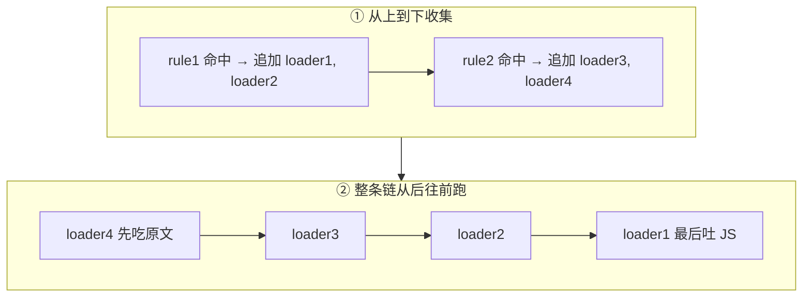
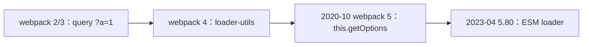
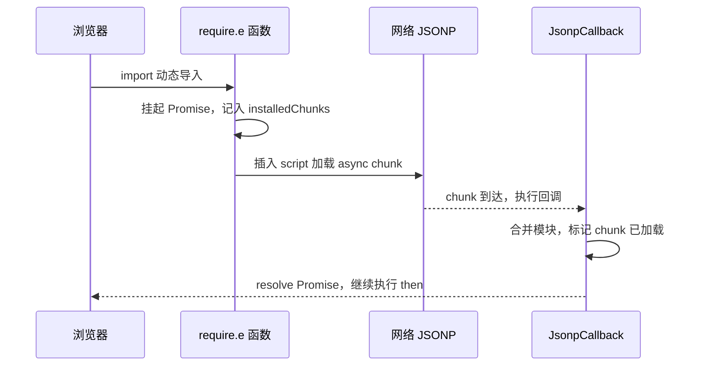

# 编译构建扩展专题素材

从课程正文移出的原始素材，尚未整理为发布文章。版本细节、代码示例与新闻案例需在发布前逐项核验；不进入博客文章列表。重复优化清单仅作编辑留档。

# Loader 编写与 API 演进

**记住两个端点：最后一个 loader（最右、最先执行）拿到的是原始文件内容；对这里的普通 JS 模块处理链，第一个 loader（最左、最后执行）要返回 webpack 能解析的 JavaScript。** 另外 loader 还有一个"从左到右"运行的 pitch 阶段，可以提前短路后续 loader，这里不展开（详见官方 [Writing a Loader](https://webpack.js.org/contribute/writing-a-loader/)）。

上面说的是**一条** `use` 数组。项目里通常有多条 `rules`，一个文件可能同时命中好几条——这时不是「哪条先写哪条先跑」这么简单，而是**先收集、再整条反向**：

1. 按 `rules` **从上到下**检查 `test`（匹配的是模块路径，如 `./src/index.js`）。
2. 命中的每条 rule，把它的 `use` **按书写顺序追加**进一个总数组。
3. 总数组形成后，**从后往前**执行——和单条 `use` 的右→左是同一条规则，只是数组更长。

```js
module.exports = {
  module: {
    rules: [
      { test: /\.js$/, use: ['loader1', 'loader2'] },
      { test: /index\.js$/, use: ['loader3', 'loader4'] },
    ],
  },
}
```

`index.js` 两条都中，总数组是 `[loader1, loader2, loader3, loader4]`，实际跑 **4 → 3 → 2 → 1**。`a.js` 只中第一条，总数组是 `[loader1, loader2]`，跑 **2 → 1**。入口和依赖模块走的链可以不一样——这是面试里很爱挖的坑。



进阶一句：`enforce: 'pre' | 'post'` 会再把某些 loader 抽到整条链的最前或最后，社区里 `eslint-loader` 当年就常标 `pre`。没碰到再记即可。

**loader 函数内部的核心工作，往往还是 AST 变换。** 以最常见的 `babel-loader` 为例，它把源码交给 `@babel/parser` 解析成 **AST（抽象语法树）**，在树上做转换（如把箭头函数、可选链降级），再 `generate` 回字符串。"理解代码结构再改写"，靠的就是 AST，而不是字符串替换。注意这是 **loader 自己**在函数内部做的 AST，和前面流程图里 webpack 在 loader **之后**做的那次解析是两回事：webpack 那次是为了找依赖；Babel 这次是为了改语法。

一个最简单的 loader 其实就是一个导出函数。它跑在 **Node 里、构建期**，处理完就扔掉，**不会**打进浏览器拿到的 bundle。所以函数体里没有 `window`，`source` 才是「正在被翻译的那份源码」。

```js
// upper-loader.js：把源码里的注释标记替换掉（示意）
module.exports = function (source) {
  const { mark = '__MARK__' } = this.getOptions()
  // source 是上一个 loader 的输出（或原始文件内容）
  return source.replace(`// ${mark}`, '// processed by upper-loader')
}
```

参数不从函数签名里来，而从 **`this`（loader context）** 来。配置里可以写对象，也可以走老的查询串：

```js
// 完整对象（现在的常规写法）
{ loader: './upper-loader', options: { mark: '__MARK__' } }

// 简写：use: ['style-loader', 'css-loader']
// 更老：loader 路径后面拼 ?mark=__MARK__
```

这几条规则变过一轮，面试或翻旧文时很容易对不上。时间线比死记「现在的写法」有用：



- **query 字符串**（`loader: './x?a=1'`，以及 `!!xxx-loader?a=1!./file.js` 这种内联写法）是 2/3 时代的主流。对象 `options` 后来成了正统，query 还在，但只适合传几个标量。
- **`loader-utils`**：webpack 4 官方推荐用它解析 `this.query`。它会把 `true` / `false` / `null` 收成字面量，还一度接受 JSON5（`?{arg:true}` 可以不写引号）。
- **webpack 5.0（2020-10-10）** 把 `this.getOptions([schema])` 做成内置 API，用来取代 `loader-utils.getOptions`（[迁移指南](https://webpack.js.org/migrate/5/#getoptions-method-for-loaders)、[Loader Interface](https://webpack.js.org/api/loaders/)）。解析改走 Node 原生 querystring，JSON5 那种宽松写法算废弃。
- **「loader 必须 CommonJS，不能写 `import`」**：在 webpack 4 和 5.0～5.79 基本成立——loader 由 Node `require` 加载。**2023-04-19 的 5.80.0** 才正式支持 ESM loader（[v5.80.0](https://github.com/webpack/webpack/releases/tag/v5.80.0)，PR [#15198](https://github.com/webpack/webpack/pull/15198)）：文件用 `.mjs` 或包上 `"type": "module"`。很多讲义还停在「必须 CJS」，说的是 5.80 之前的世界。
- **别和源码混**：`src/` 里的 ESM / CJS 是**被打包的代码**；loader / plugin 是**打包过程自己在 Node 里跑的代码**。前者转完给浏览器，后者从不进 bundle。

今天写新 loader：函数 + `this.getOptions()`，CJS 或 ESM 都行。翻到 `loader-utils` + `?a=1` 的旧 gist，按这条时间线对一下版本即可。


# Webpack 运行时源码专题

## 3.6 webpack 运行时：产物到底长什么样

很多人以为 webpack 的产物只是"把模块代码拼在一起"，其实不然——它还注入了一套**运行时（runtime）**，用来在浏览器里实现一个模块系统。理解这套运行时，才算真正理解 webpack。

### 项目初始化：三个核心结构

打开打包后 `dist/` 目录里的 `main.js`（也就是前面说的 **asset**——浏览器真正下载执行的那个文件），会看到三个关键东西：

```js
// 1) __webpack_modules__：除入口外的所有模块，key 是模块 id
var __webpack_modules__ = [
  ,
  /* 1 */ (module) => {
    module.exports = (...args) => args.reduce((x, y) => x + y, 0)
  },
]

// 2) __webpack_module_cache__：缓存已加载过的模块，保证模块只执行一次
var __webpack_module_cache__ = {}

// 3) __webpack_require__：webpack 自实现的 require
function __webpack_require__(moduleId) {
  // 命中缓存直接返回
  var cachedModule = __webpack_module_cache__[moduleId]
  if (cachedModule !== undefined) {
    return cachedModule.exports
  }
  // 未命中：创建 module 对象并放进缓存
  var module = (__webpack_module_cache__[moduleId] = { exports: {} })
  // 执行模块函数，把 module / exports / require 传进去
  __webpack_modules__[moduleId](module, module.exports, __webpack_require__)
  // 返回模块导出
  return module.exports
}
```

三者配合，就还原了一套 CommonJS 式的模块系统：`__webpack_modules__` 存代码、`__webpack_module_cache__` 保证单例、`__webpack_require__` 实现"按需执行 + 缓存"。

> 这段代码是概念化的整理版，真实产物会更啰嗦（带很多 `/******/` 注释和边界处理），但核心逻辑就是这三块。想亲眼看的话，建一个最小 demo（`index.js` + 一个 `a.js`），跑 `npx webpack`，打开 `dist/main.js` 就能对照。

### 入口模块与 IIFE

入口 chunk 的代码会被包在一个 **IIFE（Immediately Invoked Function Expression，立即执行函数表达式）**里——就是"定义完立刻就执行"的匿名函数 `(() => { ... })()`，作用是给这段代码开一个独立作用域，避免里面的变量污染全局。入口逻辑往往就是一句 `__webpack_require__` 触发整条依赖链：

```js
;(() => {
  // 这个入口需要用 IIFE 包裹，以便和 chunk 里其他模块隔离
  const sum = __webpack_require__(1)
  console.log(sum(3, 8)) // 11
})()
```

### 异步 chunk 加载（以 webpack 4 风格运行时为例）：`__webpack_require__.e` 与 `webpackJsonpCallback`

> 说明：运行时的**具体产物格式会随 webpack 大版本和配置（`target` 等）变化**，下面这套 `webpackJsonpCallback` 是 **webpack 4 时代**较易读的形式，用来讲清原理最合适；webpack 5 的真实格式略有不同（见本节末尾）。原理是相通的：**挂起 Promise → JSONP 加载 chunk → 回调里合并模块并 resolve**。

当你写 `import('./async-module')`（动态导入，用于路由懒加载、按需加载）时，webpack 会把它编译成 `__webpack_require__.e(...)`——`.e` 就是 "ensure chunk"，负责保证某个异步 chunk 被加载，返回一个 Promise：

```js
// 动态加载模块
__webpack_require__
  .e('asyncChunk')
  .then(__webpack_require__.bind(__webpack_require__, /* moduleId */ 42))
  .then((asyncModule) => {
    // 异步模块加载完成后使用
  })
```

> 这里返回 Promise、`.then` 链式调用的机制，如果不熟，可以先看这篇：[Promise手撕教程](/blog/promiseTutorial)。下面出现的"挂起 Promise、稍后 resolve"就是同一套东西。

**先解释 JSONP 是什么。** 异步 chunk 是通过 JSONP 的方式加载的。JSONP 的核心套路是：**动态往页面插入一个 `<script src="异步chunk.js">` 标签**，浏览器下载并执行这个 JS；而这个 JS 文件的内容被设计成"执行时会主动调用一个约定好的全局函数"，从而把数据交回给主程序。webpack 正是用这个套路加载异步 chunk——异步 chunk 文件被加载后，会调用全局的 `webpackJsonpCallback` 把自己的模块交出来。

先用**伪代码**理解 `webpackJsonpCallback` 干的两件事（真实源码更繁琐，看懂这个骨架就够了）：

```js
// 伪代码：异步 chunk 加载完成后，会调用这个回调，data 里带着 [chunk的id列表, 新模块]
function webpackJsonpCallback(data) {
  const [chunkIds, moreModules] = data
  const resolves = []

  // 第一件事：把这些 chunk 标记为"已加载"，并收集它们挂起的 resolve 函数
  for (const chunkId of chunkIds) {
    if (installedChunks[chunkId]) {
      resolves.push(installedChunks[chunkId][0]) // 取出之前挂起的 resolve
    }
    installedChunks[chunkId] = 0 // 0 表示"已加载"
  }

  // 第二件事：把异步 chunk 带来的新模块，合并进全局模块表
  for (const id in moreModules) {
    modules[id] = moreModules[id]
  }

  // 收尾：依次 resolve 掉挂起的 Promise —— 于是上面那个 .then 就能继续执行了
  resolves.forEach((resolve) => resolve())
}
```

下面是接近真实产物的版本（逻辑和上面伪代码一一对应）：

```js
function webpackJsonpCallback(data) {
  var chunkIds = data[0]
  var moreModules = data[1]
  var moduleId,
    chunkId,
    i = 0,
    resolves = []
  for (; i < chunkIds.length; i++) {
    chunkId = chunkIds[i]
    if (Object.prototype.hasOwnProperty.call(installedChunks, chunkId) && installedChunks[chunkId]) {
      resolves.push(installedChunks[chunkId][0])
    }
    // 将当前 chunk 标记为已加载
    installedChunks[chunkId] = 0
  }
  // 把异步 chunk 的模块合并进入口的 modules 中
  for (moduleId in moreModules) {
    if (Object.prototype.hasOwnProperty.call(moreModules, moduleId)) {
      modules[moduleId] = moreModules[moduleId]
    }
  }
  // 对 __webpack_require__.e 挂起的 Promise 依次 resolve
  while (resolves.length) {
    resolves.shift()()
  }
}
```

整个异步加载的时序可以这样看：



> 👉 **动手验证**：自建一个带动态 `import()` 的 webpack 最小项目，`npm install && npm run build` 后，打开切出来的异步 chunk 文件（形如 `dist/[name].[hash].chunk.js`），开头就是下面这段真实的 webpack 5 格式；入口 `dist/main.[hash].js` 和 `dist/runtime.[hash].js` 里能看到 `__webpack_require__` 的真身。（本文的下述产物是实测得到的。）

**webpack 5 的真实格式**：webpack 5 不再用 `webpackJsonpCallback` 这个具名全局函数，而是往一个全局数组 `self.webpackChunk_xxx` 上 `push`，由运行时重写这个数组的 `push` 方法来接管新到的 chunk。异步 chunk 文件大致长这样：

```js
// webpack 5 浏览器产物：异步 chunk 文件（示意）
;(self['webpackChunk_my_app'] = self['webpackChunk_my_app'] || []).push([
  ['asyncChunk'], // chunkIds
  {
    42: (module, exports, __webpack_require__) => {
      /* 该异步 chunk 里的模块代码 */
    },
  },
])
```

思路和 webpack 4 完全一致（chunkIds + 新模块 → 合并 → resolve 挂起的 Promise），只是"回调"从一个具名函数变成了"重写数组 `push`"。不同 `output.chunkFormat` / `target` 下格式还会再变，所以**不要把某一种产物当成唯一实现**——理解原理比记住某版代码更重要。


# 分包参数与策略专题

## 拆包优化：SplitChunksPlugin

现在的正统是 `optimization.splitChunks`（底层就是 `SplitChunksPlugin`）。先记住默认，再看下面那份「为了演示才写得很激进」的配置，才不会以为官方默认就是 `chunks: 'all'`。

webpack 5 的默认大致是（官方 [SplitChunksPlugin](https://webpack.js.org/plugins/split-chunks-plugin/)）：

```js
{
  chunks: 'async', // 只处理动态 import() 切出来的块
  minSize: 20000, // 约 20KB 以下不独立成文件
  minChunks: 1, // 顶层默认：被 1 个 chunk 用到就可能拆
  maxAsyncRequests: 30,
  maxInitialRequests: 30,
  cacheGroups: {
    defaultVendors: {
      test: /[\\/]node_modules[\\/]/,
      priority: -10,
      reuseExistingChunk: true,
    },
    default: {
      minChunks: 2, // 业务公共代码：至少被 2 个 chunk 引用
      priority: -20,
      reuseExistingChunk: true,
    },
  },
}
```

几条容易对不上号的：

- **`chunks` 默认 `'async'`。** 只有同步入口、没有 `import()` 时，你会觉得「没拆」。示例里写 `'all'`，是为了让同步的 lodash 也能抽出来。三个取值：`async` 只拆异步块；`initial` 只拆首屏同步加载的那些 chunk（不含 `import()`）；`all` 两边都拆。生产里多入口 / 要抽 vendor，才常改成 `all`。
- **`minSize`**：webpack 4 默认约 **30KB**（旧讲义那个数字），webpack 5 改成 **20KB**。小于阈值的公共模块宁可重复，也不换一次 HTTP。
- **`minChunks` 有两层。** 顶层默认是 1；真正管「业务公共代码」的是默认组 `default` 的 `minChunks: 2`。所以「两个入口都引用的小工具函数没被拆」——先看体积够不够 `minSize`，再看是不是落进了 `default` 组。
- **`maxSize`**：超过就尝试再切，但**切割单位是模块**，单个 200KB 的 lodash 切不开。拆多了不减传输量，只加请求，实际意义有限。
- **默认缓存组**：`defaultVendors` 吃 `node_modules`（priority -10），`default` 吃被 2 个 chunk 引用的其余模块（-20）。webpack 4 里前者叫 `vendors`，**5 改名为 `defaultVendors`**，避免和用户自己写的 `vendors` 撞名。缓存组继承顶层选项，也可以覆盖；设成 `false` 就关掉该默认组。

下面这份配置是**为了讲解逐字段列出的，`minSize` / 请求数上限刻意缩小到不合理的程度**（只为触发拆分方便演示），**请勿照抄到生产**：

```js
// ⚠️ 演示用配置：数值为方便演示而刻意缩小，非推荐默认值
module.exports = {
  optimization: {
    splitChunks: {
      chunks: 'all', // 作用范围：all（全部）/ initial（同步）/ async（异步）
      minChunks: 2, // 一个模块至少被 2 个 chunk 引用，才会被拆出去（不是"被引用 2 次"）
      maxInitialRequests: 2, // 入口起点的最大并行请求数
      maxAsyncRequests: 2, // 按需加载时的最大并行请求数
      minSize: 100, // 生成 chunk 的最小体积（字节）——演示值极小，生产别这么写
      maxSize: 100, // 超过则尝试进一步拆分——同上，演示值
    },
  },
}
```

> ⚠️ 两个容易踩的点：
> - `minChunks: 2` 的准确含义是**"这个模块至少被 2 个 chunk 引用才拆分"**，不是"被引用超过 2 次"。
> - `minSize: 100` / 请求数上限设成 2 这类值只是为了演示时容易触发拆分，**照抄到生产会拆出一堆过小的碎文件、适得其反**。

实际项目里，更推荐直接用 webpack 5 的默认值，只按需覆盖。多入口或要抽同步 vendor 时，常只改这一处：

```js
// 生产可参考：多数值用 webpack 默认，只做必要覆盖
module.exports = {
  optimization: {
    splitChunks: {
      chunks: 'all', // 覆盖默认的 async，让同步入口里的公共库也能抽
      // minSize 默认 20KB；maxInitialRequests / maxAsyncRequests / minChunks 一般不用改
    },
  },
}
```

## 常见分包策略

上一节默认组里已经出现过这两件事，这里把社区叫法钉死：

- **vendor**：指第三方依赖（`node_modules` 里的 React、lodash 等），因为它们不常变，适合单独打成一个包长期缓存。"vendor" 是社区约定俗成的叫法，意为"供应商代码"。
- **`cacheGroups`**：`splitChunks` 里用来**定义"分组规则"**的字段。默认的 `defaultVendors` / `default` 就是两组；你也可以再写自己的规则，告诉 webpack"符合条件的模块归到哪个 chunk、叫什么名字"。

一个典型配置长这样：

```js
module.exports = {
  optimization: {
    splitChunks: {
      chunks: 'all',
      cacheGroups: {
        // 规则一：所有 node_modules 里的模块 → 打成 vendors 包
        vendors: {
          test: /[\\/]node_modules[\\/]/, // 匹配路径含 node_modules 的模块
          name: 'vendors',
          priority: 10, // 优先级：一个模块同时命中多条规则时，用优先级高的
        },
        // 规则二：被 2 处以上引用的业务代码 → 合并成 common 包
        common: {
          minChunks: 2,
          name: 'common',
          priority: 5,
        },
      },
    },
  },
}
```

这是在**覆盖默认组**，不是从零发明：`priority` 比默认的 -10 / -20 高，会抢走本该进 `defaultVendors` / `default` 的模块。`name: 'vendors'` 会把命中的第三方收成**一个**文件；默认组不写死 `name` 时，文件名往往带上关联的入口，粒度更碎、缓存更细，也更容易请求变多。

对应到实践中通常这样设置：

- **针对 `node_modules`**：用 `cacheGroups` 把第三方依赖单独打成 vendor 文件，避免业务代码变更影响 npm 包的缓存（业务代码天天改，但 React 版本很久才动一次，分开打包，React 那个文件的 hash 就能长期不变）。`maxSize` 可以设阈值防止 vendor 过大，但切不开单个大模块。
- **针对业务代码**：设一个 common 分组，通过 `minChunks` 把使用率较高的资源合并为 common；首屏用不上的代码尽量用异步 `import()` 引入（见后面「懒加载」）。
- **runtime chunk**：把 `optimization.runtimeChunk` 设为 `true`（或 `{ name: 'runtime' }`），将 webpack 运行时代码拆成独立资源。这样运行时变动就不会牵连其他 chunk 的 `contenthash`，缓存更稳定。

## 两种分包思路：split-by-module vs split-by-experience

再往上抽象一层，分包其实有两种思路：

- **split-by-module（按模块拆）**：按 `node_modules`、按包名、按引用次数机械地拆（vendor、common）。实现简单，但**拆得过细**会导致请求数增多，**拆得过粗**又会让缓存命中率变低。
- **split-by-experience（按体验拆）**：按路由、首屏、交互优先级、加载时机（同步首屏 vs 异步次要）来拆，目标是"首屏最小、其余按需"，更贴近真实用户体验。

实践中两者常结合：用 split-by-module 处理第三方库，用 split-by-experience 规划业务代码的加载节奏。


# Tree Shaking 旧插件

webpack 4 时代有个 `webpack-deep-scope-plugin`，用来补「函数内部其实没用到的依赖还被留下」——作者后来直接写：**别用了，会弄坏代码，请上 webpack 5。** webpack 5 的内部图分析已经覆盖它想做的事。CSS 也不能当无副作用 JS 来摇；旧讲义里的 PurgeCSS 是另一套「对照 HTML / JS 字符串删选择器」，和 ESM 摇树不是同一条路，CSS Modules 的哈希类名会让它误伤，这里不展开。


# 压缩器历史与进阶配置

## 代码压缩：模块内部变短

生产环境 `mode: 'production'` 会打开 `optimization.minimize`，开发默认不压——否则你在 DevTools 里看到的全是一行。压缩同时干两件：减小体积、把标识符搅短（提高阅读成本，不是加密）。

工具史：


UglifyJS 老版本吃不了 ES6，官方建议先 Babel 再压。社区 fork 出 uglify-es，维护跟不上，**Terser** 从那条线接着做。webpack **4.26.0（2018-11-19）** 把默认压缩器换成 Terser（[v4.26.0](https://github.com/webpack/webpack/releases/tag/v4.26.0)）；webpack 5 继续内置，一般不用自己再装一遍。

Terser 里两个开关别混：

- **compress**：删空白、合并语句、常量折叠、**DCE**（`return` 后面的代码、`if (false)` 分支、标记为纯的未使用调用）。
- **mangle**：把 `userName` 收成 `a`。可以 `reserved` 保住几个全局名。

「纯函数」才会被当成可删 / 可折叠：相同输入相同输出、不改外部。`fetch`、写 `localStorage`、改传入对象，都有副作用，默认不敢动。源码里可用 `/*#__PURE__*/` 提示某次调用没副作用。

CSS 要另接压缩器。webpack 4 常用 `optimize-css-assets-webpack-plugin`；**webpack 5 请换官方的 [css-minimizer-webpack-plugin](https://webpack.js.org/plugins/css-minimizer-webpack-plugin/)**，旧插件依赖的钩子已经废弃。

```js
const CssMinimizerPlugin = require('css-minimizer-webpack-plugin')

module.exports = {
  optimization: {
    minimize: true,
    minimizer: [
      '...', // webpack 5：保留默认的 Terser，不要把 JS 压缩弄丢
      new CssMinimizerPlugin(),
    ],
  },
}
```

注意：一旦自己写 `minimizer` 数组，就等于接管整份压缩名单。漏掉 `'...'` 或不显式放回 `TerserPlugin`，JS 可能不再压缩。

摇完再压：Tree Shaking 标出来的 unused export，要靠这一步从文件里消失。压完之后怎么调试，就是下一节的 source map。


# Source map 新闻案例（待核验）

这也能理解 2026 年的 Claude Code CLI 源码泄露：发布到 npm 的安装包意外包含了可公开获取、可还原源码的 `.map` 文件；[heise 对事件的报道](https://www.heise.de/en/news/Claude-Code-unintentionally-open-source-Source-map-reveals-all-11242079.html)解释了 source map 如何让 CLI 源码暴露。[Axios 引述 Anthropic](https://www.axios.com/2026/03/31/anthropic-leaked-source-code-ai)称这次事故没有暴露客户数据或凭据。问题出在**发布范围**，而不是 source map 这项技术本身；「生成 map」与「发布 map」是两个不同决定。

# 重复优化清单

## 面试高频优化清单

上面讲的拆包、摇树、压缩、缓存是重点，这里再收成一份**面试速查**，分两类记忆：

**一、减小产物体积（优化加载）**

- **Tree Shaking**：见上文「Tree Shaking」。抓 ESM 静态结构、`usedExports` 只是标记、真正删除靠压缩器、`sideEffects` 别标错。
- **代码分割 + 路由懒加载**：见上文「懒加载」。动态 `import()` 按路由 / 组件拆，首屏只加载核心 chunk——最常被问、收益最大。
- **按需引入**：像 lodash、组件库不要整包 `import`，只引用到的部分（`import debounce from 'lodash/debounce'`），这是路径级少打进去；摇树是导出级再删。
- **压缩**：见上文「代码压缩」。JS 默认 Terser，CSS 用 `css-minimizer`；传输层再开 **Gzip/Brotli**（CDN / Nginx，或 `compression-webpack-plugin` 预生成 `.gz`）。
- **`contenthash` 长期缓存**：产物名带内容 hash，内容不变文件名不变，浏览器缓存长期命中。

**二、加快构建速度（优化构建）**

- **缩小 loader 处理范围**：用 `include` / `exclude` 精确命中（如 `exclude: /node_modules/`），别让 babel 去转译第三方库。
- **持久化缓存**：`cache: { type: 'filesystem' }`（前面讲过）+ `babel-loader` 的 `cacheDirectory`。
- **多进程**：`thread-loader` 并行跑 loader，`TerserPlugin` 的 `parallel` 并行压缩。
- **`resolve` 优化**：合理配置 `extensions`（少写后缀）、`alias`（直接指向库的产物），减少模块查找耗时。

> 一个高频追问：**"这么多手段，先做哪个？"** 通常先用 `webpack-bundle-analyzer` 定位体积大头，再针对性地拆包 / 按需引入 / 懒加载——**先测量，再优化**，别上来就堆配置。


# Vite 分包与循环依赖专题

## 4.5 通用拆包策略

生产构建同样面临"怎么拆包"的问题。Vite/Rollup 提供两种方式：

**手动拆包 `manualChunks`**：在 `build.rollupOptions.output.manualChunks` 里手动指定哪些模块拆到哪个 chunk（官方 [manualChunks](https://rollupjs.org/configuration-options/#output-manualchunks)）。比如把 React 相关拆成 `react-vendor`。

> ⚠️ **一个 Vite 8 的真实差异**：Vite 8 底层换成 Rolldown 后，`manualChunks` **只接受函数形式** `manualChunks(id) { ... }`，不再支持 Rollup 时代 `{ 'react-vendor': ['react'] }` 的对象写法（否则报 `manualChunks is not a function`）。这是"Vite 8 换 Rolldown"在配置层面能实际摸到的一个变化——实测得到，配置时留意即可。

**用插件声明式配置**：手写 `manualChunks` 略繁琐，社区的 [vite-plugin-chunk-split](https://github.com/sanyuan0704/vite-plugin-chunk-split) 让拆包更直观：

```ts
// vite.config.ts
import { chunkSplitPlugin } from 'vite-plugin-chunk-split'

export default {
  plugins: [
    chunkSplitPlugin({
      // 指定拆包策略
      customSplitting: {
        // 1. 支持填包名。react 和 react-dom 会被打包到名为 react-vendor 的
        //    chunk 里（包括它们的依赖，如 object-assign）
        'react-vendor': ['react', 'react-dom'],
        // 2. 支持填正则。src 中 components 和 utils 下的所有文件
        //    会被打包为 component-util 的 chunk
        'components-util': [/src\/components/, /src\/utils/],
      },
    }),
  ],
}
```

拆包思路和前面 webpack 那套 split-by-module / split-by-experience 是相通的——底层逻辑不变，只是配置形态不同。

## 4.6 循环依赖问题

最后讲一个 no-bundle + 原生 ESM 场景下**更容易暴露**的坑：循环依赖。

设想 `a.js` 引用 `b.js`，`b.js` 又反过来引用 `a.js`：


问题出在**执行顺序**上，但 ESM 和 CommonJS 的具体表现**并不相同**，别混为一谈：

- **ESM**：模块间是"先建立绑定（live binding）、再按顺序求值"。如果 `b.js` 在 `a.js` 那个 `export const x = ...` 还没执行到时就去读 `x`，读到的是一个处于 **TDZ（Temporal Dead Zone，暂时性死区）** 的 `let`/`const` 绑定，会直接抛 **`ReferenceError`**——而不是安静地拿到 `undefined`。
- **CommonJS**：`require` 返回模块当前导出的值；若是对象，拿到的是对象引用，不是把属性复制一份。循环依赖时，`b` 可能拿到 `a` **执行到一半、还不完整的 `module.exports`**（缺了后面才赋值的属性，读出来是 `undefined`），程序不报错但值不对——更隐蔽。

一句话区分：**ESM 更可能"直接报错"（TDZ），CommonJS 更可能"拿到不完整的值"。**

规避办法（两者通用）：

- **延迟引用**：把对循环依赖的读取放到函数内部（真正调用时才读），而不是模块顶层。
- **打破环**：把两个模块共同依赖的部分抽成第三个公共模块。
- **避免顶层互相依赖**：设计上尽量让依赖是单向的。

> 为什么放在 Vite 章节讲？因为 webpack 打包后模块被合进同一作用域，有时会"意外掩盖"循环依赖；而 Vite 开发态是浏览器原生 ESM 按真实顺序加载，循环依赖的问题往往更早、更直接地暴露出来。


# 并行 loader 配置素材

**并行提升 CPU 利用率**：更严谨地说——**同一条 loader 链内部是有顺序的（串行）**，但 webpack 对不同模块的构建本身存在一定并发；瓶颈更多在于 JS 单线程下 CPU 密集的转换（如 Babel 解析大量文件）。可以用 [thread-loader](https://webpack.js.org/loaders/thread-loader/) 把耗时的 loader 放进独立的 worker 池并行跑：

```js
module.exports = {
  module: {
    rules: [
      {
        test: /\.js$/,
        use: [
          'thread-loader', // 放在最前面：后续 loader 会在 worker 池里并行执行
          {
            loader: 'babel-loader',
            options: { cacheDirectory: true }, // babel 自身也缓存转译结果
          },
        ],
      },
    ],
  },
}
```

> 注意 `thread-loader` 要放在 loader 链的**最前面**（即最先 pitch、最后执行），它之后的 loader 才会被放到 worker 池里。**是否真有收益，取决于"转换本身的 CPU 成本"与"开 worker + 进程间通信的开销"谁大**——小项目里通信开销可能反而拖慢，所以别无脑加。
