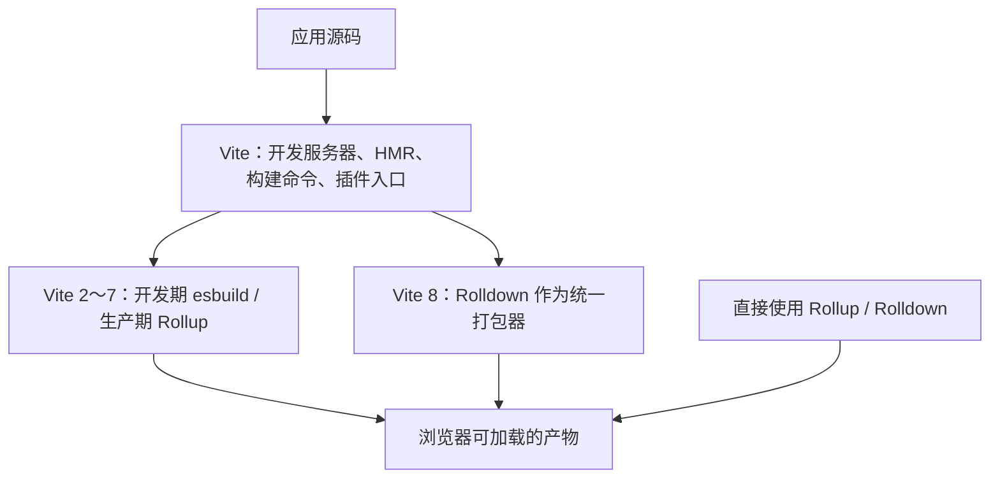

# 构建工具趋势文章草稿

以下保留原第六章素材，尚未完成事实核验与独立文章改写，不进入博客文章列表。公司、收购、发布时间、性能倍数与选型判断均需核对官方来源后再发布。

# 六、2024–2026：构建工具的"原生化元年"

如果说前面讲的是 2023 年之前的格局，那么接下来这几年，剧情急转直下。

一句话概括：**2020 年 esbuild 证明了"换种语言能快 100 倍"之后，2024–2026 集中爆发的不是"又出了新工具"，而是"同一批工具被用 Rust/Go 重写了一遍"。** 这是一次代际更替。

| 工具 | 重写前 | 重写后 | 时间线 |
| --- | --- | --- | --- |
| esbuild | —（一上来就是 Go） | Go | 2020 |
| SWC | TS | Rust | 2021 |
| Rspack | — | Rust | 2023 起，2024-08 发 1.0 |
| Rolldown | — | Rust | 2024 开源 |
| TypeScript 7 | TS | Go | 2025 底官宣 |
| Vite 8 | JS(Rollup) | Rust(Rolldown) | 2026-03 |

## 6.1 先认识 Rollup 与 Rolldown

**Rollup 是一个可独立使用的 JavaScript 模块打包器。** 它从入口读取 ESM 的 `import` / `export`，构建依赖关系，做 Tree Shaking、代码分割，再输出 JS 文件。发布类库时，可以直接运行 Rollup；在 Vite 2～7 中，它也曾是 Vite 生产构建的底层打包器。[Rollup 官网](https://rollupjs.org/)把自己定义为 JavaScript module bundler。

**Rolldown 是用 Rust 实现的新打包器，不是给 Rollup 套一层壳。** 它有自己的解析、转换和生成流程，目标是保持 Rollup/Vite 插件 API 的兼容性，同时覆盖原先 esbuild 和 Rollup 分担的部分工作。它既能被 Vite 8 调用，也能像 Rollup 一样独立打包；区别是 Vite 还提供开发服务器、HMR、配置与框架集成，打包器只负责其中一部分。[Rolldown 官方介绍](https://rolldown.rs/guide/introduction)明确把它定位为 Vite 的下层打包器，也说明了独立使用方式。

所以它们与 webpack 的关系是**可替代的打包器路线**，与 Vite 的关系是**下层能力与上层工具的关系**。把「Vite、Rollup、Rolldown」平铺为三个完全同层的产品，容易误解；讲选型时先问「我要一个完整应用开发体验，还是只需要打包一个库」。

## 6.2 VoidZero 与工具链统一（2023 起）

Vue 和 Vite 的作者尤雨溪在 2023 年创立了 [VoidZero](https://voidzero.dev/)，目标是终结 Vite 生态里"构建、测试、lint、format 各自为政"的碎片化，做一套**统一的高速工具链**。它的产出包括：Rolldown（Rust 打包器）、Oxc（Rust 语言工具链）、Oxlint / Oxfmt（对标 ESLint / Prettier）。

## 6.3 Vite 8：删掉 esbuild + Rollup，换上 Rolldown（2026-03）

2026 年 3 月，[Vite 8 稳定版发布](https://vite.dev/blog/announcing-vite8)，做了一件"自我否定"的大事：**用统一的 Rust 内核 [Rolldown](https://rolldown.rs/) 取代原来的 esbuild + Rollup 双引擎**，官方称构建快 10–30x，同时保持对 Rollup 插件的兼容。

这正好回扣第四章讲的双引擎架构——**那套"dev esbuild / prod Rollup"既是 Vite 成名的招牌，也逐渐变成了两套转换管线、两套语义、大量胶水代码的技术债。** Vite 8 把这笔债一次性还清。（8.1 还引入了实验性的 Bundled Dev Mode，开发期也打包，进一步统一 dev/build 行为。）

## 6.4 Vite+ 与 Cloudflare 收购 VoidZero（2026）

VoidZero 还推出了 [Vite+](https://viteplus.dev/)（`vp` 命令），把 runtime 管理、包管理、dev / test / lint / format / build 收敛到一个入口，2026 年 8 月发布 [Beta](https://www.infoq.com/news/2026/08/vite-plus-beta/)。

更大的新闻是：2026 年 6 月 4 日，[Cloudflare 收购了 VoidZero](https://voidzero.dev/posts/voidzero-cloudflare)。官方承诺 Vite / Vitest / Rolldown / Oxc / Vite+ 继续保持 MIT 开源、社区中立。

## 6.5 更大的原生化浪潮

这股"原生化"不止发生在打包器（以下均为**截至本文发布（2026-08）的公开信息**，快速演进中，请以官方最新公告为准）：

- **TypeScript 7** 的编译器用 Go 重写（[microsoft/typescript-go](https://github.com/microsoft/typescript-go)，官方主导），目标是把类型检查/编译提速约一个数量级。
- **Bun**（Zig 编写的运行时/工具链）被 Anthropic 收购、并作为 Claude Code 的底层执行环境——这条属于新闻性信息，请以 [Bun 官方博客](https://bun.sh/blog) 与 Anthropic 官方公告为准。
- **Biome / Oxlint** 正在成为 ESLint / Prettier 的高性能替代。
- **AI / Agent 时代对工具链速度的需求**成了新推力——Agent 高频跑构建、测试、lint，慢工具的成本被放大。

> 一个更深的主线是：JS 时代信奉 Unix 哲学"每个工具只做一件事"；Rust 时代则转向"共享一棵 AST、只解析一次"的垂直整合（Biome 合并 lint+format，Oxc 想统一 parse/transform/lint/format/minify）。两条路各有道理，但当下的势头明显偏向整合。

## 6.6 横向对比与选型建议

铺垫了这么多，最后落到最实际的问题：**这么多工具，到底怎么选？**

先用一张表看清全貌：

| 工具 | 底层语言 | 插件生态 | 核心优势 | 主要短板 | 适用场景 |
| --- | --- | --- | --- | --- | --- |
| webpack | JS | 最成熟 | 生态最广、配置最灵活 | 慢 | 存量大型项目、需极致定制 |
| Rspack | Rust | 兼容 webpack | 近乎无缝替换 + 数量级提速 | 生态仍在补齐 | 给存量 webpack 项目提速 |
| Vite (Rolldown) | Rust | Rollup 生态 | DX 最好、生态最广 | 历史双引擎的语义边角料 | 新项目、框架无关首选 |
| Turbopack | Rust | 自有（webpack 兼容有限） | 函数级增量缓存 | 强绑定 Next.js | Next.js 项目 |
| Rollup / Rolldown | JS / Rust | 优雅 | 产物干净、Tree Shaking 强 | 偏库打包 | 类库、SDK 发布 |
| esbuild | Go | 较弱 | 转译极快 | 不做复杂产物优化 | 转译 / 预构建 / 小工具 |

**决策速查**（按场景一句话给结论）：

- 存量 webpack 大项目要提速 → **Rspack**（改动最小、收益最大）
- 全新项目 / 框架无关 → **Vite（Rolldown）**
- Next.js 项目 → **Turbopack**（基本不用选）
- 发布类库 / 组件库 → **Rollup / Rolldown / tsdown**
- 只要转译或极简打包 → **esbuild**

**最后是我的个人判断**（仅供参考，请结合团队现状选型）：

- **最看好落地的是 Rspack。** 它不是"又一个新工具"，而是 webpack 的 Rust 转世——`module.rules`、`plugins` 这套心智几乎零迁移成本，却能换来数量级的提速。加上巨石应用的实战淬炼和 Rstack 全家桶，属于"上限高、风险低"的一档。
- **最看好未来的是 Rolldown / Oxc 体系。** 它走的是"共享一棵 AST、一个工具链统一 parse / transform / lint / format / bundle"的整合路线，代表下一个十年的方向。

一句话总结：**要立刻落地，选 Rspack；要押注趋势，看 Rolldown / Oxc。** 至于 webpack，短期不会消失（存量和生态还在），但新项目的默认位，已经让给了 Rust 新一代。

> 提醒：文中的性能倍数都以各自官方 benchmark 为准，且因项目而异；选型别只看跑分，要结合团队的存量代码、框架绑定和维护成本综合判断。

# 原第五章素材

# 五、其他新一代工具：Rspack 与 Turbopack

webpack 和 Vite 之外，还有几个可以了解的名字。这里不展开源码，只讲清"是什么、为什么快、适合谁"。

## 5.1 Rspack：webpack API 的 Rust 实现

[Rspack](https://rspack.rs/zh/guide/start/introduction) 是一个 [MIT 完全开源](https://github.com/web-infra-dev/rspack)、由字节团队主导发起的项目（性质类似 Vite 之于 VoidZero——公司主导、社区开源中立）。它的出发点非常直接：**解决大型/巨石应用里 webpack "构建十几分钟"的性能问题。**

它为什么快？官方给了几个原因：

- **Rust 原生代码**：编译成 Native Code，天然比 JS 快。
- **高度并行架构**：模块图生成、代码生成等阶段多线程并行，吃满多核 CPU（JS 的单线程在这里很吃亏）。
- **大部分功能内置**：webpack 常靠一堆 JS loader/plugin，而这些往往是性能瓶颈；Rspack 把常用功能内置，减少 JS 侧的通信开销。
- **增量编译**：HMR 阶段用增量策略，热更新很快。

最关键的是**兼容性**：Rspack 提供现代化的 webpack API，可以近似"无缝替换"，兼容社区几乎所有 loader，下载量最高的 50 个 webpack 插件里 85%+ 可用或有替代。围绕它还有一套 Rstack 全家桶——Rsbuild（上层构建工具，类比 Vite 之于 Rollup）、Rslib（库开发）、Rspress（文档站）、Rsdoctor（构建分析）。2024 年 8 月发布的 1.0 已达到生产稳定。

## 5.2 Turbopack：Next.js 专属，函数级增量

[Turbopack](https://nextjs.org/docs/app/api-reference/turbopack) 由 webpack 的作者 Tobias Koppers 在 Vercel 主导，专为 Next.js 设计，用 Rust + SWC 编写。

它最有意思的地方是核心思想——**函数级缓存 / 增量计算**：把每个转换都表达成一个函数，只要输入相同就命中缓存，代码变更时只重算受影响的模块及其依赖链。二次构建因此极快。

现状是：2025 年 10 月发布的 [Next.js 16](https://nextjs.org/blog/next-16) 已把 Turbopack 定为 **`next dev` 和 `next build` 的双默认打包器**（想回退 webpack 需显式加 `--webpack`）。但它**强绑定 Next.js**，作为独立通用打包器的能力弱于 Rspack 和 Vite。

## 5.3 底层引擎层：esbuild / SWC / Oxc

再往下一层，还有"引擎"级别的工具，它们通常不直接当打包器用，而是被上层工具集成：

- **esbuild**（Go，2020）：高速转译与打包工具，Vite 2～7 的开发期依赖预构建曾用它；Vite 8 已改用 Rolldown。
- **SWC**（Rust）：Next.js、部分工具链的转译器，替代 Babel。
- **Oxc**（Rust）：VoidZero 的 parser / resolver / transformer / minifier 一体化底座，支撑着 Rolldown。

这正好呼应第二章说的"编译器层从 Babel 走向 SWC / Oxc"的演进。
